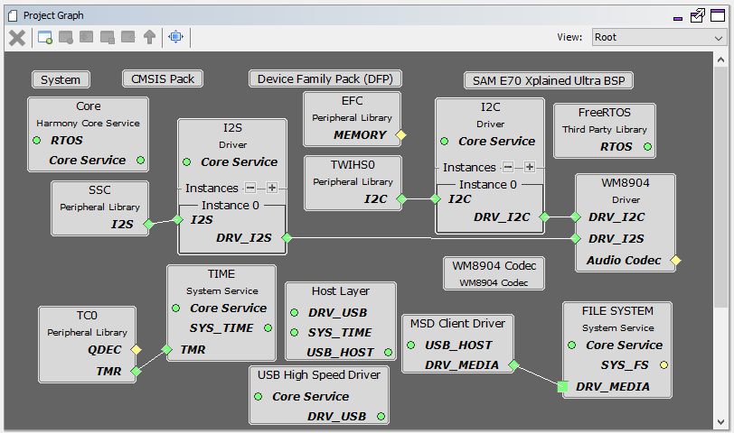
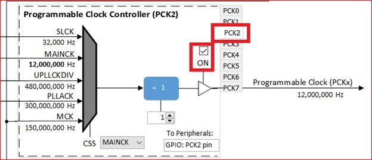

# audio_player_basic

This topic provides instructions and information about the MPLAB Harmony 3 Audio Player Basic demonstration application, which is included in the MPLAB Harmony Library distribution.

## Description

The audio player (audio_player_basic) application configures the development board to use a microSD card or be in USB Host Mass Storage Device (MSD) mode. The application supports the FAT file system. When a mass storage device is connected to the development board via its Target USB port, the device is mounted, and the application begins to scan for files starting at the root directory. It will search for .wav files up to 10 directory levels deep. A list of files found, and their paths, will be created and stored.

Once the scan is complete, the first track in the list will be opened, validated and played. The application will read the .wav file header to validate. Configuration of the number of channels, sample size, and sample rate stated in the file will be handled by the application for proper playback. If a file that can't be played is found, it will be skipped, and the next sequential file will be tried. If the file can be played, it will then go on and read the .wav file data and write it to the codec for playback.

Command and control of the codec is done through an I2C driver. Data to the codec driver is sent through SSC via I2S Driver and the output will be audible through the headphone output jack of the WM8904 Audio Codec Module connected to the SAM E70 Xplained Ultra board.

Supported audio files are as represented in the table below.

## Supported Format

| **Audio Format** | **Sample Rate (kHz)** | **Description** |
| --- | --- | --- |
| PCM | 8 to 96 | PCM (Pulse Code Modulation) is an uncompressed format. The digital data is a direct representation of the analog audio waveform. The container for the data will be a WAVE file (.wav) format. It is the native file format used by Microsoft Windows for storing digital audio data. |

The defines DISK_MAX_DIRS and DISK_MAX_FILES in the app.h file, determines the maximum number of directories that should be scanned at each level of the directory tree (to prevent stack overflow, the traversing level is limited to 10), and the maximum number of songs in total the demonstration should scan (currently set to 4000 because of memory limitations).

## Architecture

The application runs on the SAM E70 Xplained Ultra Board, which contains a ATSAME70Q21B microcontroller with 2 MB of Flash memory and 384 KB of RAM running at 300 MHz using the following features:

*   One push button (SW1)
*   Two LEDs (amber LED1 and green LED2)
*   WM8904 Codec Daughter Board mounted on a X32 socket

The SAM E70 Xplained Ultra board does not include the WM8904 Audio Codec daughterboard, which is sold separately on microchipDIRECT as part number AC328904.

The application currently only supports WAVE (.wav) format files and ADPCM (.pcm) files.

The audio_player_basic application uses the MPLAB Harmony Configurator to setup the USB MSD Host, file system, codec, and other items in order to read the music files on a USB mass storage device and play it back through the WM8904 Codec Module. It scans WAV (PCM) format files from a mounted FAT drive and streams audio through a WM8904 Audio Codec to a pair of headphones. In the application, the number of audio output buffers can always be set to more than two to enhance the audio quality. The size of input buffer in this application is chosen to be able to handle the data supported.

The following figure shows the architecture for the demonstration (USB Host version shown):

### Architecture Block Diagram

## Demonstration Features

*   USB MSD Host Client Driver (see USB MSD Host Client Driver Library)
*   microSD card
*   FAT File System (see File System Service Library)
*   Audio real-time buffer handling
*   WM8904 Codec Driver (see Audio Codec Driver Libraries)
*   I2S usage in audio system (see I2S Driver Library)
*   DMA (see DMA Peripheral Library)
*   Timer (see Timer Peripheral Library)
*   GPIO Control (see Port Peripheral Library)

### Harmony Configuration

1.  Add BSP->SAM E70 Xplained Ultra BSP
2.  Add Audio->Templates->WM8904 Codec
a.  Yes to all popups.
3.  Add Libraries->USB->Host Stack->MSD Client Driver
a.  Yes to all popups.
4.  Add Harmony->System Services->FILE SYSTEM
5.  Remove FreeRTOS if Bare Metal or Graphics versions.
6.  Add Harmony->Audio->Decoder->Audio Decoder Libraries
7.  Connect MSD Client Driver: DRV_MEDIA to FILE SYSTEM: DRV_MEDIA
8.  Connect WM8904 Driver:DRV_I2S to I2S Driver:DRV_I2S

After reorganization, your graph would look similar to one of the following project graphs. They specify the drivers, services, and libraries being brought into the project to further extend the applications abilities.

Fig 2 (Project graph of the default E70 bare metal configuration using the SSC)

Fig 3 (Project graph of the E70 FreeRTOS configuration using the SSC)

Fig 4 (Project graph of the E54 bare metal configuration using the I2S)

Fig 5 (Project graph of the E54 FreeRTOS configuration using the I2S)

## Tools Setup Differences

The default configuration should be correct for the majority of the application. The following configurations will need to be changed in order for proper operations.

For projects using the E54 Curiosity Ultra, the I2S interface and the WM8904 as a Slave (the E54 generates the I2S clocks):

In the MPLAB Harmony Configurator: _Tools>Clock_ _Configuration_ dialog:

*   Set enable the Crystal Oscillator, change it frequency to 12,000,000 Hz, and select CRYSTAL.
*   Uncheck the Fractional Digital Phase Locked Loop enable (FDPLL 0).
*   In the CLK Generator 0 box, change the input to DFLL for an output of 48 MHz.
*   In the CLK Generator 1 box, change the input to XOSC0 with a divider of 1 for an output of 12 MHz.
*   In the GCLK Generator, uncheck the selection for GCLK 2, and then select the GCLK 3 tab. Choose the DFLL as the input, with a divide by 4 for an output of 12 MHz. You should end up with a clock diagram like this:

For projects using the E70 Xplained Ultra, the SSC interface and the WM8904 as a Master (the WM8904 codec generates the I2S clocks):

In the MPLAB Harmony Configurator: _Tools>Clock_ _Configuration_ dialog:

Uncheck the Main RC Oscillator and check the "Bypass" for the Main Crystal Oscillator. When the Bypass is checked, it will cause the Main Crystal Oscillator to become unchecked.

Enable the PCK2 output to enable the WM8904 master clock:

_Clock Diagram>Peripheral Clock Enable_ Enable clocking for the SSC.

In the MPLAB Harmony Configurator: _File System_ dialog_:_

The Auto Mount feature must be selected in order to expose the media type selection. The media type that is being used in this application is Mass Storage Device. This must be correctly configured, or the storage device will not mount.

In the MPLAB Harmony Configurator: _System_ dialog:

Set the heap size in Harmony if it is not already set for the linker. Certain projects may set the heap to a larger size automatically.

### Building the Application

This section identifies the MPLAB X IDE project name and location and lists and describes the available configurations for the demonstration.

**Description**

The parent folder for these files is audio/apps/audio_player_basic. To build this project, you must open the audio/apps/audio_player_basic/firmware/*.X project file in MPLAB X IDE that corresponds to your hardware configuration.

## MPLAB X IDE Project Configurations

The following table lists and describes supported project configurations.

| **Project Name** | **BSP Used** | **Description** |
| --- | --- | --- |
| apb_sam_e54_ult_wm8904_i2s_sdmmc | sam_e54_cult | This demonstration runs on the ATSAME54P20A processor on the SAM E54 Curiosity Ultra board with the WM8904 Audio Codec Daughter Board. The WM8904 codec is configured as the master, and the I2S peripheral as the slave. The project config is for reading data from a microSD card. The data is sent to the headphone output of the codec daughter card via I2S driver. |
| apb_sam_e54_ult_wm8904_i2s_sdmmc_freertos | sam_e54_cult | This demonstration runs on the ATSAME54P20A processor on the SAM E54 Curiosity Ultra board with the WM8904 Audio Codec Daughter Board. The WM8904 codec is configured as the master, and the I2S peripheral as the slave. The project config is for reading data from a microSD card. The data is sent to the headphone output of the codec daughter card via I2S driver. This demonstration uses FreeRTOS to schedule running tasks. |
| apb_sam_e70_xult_wm8904_ssc | sam_e70_xult | This demonstration runs on the ATSAME70Q21B processor on the SAM E70 Xplained Ultra board with the WM8904 Audio Codec Daughter Board. The WM8904 codec is configured as the master, and the SSC peripheral as the slave. The project configuration is for reading data from a file on a USB Mass Storage Device. The data is sent to the headphone output of the codec daughter card via I2S protocol using the SSC PLib. |
| apb_sam_e70_xult_wm8904_ssc_freertos | sam_e70_xult | This demonstration runs on the ATSAME70Q21B processor on the SAM E70 Xplained Ultra board with the WM8904 Audio Codec Daughter Board. The WM8904 codec is configured as the master, and the SSC peripheral as the slave. The project configuration is for reading data from a file on a USB Mass Storage Device. The data is sent to the headphone output of the codec daughter card via I2S protocol using the SSC PLib. This demonstration uses FreeRTOS to schedule tasks to run. |

### Configuring the Hardware

This section describes how to configure the supported hardware.

**Description**

Using the SAM E54 Curiosity Ultra board and the WM8904 Audio Codec Daughter Board, using the I2S PLIB:

To connect to the I2S, the jumpers (J6, J7, J8, and J9) on the WM8904 Codec Daughterboard must be oriented away from the pink, mic in, connector. See the red outlined jumpers in the below image as reference.

In addition, make sure the J401 jumper (CLK SELECT) is set for the PA17 pin:

 **Note:** The SAM E54 Curiosity Ultra board does not include the WM8904 Audio Codec daughterboard, which is sold separately on microchipDIRECT as part number AC328904.

Using the SAM E70 Xplained Ultra board and the WM8904 Audio Codec Daughter Board, using the SSC PLIB:

Jumper J203, which is next to the SAM E70 Xplained Ultra logo, should be jumpered for LED2.

To connect to the SSC, the jumpers (J6, J7, J8, and J9) on the WM8904 Codec Daughterboard must be oriented away from the pink, mic in, connector. See the red outlined jumpers in the below image as reference.

 **Note:** The SAM E70 Xplained Ultra board does not include the WM8904 Audio Codec daughterboard, which is sold separately on microchipDIRECT as part number AC328904.

### Running the Demonstration

This section demonstrates how to run the demonstration.

**Description**

  **Important!** Prior to using this demonstration, it is recommended to review the MPLAB Harmony 3 Release Notes for any known issues.

Compile and program the target device. While compiling, select the appropriate MPLAB X IDE project based. Refer to Building the Application for details.

1.  Connect headphones to the HP OUT jack of the WM8904 Audio Codec Daughter Board (see **Figure 2 below**).
2.  Connect power to the board. The system will be in a wait state for USB to be connected (amber LED1 blinking).
3.  For the E54 board:

Insert a micro SD card into the slot on the bottom side of the board as shown in Figure 1. The contacts of the micro SD card should be facing the bottom side of the board.

#### Figure 1: SD Card slot on bottom of SAM E54 Curiosity Ultra Board

3. For the E70 board:

Connect a USB mass storage device (thumb drive) that contains songs of supported audio format to the USB TARGET connector of the SAM E70 Xplained Ultra board. You will probably need a USB-A Female to Micro-B Male adapter cable to do so. The application currently can only stream WAVE (.wav) format audio files.

4. When the device is connected the system will scan for audio files. Once the scanning is complete and at least one file is found (green LED2 on steady), listen to the audio output on headphones connected to the board. Use Switch SW1 as described under Control Description to change the volume or advance to the next track.

#### Figure 2: WM8904 Audio Codec Daughter Board on SAM E70 Xplained Ultra board Control Description

Long presses of the push button cycle between volume control and the linear track change mode.

When in volume control mode, short presses of the push button cycle between Low, Medium, High, and Mute volume outputs. While in the Mute mode, a pause of the playback will also take place.

When in the linear track change mode, short presses of the push button will seek to the end of the currently playing track and willstart the next track that was found in sequence. After all tracks have been played, the first track will start again in the same sequential order.

Button control is shown in the table below.

#### Button Operations

| **Long Press (> 1 sec)** | **Short Press (< 1 sec)** |
| --- | --- |
| Volume Control | Low (-66 dB) |
| - | Medium (-48 dB) |
| - | High (0 dB) |
| - | Mute/Pause |

|  |  |
| --- | --- |
| Linear Track Change | Next sequential track |

#### Status Indicator Description

When the application first starts running, it looks to find an attached storage device. If one is not found, LED1 will toggle on and off about every 100ms indicating that a storage device is not attached.

When a storage device is attached, LED1 will turn off. At this time, the file system will be scanned for WAVE files with a .wav extension.

If no WAVE files are found on the storage device, LED2 will remain off and scanning of the device will continue.

If any WAVE files are found, LED2 will turn on and playback of the first file found in sequence will start.

LED status indication is shown in the table below.

#### LED Status

| **Operation** | **LED1 Status (Red)** | **LED2 Status (Green)** |
| --- | --- | --- |
| No Storage Device Connected | Toggle 100ms | Off |
| Storage Device Connected | Off | See Files Found Operation |
| Playback: Volume Control | Off | See Files Found Operation |
| Playback: Volume Mute | Toggle 500ms | See Files Found Operation |
| Playback: Linear Track Change | On | See Files Found Operation |
| Files Found (Yes/No) | See above operations | On/Off |

