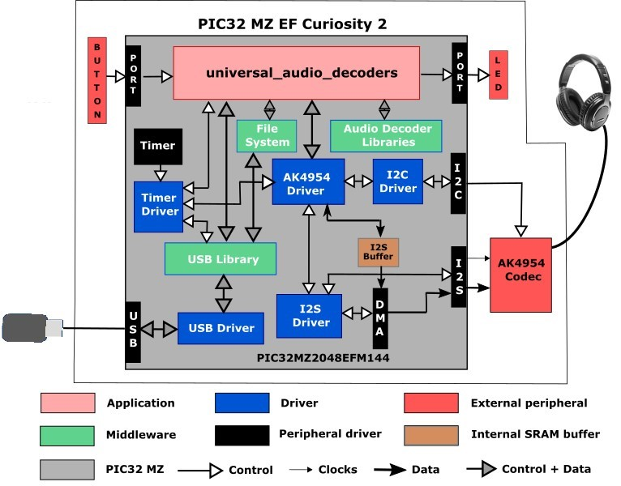
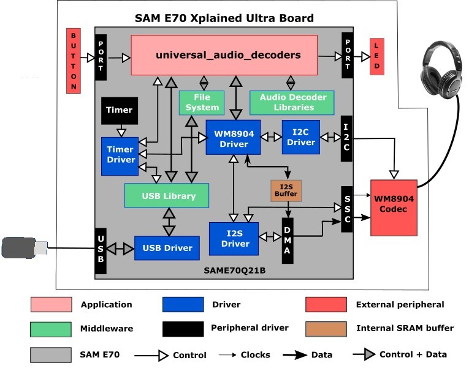

# universal_audio_decoders

This topic provides instructions and information about the MPLAB Harmony 3 Universal Audio decoders demonstration application, which is included in the MPLAB Harmony Library distribution.

## Description

The Universal Audio Decoders application uses the MPLAB Harmony Decoder Library to decode music files on a USB thumb drive.

The application configures the development board to be in USB Host mode, and supports the FAT32 file system. When a mass storage device is connected to the development board, the application begins to scan the root directory. Once the scan is complete, the first track in the list will be opened and played. The fill buffer routine will read a chunk of data as an input to the decoder of the supported file format. The decoder will decode the packet and send the first frame of audio data to the codec driver through I2S Driver and the output will be audible through the speakers. The following block diagram depicts a representation of the application.

Button or touch controls provide typical VCR-like control over the playback, such as play/pause, rewind, and next track.

The application currently supports ADPCM, WAV, MP3 and FLAC files. 

| **Audio Format** | **Decoder Location** | **Sampling Rates (kHz)** | **Description** |
| --- | --- | --- | --- |
| ADPCM | audio/decoder | 8, 16 | Adaptive Delta Pulse Code Modulation (ADPCM) is a sub-class of the Microsoft waveform (.wav) file format. In this demonstration, it only decodes ADPCM audio which has a WAV header. The extension name for this format is pcm. |
| WAVE | audio/decoder | 8 through 96 | The WAVE file format is the native file format used by Microsoft Windows for storing digital audio data. |
| MP3 | helix_mp3 | 8 through 48 | The MPEG 2.5 Layer 3 is a lossy digital compression formats for audio data. The current version of the MP3 Library is an open-source based on the Helix MP3 decoder used in RealPlayer. The version in MPLAB Harmony is v1.0. |
| FLAC | xiph_flac | 8 through 48 | FLAC stands for Free Lossless Audio Codec, here lossless, means that audio is compressed in FLAC without any loss in quality. The current version of the FLAC Library is an open-source version based on the Xiph FLAC decoder. The version in MPLAB Harmony is based on version 1.3.3 of the open source XIPH FLAC source. |

## Architecture

There are two different projects packaged in this application.

PIC32 MZ EF Curiosity 2.0 Project:

One project runs on the PIC32 MZ EF Curiosity 2.0 board, using the PIC32MZ2048EFM144 microcontroller with 2 MB of Flash memory and 512 KB of RAM running at 198 MHz. Around 16K of heap is reserved for FLAC enabled projects. The PIC32 MZ EF Curiosity 2.0 board includes the following features:

*   Four push buttons (SW1-SW4, only SW1 is used)
*   Four LEDs (LED1-LED4, only LED1 is used)
*   AK4954 Codec Daughter Board mounted on X32 HEADER 2 socket

The PIC32 MZ EF Curiosity 2.0 board does not include the AK4954 Audio Codec daughterboard, which is sold separately on microchipDIRECT as part number AC324954.

The following figure illustrates the application architecture for the PIC32 MZ EF Curiosity 2.0 project without a display. The program takes up to approximately 14% (287 KB) of the PIC32MZ2048EFM144 microcontroller's program space, and 52% (273 KB) of the RAM. Around 16 KB of heap is reserved for FLAC based projects.
 

The I2S (Inter-IC Sound Controller) is used with the AK4954 codec. The AK4954 is configured in slave mode, meaning it receives I2S clocks (LRCLK and BCLK) from the PIC32, and the I2S peripheral is configured as a master.

SAM E70 Xplained Ultra Projects:

One project runs on the SAM E70 Xplained Ultra Board, which contains a ATSAME70Q21B microcontroller with 2 MB of Flash memory and 384 KB of RAM running at 300 MHz using the following features:

*   One push button (SW1, may be labeled as SW0 on some boards)
*   Two LEDs (LED1 and 2, only LED1 is used)
*   AK4954 Codec Daughter Board mounted on a X32 socket

The SAM E70 Xplained Ultra board does not include the AK4954 Audio Codec daughterboard, which is sold separately on microchipDIRECT as part numbers AC324954.

The following figure illustrates the application architecture for the SAM E70 Xplained Ultra project. The program takes up to approximately 5% (110 KB) of the ATSAME70Q21B microcontroller's program space, and 19% (71 KB) of the RAM. Around 16 KB of heap is reserved for FLAC based projects.

The SSC (Synchronous Serial Controller) is used with the WM8904 codec, selected by a strapping option on the WM8904 daughterboard. The WM8904 is configured in master mode, meaning it generates the I2S clocks (LRCLK and BCLK), and the SSC peripheral is configured as a slave.

## Demonstration Features

*   USB MSD Host Client Driver (see USB MSD Host Client Driver Library)
*   FAT File System (see File System Service Library)
*   Audio real-time buffer handling
*   AK4954 or WM8904 Codec Driver (see Audio Codec Driver Libraries)
*   I2S usage in audio system (see I2S Driver Library)
*   DMA (see DMA Peripheral Library)
*   Timer (see Timer Peripheral Library)
*   GPIO Control (see Port Peripheral Library)

## Tools Setup Differences

For the project using the PIC32MZ, the I2S interface and the AK4954 as a Slave (the I2S peripheral generates the I2S clocks):

When building a new application, start by creating a 32-bit MPLAB Harmony 3 project in MPLAB X IDE by selecting _File > New Project_. Chose the Configuration name based on the BSP. Select the appropriate processor (PIC32MZ2048EFM144 for the PIC32 MZ EF Curiosity 2.0). Click Finish.

In the MHC, under Available Components select the BSP PIC32 MZ EF Curiosity 2.0. Under _Audio>Templates_, double-click on

AK4954 Codec. Answer Yes to all questions except for the one regarding FreeRTOS; answer No to that one. Then under _Libraries>USB>Host Stack_, double-click on MSD Client Driver. Finally, under _Harmony>System Services_, double-click on FILE

SYSTEM.

You should end up with a project graph that looks like this, after rearranging the boxes:

Connect the MSD Client Driver block to the FILE SYSTEM block. Click on the FILE SYSTEM block.

Under File System Settings, check the checkbox for Use File System Auto Mount Feature. Under Media0>Media Configuration0, change the Media Type to SYS_FS_MEDIA_TYPE_MSD.

Click on the I2S Peripheral. In the Configurations Options, under 32/16-Bit Communication Select bits, select (AUDEN=1) 16-bit data, 16-bit FIFO, 32-bit Channel/64-bit Frame. Change Master Clock the Baud Rate to 44,100. Set the Frame Select Pin to C2. The configuration should look like this:

Under Tools, click on Clock Configuration. In the Clock Diagram:

*   Change the Primary Oscillator frequency to 12,000,000 Hz, and select EC under POSCMOD.
*   Change FPLLICLK to POSC, FPLLIDIV to DIV_2, and FPLLMULT to MUL_66 for an SPLL value of 198 MHz. Change the UPLLFSEL to FREQ_12MHZ.
*   In the Reference Clock #1 section, check the ON and OE checkboxes,, and set ROTRIM1 to 393 and RODIV1 to 8. This should give a REFCLKO1 output of 11,291,601 Hz, which is 256 times the 44,100 Hz sample rate.

For the project using the E70, the SSC interface and the WM8904 as a Master (the WM8904 codec generates the I2S clocks), with or without a display:

When building a new application, start by creating a 32-bit MPLAB Harmony 3 project in MPLAB X IDE by selecting _File > New Project_. Chose the Configuration name based on the BSP used. Select the appropriate processor (ATSAME70Q21B). Click Finish.

In the MHC, under Available Components select the appropriate BSP (SAM E70 Xplained Ultra). Under _Audio>Templates_, double-click on WM8904 Codec. Answer Yes to all questions except for the one regarding FreeRTOS; answer No to that one. Then under _Libraries>USB>Host Stack_, double-click on MSD Client Driver. Finally, under _Harmony>System Services_, double-click on FILE SYSTEM.

You should end up with a project graph that looks like this, after rearranging the boxes:

Connect the MSD Client Driver block to the FILE SYSTEM block. Click on the FILE SYSTEM block.

Under File System Settings, check the checkbox for Use File System Auto Mount Feature. Under Media0>Media Configuration0, change the Media Type to SYS_FS_MEDIA_TYPE_MSD.

Click on the WM8904 Driver. In the Configurations Options, set the Sample Rate to 44,100.

In the Clock Diagram, set MOSCEL to Main Crystal, check the Bypass checkbox, and uncheck the RC Crystal Oscillator and Main Crystal Oscillator boxes, to make use of the 12 MHz external oscillator:

Also in the Clock Diagram, in the PCK2 tab of the **Programmable Clock Controller** section, check the On checkbox, and set CSS to MAINCLK (12 MHz). Then check the SSC checkbox in the **Peripheral Clock Controller** section.
### Building the Application

This section identifies the MPLAB X IDE project name and location and lists and describes the available configurations for the demonstration

**Description**

The parent folder for these files is audio/apps/universal_audio_decoders. To build this project, you must open the audio/apps/universal_audio_decoders/firmware/*.X project file in MPLAB X IDE that corresponds to your hardware configuration.

#### MPLAB X IDE Project Configurations

The following table lists and describes supported project configurations.

| **Project Name** | **BSP Used** | **Description** |
| --- | --- | --- |
| uad_pic32mz_ef_c2_ ak4954 | pic32mz_ef_curiosity_v2 | This demonstration runs on the PIC32MZ2048EFM144 processor on the PIC32 MZ EF Curiosity 2.0 board and the AK4954 Audio Codec Daughter Board. The AK4954 codec is configured as the slave, and the I2S peripheral as the master. The project configuration is for reading data from a file on a USB Mass Storage Device. The data is sent to the headphone output of the codec daughter card via I2S protocol using the I2S PLIB. |
| uad_sam_e70_xult_ wm8904_ssc | sam_e70_xult | This demonstration runs on the ATSAME70Q21B processor on the SAM E70 Xplained Ultra board and the WM8904 Audio Codec Daughter Board. The WM8904 codec is configured as the master, and the SSC peripheral as the slave. The project configuration is for reading data from a file on a USB Mass Storage Device. The data is sent to the headphone output of the codec daughter card via I2S protocol using the SSC PLIB. |

### Configuring the Hardware

This section describes how to configure the supported hardware.

**Description**

For all configurations, a pair of headphones should be connected to the HP Out jack of the audio codec. A FAT32 file system USB Flash drive will be needed to inserted into the USB TARGET connector of the board. You will probably need a USB-A Female to Micro-B Male adapter cable to do so.

Using the PIC32 MZ EF Curiosity 2.0 board and the AK4954 Audio Codec Daughter Board and I2S PLIB. The AK4954 daughter board is plugged into the set of X32 connectors on the right side of the board (X32 HEADER 2).

 **Note:** The PIC32 MZ EF Curiosity 2.0 does not include the AK4954 Audio Codec daughterboard, which is sold separately on microchipDIRECT as part number AC324954.

Using the SAM E70 Xplained Ultra board and the WM8904 Audio Codec Daughter Board and SSC PLIB. All jumpers on the WM8904 should be toward the **front:**

 **Note:** The SAM E70 Xplained Ultra board does not include the WM8904 Audio Codec daughterboard, which is sold separately on microchipDIRECT as part number AC328904.

### Running the Demonstration

This section demonstrates how to run the demonstration.

**Description**

  **Important!** Prior to using this demonstration, it is recommended to review the MPLAB Harmony 3 Release Notes for any known issues.

Compile and program the target device. While compiling, select the appropriate MPLAB X IDE project based. Refer to Building the Application for details.

1.  Connect headphones to the HP OUT jack of the Audio Codec Daughter Board.
2.  Connect power to the board if necessary. The system will be in a wait state for USB to be connected (amber LED1 blinking).
3.  Connect a USB mass storage device (thumb drive) that contains songs of supported audio format to the USB TARGET connector of the board. You will probably need a USB-A Female to Micro-B Male adapter cable to do so.
4.  When the device is connected the system will scan for audio files. Once the scanning is complete and at least one file is found (green LED2 on steady), listen to the audio output on headphones connected to the board. Use Switch SW1 as described under Control Description to change the volume or advance to the next track.

**Control Description:**

Long presses of the push button cycle between volume control and the linear track change mode.

When in volume control mode, short presses of the push button cycle between Low, Medium, High, and Mute volume outputs. While in the Mute mode, a pause of the playback will also take place.

When in the linear track change mode, short presses of the push button will seek to the end of the currently playing track and start the next track that was found in sequence. After all tracks have been played, the first track will start again in the same sequential order.

Button control is shown in the table below.

#### Button Operations

| **Long Press (> 1 sec)** | **Short Press (< 1 sec)** |
| --- | --- |
| Volume Control | Low (-66 dB) |
| - | Medium (-48 dB) |
| - | High (0 dB) |
| - | Mute/Pause |
| Linear Track Change | Next sequential track |

#### Status Indicator Description

When the application first starts running, it looks to find an attached storage device. If one is not found, LED1 will toggle on and off about every 100ms indicating that a storage device is not attached.

When a storage device is attached, LED1 will turn off. At this time, the file system will be scanned for supported files with the appropriate extension.

If no supported files are found on the storage device, LED2 will remain off and scanning of the device will continue.

If any supported files are found, LED2 will turn on and playback of the first file found in sequence will start.

LED status indication is shown in the table below.

#### LED Status

| **Operation** | **LED1 Status (Red)** | **LED2 Status (Green)** |
| --- | --- | --- |
| No Storage Device Connected | Toggle 100ms | Off |
| Storage Device Connected | Off | See Files Found Operation |
| Playback: Volume Control | Off | See Files Found Operation |
| Playback: Volume Mute | Toggle 500ms | See Files Found Operation |
| Playback: Linear Track Change | On | See Files Found Operation |
| Files Found (Yes/No) | See above operations | On/Off |

