# usb_headset

This topic provides instructions and information about the MPLAB Harmony 
3 USB Speaker Basic demonstration application, which is included in the MPLAB 
Harmony Library distribution.

## Description

This demonstration application configures the development board to implement a 
USB Headset device configured to run at 48 kHz sampling rate at 16 bit per sample.

The USB Device driver in Full Speed mode will interface to a USB Host (such as a 
personal computer) via the USB Device Stack using the V1.0 Audio Function Driver. 
The embedded system will enumerate with a USB audio device endpoint and enable 
the host system to input/output audio from the USB port using a standard USB 
Full-Speed implementation. The embedded system will stream USB playback audio to
the Codec. The Codec Driver sets up the audio interface, timing, DMA channels 
and buffer queue to enable a continuous audio stream. The digital audio is 
transmitted to the codec through an I2S data module for playback and record 
through a headphone jack.

## Architecture

The application runs on the PIC32 MZ EF Curiosity 2 (MZEFC2) demo board, as follows: 

*   Processor runs @ 200 MHz
*   4 push buttons (SW1-SW4)
*   3 LEDs (all red LED1-LED3) and RGB LED (LED4).
*   AK4954 Codec Daughter Board mounted on X32 socket
*   USB Device interface

 **Note:** The PIC32 MZ EF Curiosity 2 does not include the
AK4954 Audio Codec daughterboard, which is sold separately on microchipDIRECT as
part number AC324954.

The usb_headset application uses the MPLAB Harmony Configurator to setup the USB
Audio Device, codec, and other items in order to play back the USB audio through
the Codec Module.

A USB Host system is connected to the micro-mini USB device connector. The
application detects the cable connection, which can also supply device power;
recognizes the type of connection (Full Speed); enumerates its functions with the
host, isochronous audio streaming playback and record through device. Audio stream data is
buffered in 1 ms frames for playback/record using the AK4954 Codec daughter board. Audio
is heard through the Headphone jack (HP OUT).  Audio is sent to the
record channel from the on-board microphone

The following figure shows the basic architecture for the demonstration.

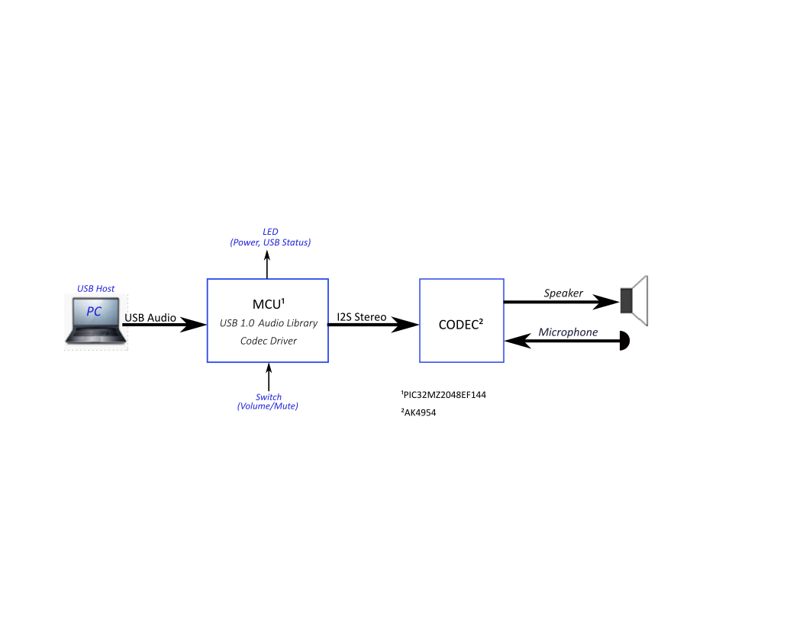    
_Figure 1. Architecture Block Diagram_

## Demonstration Features

*   Audio playback/record using a AK4954 codec daughterboard on the MZEFC2 board.
*   USB connection to a host system using the USB Library Device Stack for a USB
    Headset device using the MZEFC2 boards
*   MZEFC2 board button processing for volume/mute control
*   USB Attach/Detach and mute status using an LED on MZEFC2 board
*   Utilization of the PIC32 I2S peripheral (as master) on the MZEFC2 board

Note that all the calls to the AK4954 codec driver uses the form
DRV_CODEC_xxx rather than DRV_AK4954_xxx. This is to make the
code more generic, such that another codec could be substituted for another
without having to make changes to the application code except for the location of
the driver's public header file.

## Tools Setup Differences

### Harmony MHC Component Blocks 

MPLAB-X Harmony 3 projects only have one associated
configuration. When each Harmony 3 project is created the MPLAB-X Harmony
Configurator (MHC) will support application driver and library code generation 
for the selected processor.

Additional, MHC code generation is supported by adding additional components 
to the project graph.  This includes Core peripheral support for the processor
device, the Harmony framework, and the board support package.

The USB Headset application will be generated from the following MHC Project Graph
after each block's component parameters are configured.

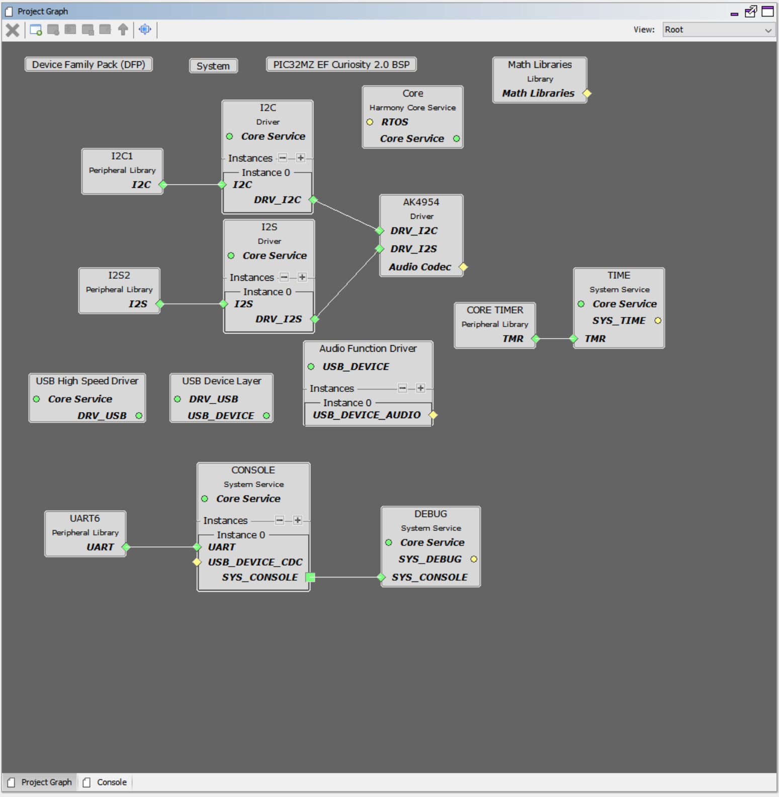    
_Figure 9. USB Speaker Project Graph for the PIC32 MZ EF Curiosity 2 Board_

The creation of this Project Graph and the configuring of each components will
be described in the following Sections.

#### Harmony Core Block

Start MHC for the project in order to add the Harmony and the application 
code components.  The Board Support Package (BSP) for the Pic32 MZ EF Curiosity
board should be selected first from the Available Components.

Next,  the Harmony core is selected without FreeRTOS.
Answer Yes to all questions except for the one regarding FreeRTOS; answer No to
that one.

#### USB Audio Component Blocks 

The MHC USB Audio Stack component blocks can 
added by selecting the Libraries/USB/Device Stack/Audio Function Driver
component template under the MHC Available Components list, as shown below. 

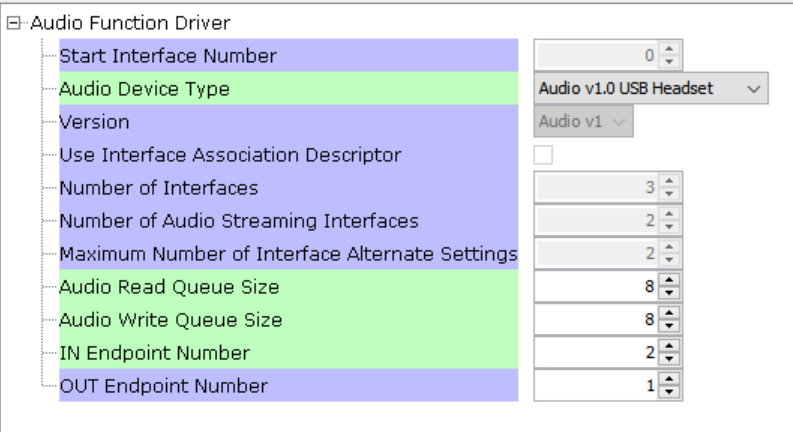    
_Figure 2. USB Headset USB Audio Function Driver Selection_

Answer yes to all questions. This allows the generation of the 
USB High Speed Driver, the USB Device
Layer and Audio Function Driver components.

#### AK4965 Daughter Board Component Blocks

Under Audio\\Templates, double-click on AK4954 Codec Template (shown below).
Answer Yes to all questions.
This loads the AK4954 Codec component along with associated I2C, I2S
and timer driver components.

_Figure 3. USB Headset AK4954 Codec Selection_

#### Debug Console Output
Debug output to the console is sent to UART6 using the PKOB4 USB connections 
as a virtual com port on the PC.  This is the same USB connection used
to program the device.  Three components block have to be added to the
diagram:  UART6, Console and Debug.  These can use the default configuration
settings.

### Harmony Code Configuration Options

Each block in the MHC Project Graph may need to be configured through parameters
for the specific application. These parameters are accessed by selecting the
block with the mouse, and appear in the Configuration Options window, where they
can be edited. The next section describes the configuration of the USB, Math, and
Codec component blocks for the USB Speaker with “Bass Boost” application.

#### USB Configuration

The application uses USB Library as a "Device" stack, which will connect to a
"Host". The USB High Speed Driver is set to “Full Speed”, V1.0 interface (not
“High Speed”, V2.0 Interface):

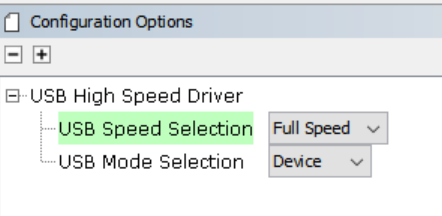    
_Figure 5. USB Headset USB High Speed Driver Peripheral Configuration_

The USB Device Layer is configured by selecting Product ID Selection as
“usb_headset_multiple_sampling_demo” with an endpoint buffer size of 64 (bytes). The Product String
Selection is changed to “Harmony USB Speaker w/Bass Boost Example”. This
information will be used to generate the fullSpeedConfigurationDescriptor array
variable structure (located in initialization.c under the config folder) that
defines the enumeration of device functions with the USB Host. This structure
defines the connection to the host at 48 kHz with 16 bit stereo channel data.

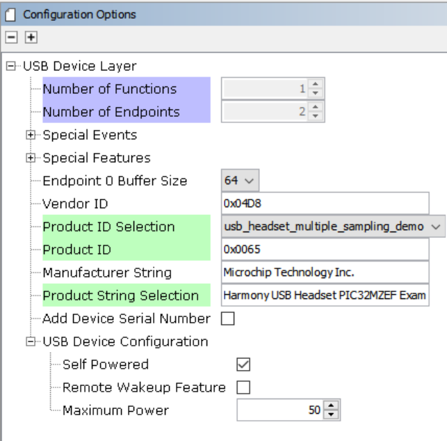    
_Figure 6. USB Headset USB Device Layer Configuration_

The Audio Function Driver is configured with an Audio Read Queue that matches
that of the codec driver write queue for this Audio V1.0 USB Speaker interface.

A playback packet queue of length 8 is set with the Audio Read Queue Size.
The Audio Write Queue Size should be the same (8), which should also 
match the Audio Write Queue Size of the I2S driver.
The The maximum USB write packets size is set to 
48 * 2 channels/sample * 2 bytes/channel= 192 bytes, which gives a 1ms
stereo sample packet size at 48Khz (the standard data frame length at this rate),
thus the read buffer size needs to be of the same size.
The write buffer size should be half of this (96 bytes), since the 1ms
write buffer only contain single channel (mono) audio data at the
48Khz rate at the same bit resolution (16 bit).

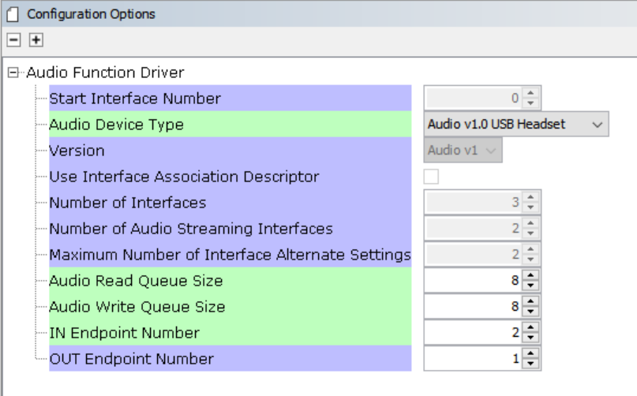    
_Figure 7. USB Headset USB Audio Configuration_

#### The AK4954 Codec

Using the MZEFC2 and the AK4954 Audio Codec Daughter Board:

The AK4954 codec uses a I2C interface for configuration and control
register setting and SPI interface configured as I2S. The settings are shown 
below.

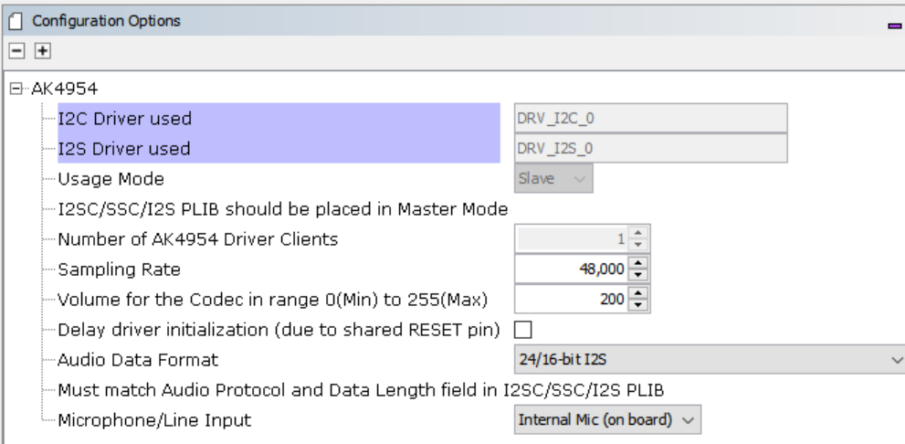    
_Figure 8. USB Headset AK4954 Codec Configuration_

The I2S Driver uses a transfer queue size of 8, which applies to both read and
write channels, and matches that that of the USB Read/Write Queue length:

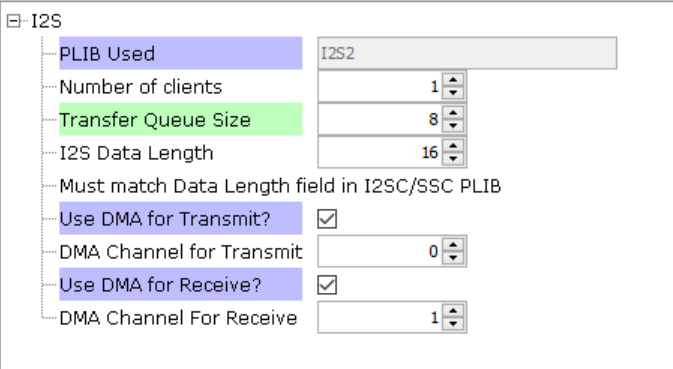    
_Figure 9. USB Headset I2S Driver Configuration_

When the I2S2 driver is used for DRV_I2S_0 the codec usage mode automatically 
changes to “Slave”

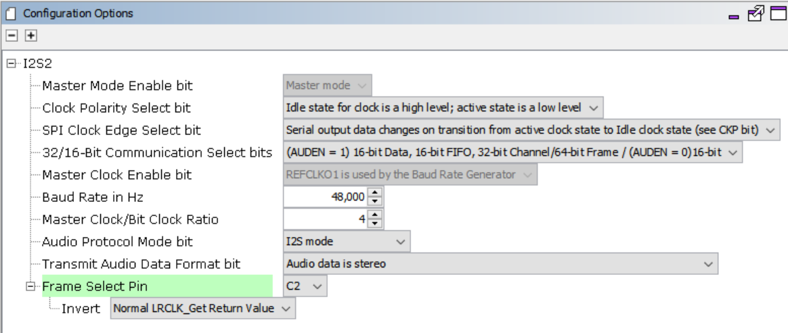    
_Figure 8. USB Headset I2S Peripheral Driver Configuration_

The I2C blocks can be used without changes to the configuration

_Table 1. USB Headset Pic32 MZ Curiosity 2 Pin Configuration_    

#### Clock Manager

##### PIC32 MZ EF PLL Clock
The CPU, Memory and Peripheral clock are generated from the 198Mhz PLL Clock, as configured below.

The I2S clocks are setup for 48KHz sampling rate, with stereo 16 bit samples, giving a 32 bit sample frame.  The I2S clocks will be generated, as follows:

| **I2S Function** | **Value** | **Description** |
| --- | --- | --- |
| LRCK | 48.000000 K | Stereo Sample rate clock |
| BCLK | 3072000 Hz | Bit Rate Clock |
| MCLK | 12.288000 MHz | Master Clock |

The clock configuration diagram is shown using Tools/Clock Configuration menu
selection.  The system clock is 198Mhz, generated from the System PLL, as
configured below.

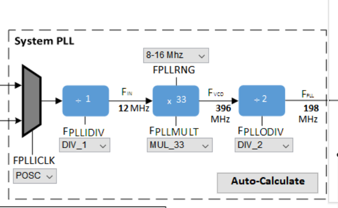

_Figure 7. 198Mhz PLL Clock Generation for I2SC Peripheral_

### I2SC2 REFCLOCK01 Configuration

The I2S master the MCLK to approximate 12.288Mhz. 
This is sourced the Reference Clock #1 as shown below.

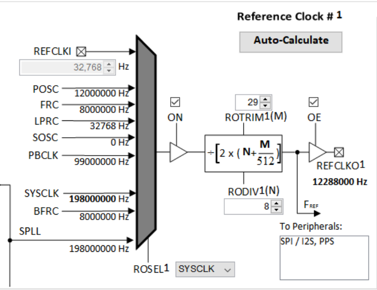
_Figure 7. Reference Clock Generation for I2S Master Peripheral Configuration_

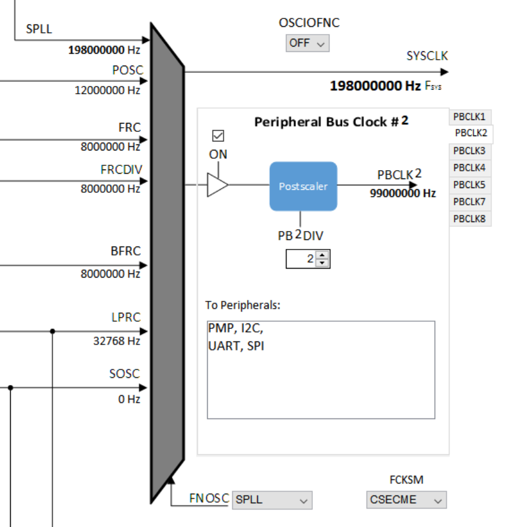
_Figure 8. Peripheral Clock Generation_ 

### Harmony Code Generation

All the needed drivers, middleware, libraries and application framework code can
be generated from the MHC blocks (MHC components) placed in the MHC Project
Graph,

The generated framework code is placed under the firmware/src/config directory
under the name of the configuration used for the Harmony 3 project. The initial
application code is located in the firmware/src directory app.c and app.h files,
which utilize the framework drivers, middleware and library APIs located in
definitions.h located in the config directory.

All Harmony applications first execute the SYS_Initialize function, located in
initialization.c. This is executed from the main function to initialize various
subsystems such as the clock, ports, BSP (board support package), codec, usb,
timers, and interrupts. The application APP_Initialize function in app.c is
executed last in the generated SYS_Initialize routine after the system
initializations have completed.

The SYS_Tasks function (located in tasks.c) is used to update the USB subsystems,
WM8904 driver, timers etc., as well as the application state machine (APP_tasks
routine in app.c). This function is executed from the main polling loop. The
polling loop either execute SYS_Tasks repeatably in the infinite loop to perform
the updates, or it the updates occur as separate processes executed at fixed time
intervals using an RTOS schedular.

The application utilizes a simple state machine (APP_Tasks executed from
SYS_Tasks) with the following functions

1.  Setup the drivers and USB Library interface
2.  Respond to USB Host control commands (“Attach”, “Detach”, “Suspend”)
3.  Initiate and maintains the bidirectional data audio streaming for the "USB
    Playback" function.
4.  Sense Volume control button pushes and set LED status lights

### Building the Application

This section identifies the MPLAB X IDE project name and location and lists and
describes the available configurations for the demonstration.

**Description**

The parent folder for these files is audio/apps/usb_headset. To build this
project, you must open the audio/apps/usb_headset/firmware/*.X project file in
MPLAB X IDE that corresponds to your hardware configuration.

** MPLAB X IDE Project **    

This table lists the name and location of the MPLAB X IDE project folder for the
demonstration.

#### MPLAB X IDE Project Configurations

This table lists and describes the supported configurations of the demonstration,
which are located within ./firmware/src/config.

| **Project Name**             | **BSP Used**      | **Description** |
| ---------------------------- | ----------------- | ----------------------------------------------------------------------------------- |
| uh_pic32mz_ef_c2_ ak4954 | pic32_mz_ef_c2 | This demonstration runs on the PIC32 MZ EF Curiosity 2 board with the AK4954 Codec. |    

### Configuring the Hardware    

This section describes how to configure the supported hardware.

#### Using the PIC32 MZ EF Curiosity 2 and the AK4965 Daughter Board:

The PIC32 MZ EF Curiosity board and the AK4954 Audio Codec Daughter Board only
requires the AK4954 Codec Daughterboard to be connected to X32 Header 2 as shown
below. No jumper settings are required.    
    
    

_Figure 9. PIC32 MZ EF Curiosity 2 Board Setup_    

AK4954 Audio Codec Daughter Board on PIC32 MZ EF Curiosity 2 board setup.
Headphone Out Jack is green. Microphone In Jack is pink._

Connect headphones to the green HP OUT jack of the Codec Daughter Board (as shown
in the Figure above).  The onboard microphone (AK4954 Daughterboard) will be
used for the audio input.

As shown, the PIC32 MZ EF Curiosity will be programmed through the USB cable 
connected to the PKOB4 micro-mini connector. 
Program debug can also be performed over USB this connection.

### Running the Demonstration

This section demonstrates how to run the demonstration.

#### Description

 **Important!** Prior to using this demonstration, it
is recommended to review the MPLAB Harmony 3 Release Notes for any known issues.

Compile and program the target device. While compiling, select the appropriate
MPLAB X IDE project. Refer to Building the Application for details

Do the following to run the demonstration:

1.  Configure the hardware, as described in the previous section, for the
    selected MPLAB-X project.

1.  Connect power to the board, compile the application and program the target
device. Run the device. The system will be in a waiting for USB to be connected
(LED1 off).
2.  Connect to the USB Host via the micro-mini connector (see Configuring the
    Hardware).
3.  Allow the Host computer to acknowledge, install drivers (if needed), and
    enumerate the device. No special software is necessary on the Host side. LED1
    will blink after enumeration. It will continue to blink until the Harmony USB
    Speaker is selected as the speaker device, and the audio stream is started.
    It will then turn a solid color.
4.  If needed, configure the Host computer to use the usb_headset as the selected
    audio recording device. For Windows, this is done in the "Recording" tab in
    and the "Playback" tab of the "Sound" dialog"

 **Note:** selection for Both Windows 10 and Windows 7 sound dialog is accessed by right
clicking the loudspeaker icon in the taskbar, which will bring up a menu for the
selection. This is shown in the Figure below for selecting the playback device.
The record device selected from the "Recording" tab in the same way.

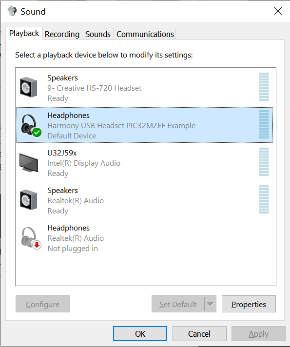

_Figure 12. Windows 10 - Sound Dialog Showing Harmony USB Headset Selection._

 **Note:** The device "Harmony USB Headset PIC32MZEF
Example" should be available along with a sound level meter indication audio 
when playing. If no sound level is registering or the name of the Harmony speaker 
is incorrect, uninstall the driver using the Windows Device Manager, 
since it may have incorrect configuration set by a similar connection to one 
of the other MPLAB-X Harmony Audio Demos.

1.  Open a playback/record application (such as Skype, or Audacity) and initiate
    playback and record through the USB Headset. LED 2 should be a solid color.

1.  Playback of audio should demonstrate that the audio is being heard in the USB
Headset headphones.
2.  Volume can be change by repeated press of SW1. Volume will increase to
    maximum. It will then mute the speaker (LED1 will fast blink during mute) and
    then start increasing from minimum volume to maximum after more presses of
    SW1. NOTE: Volume is also controlled using the PC volume control and the
    Windows Media Player volume control.,
3.  Recording should also take place through the AK4954 on-board microphone.
This should be seen when speaking on the "Sound Dialog"/Recording sound
level meter of the USB Headset device.  Actual audio can be recorded via the
recording function of Audacity or the Connection Test feature of Skype.

## Control Description

Button control uses the push button function sequence given in the table below:

| **Function** | **Press** |
| ---------------------- | --------------- |
| Volume Control Level 1 | Low (-66 dB)    |
| Volume Control Level 2 | Medium (-48 dB) |
| Volume Control Level 3 | High (-0 dB)    |
| Mute                   | Mute            |

**Note:** Mute will transition to Volume Control Level 1 on the next button push.

USB operational status is given by LED1, as shown below:

| **LED1** | **Status** |
| -------------- | ---------- |
| OFF | USB cable detached |
| ON | USB cable attached |
| Blinking | Playback muted or USB waiting to be configured|

The PIC32MZ EF Curiosity 2 has a second LED (LED2), which indicates if the audio
is streaming or not.

| **LED2** | **Status** |
| -------------- | ---------- |
| OFF | USB Audio not configured|
| ON | USB Audio is streaming|
| Blinking | Playback muted or USB Audio not streaming |

