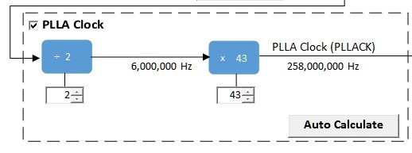
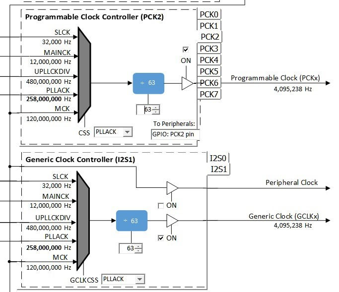

# usb_microphone

This topic provides instructions and information about the MPLAB Harmony 3 USB Microphone demonstration application, which is included in the MPLAB Harmony Library distribution.

## Description

This demonstration application configures the development board to implement a USB Microphone device configured to run at 16 Khz sampling rate at 16 bit per sample.

The USB Device driver in Full Speed mode will interface to a USB Host (such as a personal computer) via the USB Device Stack using the V1.0 Audio Function Driver. The embedded system will enumerate with a USB audio device endpoint and enable the host system to input audio from the USB port using a standard USB Full-Speed implementation. The embedded system will stream USB playback audio to the Codec. The Codec Driver sets up the audio interface, timing, DMA channels and buffer queue to enable a continuous audio stream. The digital audio is transmitted to the codec through an I2S data module for playback through a headphone jack.

## Architecture

The application runs on the SAM E70 Xplained Ultra Board (E70XULT), which can operate at 300 MHz using the following features:

*   One push button (SW1)
*   Two LEDs (amber LED1 and green LED2). Only LED 1 can be used for a USB Device, that requires VBUS sense.
*   WM8904 Codec Daughter Board mounted on a X32 socket
*   USB Device interface

 **Note:** The SAM E70 Xplained Ultra board does not include the WM8904 Audio Codec daughterboard, which is sold separately on microchipDIRECT as part number AC328904.

The usb_microphone application uses the MPLAB Harmony Configurator to setup the USB Audio Device, codec, and other items in order to play back the USB audio through the WM8904 Codec Module.

A USB device is connected to the micro-mini USB device connector. The application detects the cable connection, which can also supply device power; recognizes the type of connection (Full Speed); enumerates its functions with the host, isochronous audio streaming playback or recording through the device. Audio stream data is buffered in 1 ms frames for playback or recording using the WM8904 Codec daughter board. Audio is can be heard through the Headphone jack (HP OUT).

The following figure shows the basic architecture for the demonstration.

_USB Microphone Application Block Diagram_

## Demonstration Features

*   Audio recording using an WM8904 codec daughterboard on the SAM E70 Xplained Ultra (E70XULT) board.
*   USB device connection to a host system using the USB Library Device Stack for a USB Microphone device implemented on the SAM E70XULTZ
*   E70 XULT Button processing for microphone gain control
*   Using the USB Library
*   USB Attach/Detach and mute status using an LED.
*   Looping back of the microphone data to the codec headphone output for for playback monitoring of the input audio.

### Harmony Configuration and Code Generation

The MPLAB-X Harmony Configurator (MHC) Project Graph for usb_microphone_basic is shown below.

_USB Microphone Application MPLAB-X Harmony Configurator Project Graph_

Each block provides configuration parameters to generate the application framework code. This includes all the needed drivers, middleware, libraries. The generated framework code is placed under the firmware/src/config directory under the Harmony 3 project configuration. This Harmony 3 application has two configurations, as described below :

1.  usb_microphone_basic_sam_e70_xult_wm8904_i2sc1_usb - A bare-metal configuration
2.  usb_microphone_basic_sam_e70_xult_wm8904_i2sc1_usb_freertos> - A configuration that uses the 3rd party FreeRTOS operating system.

The harmony application system components, drivers and mideleware is configured based on the project graph.

In many cases the default configuration values are used, but in general each application requires modifications to these parameter.

The usb_microphone_basic custom application code code is located in the firmware/src directory of the application folder. The

app.c and app.h files are initially generated as stub files in this folder. The middleware and library APIs located in definitions.h (as generated by MHC), for the given project graph.

The usb_microphone application utilizes a state machine with the following functions:

1. Setup the drivers and USB Library interface as used by the application

1.  WM8904 Codec Driver
2.  Timer
3.  USB Audio
4.  Respond to USB Host control commands (�Attach�, �Detach�, �Suspend�, etc.)
5.  Initiate and maintains the audio data streaming for the "USB Record" function as data is received from the microphone codec.

All Harmony applications use the function SYS_Initialize function located in the MHC generated file initialization.c. This is executed from main to initialize various subsystems such as the clock, ports, BSP (board support package), codec, usb, timers, and interrupts. The application APP_Initialize function in app.c is also executed at the end of this routine to setup the application code state machine.

For the bare-metal configuration The USB, WM8904 driver, and the application code state machines(APP_Tasks routine in app.c) are all updated via calls located in the function SYS_Tasks, executed from the main polling loop, located in the MHC generated tasks.c.

For the FreeRTOS configuration 4 tasks are configured within 3 processes of a round-robin scheduler. The APP_Tasks and Codec update tasks is in 1 of the scheduled process, while the USB High Speed Driver and USB Device Driver are in there own separate tasks.

## Tools Setup Differences

_USB Configuration_

The application uses USB Library as a "Device" stack, which will connect to a "Host". The USB High Speed Driver is selected to by �Full Speed� (not �High Speed�):

_USB High Speed Driver Configuration_

The USB Device Layer is configured by selecting the �usb_microphone_demo� with an endpoint buffer size of 64 (bytes). The

Audio Function Driver is configured for 5 USB endpoints with a single function having 3 interfaces. All of these are defined for a USB Microphone device in the fullSpeedConfigurationDescriptor array variable structure (located in initialization.c under the config folder). This structure defines the connection to the host at 48 Khz with 16 bit stereo channel data. A packet queue of length APP_QUEUE_SIZE (set to 2) is used for playback data. The maximum USB packets size is set to 16 samples * 2 channels per sample * 2 bytes per channel= 64 bytes, which gives a 1ms stereo sample packet size at 16Khz (the standard data frame length at this rate), thus the buffer size needs to be of the same size.

_USB Device Layer Configuration_

The Audio Function Driver is configured with a Audio Read Queue that matches that of the codec driver write queue for this Audio V1.0 USB Microphone interface.

_USB Audio Function Configuration_

_The WM8904 Codec Configuration_

The WM8904 codec uses a TWIHS0 (I2C) interface for module configuration and control register setting and a I2SC1 (I2S) interface for audio data. The default settings are used.

The default values are used for the TWIHS and I2C drivers.

The E70 I2SC1 driver is set to be the master with a data length of 16, 2 channels (stereo) and a MCLK divider value of of 256. These a default values, as shown below:

_I2SC1 Peripheral Configuration_

The I2S driver is configured with transfer queue size of 8 (default value) that matches that of the USB Read Queue, as shown below:

_USB Microphone I2S Configuration_

The WM8904 Codec is configured with an I2S slave interface operating at 16000 Hz sampling rate, as shown below:

_USB Microphone I2S Configuration_ Also, the microphone input is enabled with bias for an electret microphone.

_Pin Manager Configuration_

The buttons, LED, Switch, I2S and I2C interfaces using GPIO pins via the Microchip Harmony Configurator (MHC) Pin Manager, as follows:

When the I2SC1 is used the following pins are used:

| **NAME** | **PORT** | **E70 PIN** | **Notes** |
| --- | --- | --- | --- |
| I2SC1_WS | PE00 | 4 | I2S LRCK (Word Select) |
| I2SC1_DO0 | PE01 | 6 | I2S DO (Data Out) |
| I2SC1_DI0 | PE02 | 7 | I2S DI (Data In) |
| I2SC1_CK | PA20 | 22 | I2S BCLK (Bit Clock) |
| I2SC1_GCLK | PA19 | 23 | I2S MCLK (Bit Clock as used by the E70 I2SC1, I2S Master) |
| PMC_PCK2 | PA18 | 24 | I2S MCLK (Master Clock as used by the WM8904 Codec I2S Slave) |
| SWITCH | PA11 | 66 | Push Button |
| LED1 | PA05 | 73 | - |
| TWIHS0_TWCK0 | PA04 | 77 | I2C |
| TWIHS0_TWD0 | PA03 | 91 | I2C |
| STDBY | PD11 | 98 | - |
| LED2/VBUS DETECT(J203) | PB08 | 141 | J203 set to VBUS DETECT for USB Device |

_Clock Manager_

All clocks are generated from the 12 Mhz Main Clock oscillator, including the following.

| **Clock** | **Value** | **Description** |
| --- | --- | --- |
| HCLK | 240 MHz | Processor Clock |
| USB FS | 48 MHz | USB Full Speed Clock |

The I2SC1 peripheral is set as the I2S bus master. It uses the I2SC1_GCLK to generate the I2S timing to the codec slave I2S interface.

The I2SC clocks are setup for 16Khz sampling rate (LRCK), with stereo 16 bit samples, giving a 32 bit sample frame. The frame bit clock (BCLK) and the I2S Master clock (MCLK) is calculated as follows:

LRCK = 16 KHz FRAME_SIZE = 16 bits/channel * 2 channels BCLK = LRCK * 16 * 2 = .512 KHz MCLK_MULT = 256 MCLK = MCLK_MULT * LRCK = 4.096 KHz

The generated MCLK should be set as close as possible to the calculated values as given below:

| **CLOCK** | **I2S Function** |
| --- | --- |
| I2SC1_WS | LRCK |
| I2SC1_CK | BCLK |
| I2SC1_GCLK | MCLK(I2SC1) |
| PCK2 | MCLK(X32) |

The E70 XULT board only provides PCK2 as the source of the MCLK to the X32 WM8904 Codec Daughter Board connector. It must be generated the same as I2SC1_GCLK.

The actual generated value utilizes the PLLA clock as the source for both the I2SC1_GCLK and the PCK2. These values generate the following clocks These I2S clocks are generated from the I2SC1 GCLK peripheral acting as I2S master.

_MPLAB Harmony Configurator: Clock Diagram Configuration_

The MHC Clock Diagram to generate the processor (HCK), PCK2 (I2S MCLK), and the I2SC1 MCLK (I2SC1_GCLK) is given below.

_USB Microphone MHC Clock Diagram_

Uncheck the Main RC Oscillator and check the �Bypass� for the Main Crystal Oscillator. When the Bypass is checked, it will cause the Main Crystal Oscillator to become disabled. An external MEMS oscillator input on the XIN pin is used for Main Clock generation.

_USB Microphone Main Clock_

The PLLA clock is generated from 12 Mhz Main Clock using the selected DIVA and MULA values, as shown below:

_USB Microphone PLLA Clock_

The I2S MCLK is generated using both the PCK2 output and the I2SC1_GCLK. These are both enabled and generated using the PLLA clock source to give the same value of 4,095,238 Hz (to approximate the 4096000 Hz sampling rate), as shown below:

_USB Microphone I2S1 GCLK and PCK2 Configuration_

_Timer Driver_

The Timer driver configuration, Timer driver instance 0, is used by a system for button processing (debounce and long press) and LED blink delay. It needs to be set to �Enable Period Interrupt�. It is also required by the WM8904 Codec Driver. The default configuration values are used.

### Building the Application

This section identifies the MPLAB X IDE project name and location and lists and describes the available configurations for the demonstration.

**Description**

The parent folder for these files is audio/apps/usb_microphone. To build this project, you must open the audio/apps/usb_microphone/firmware/*.X project file in MPLAB X IDE that corresponds to your hardware configuration.

**MPLAB X IDE Project**

This table lists the name and location of the MPLAB X IDE project folder for the demonstration.

#### MPLAB X IDE Project Configurations

This table lists and describes the supported configurations of the demonstration, which are located within ./firmware/src/config.

| **Project Name** | **BSP Used** | **Description** |
| --- | --- | --- |
| usb_microphone_basic_sam_e70_xult_ wm8904_i2sc_usb | sam_e70_xult | This demonstration runs on the SAM E70 Xplained Ultra board with the WM8904 daughter board |
| usb_microphone_basic_sam_e70_xult_ wm8904_i2sc_usb_freertos | sam_e70_xult | This demonstration runs on the SAM E70 Xplained Ultra board with the WM8904 daughter board. It also uses FreeRTOS. |

### Configuring the Hardware

This section describes how to configure the supported hardware.

**Description**

Using the SAM E70 Xplained Ultra board and the WM8904 Audio Codec Daughter Board, using the I2SC PLIB:

Jumper J203, which is next to the SAM E70 Xplained Ultra logo, should be jumpered for VBUS Detect.

To connect to the I2SC, the jumpers (J6, J7, J8, and J9) on the WM8904 Codec Daughterboard must be oriented towards the pink, mic in, connector. See the red outlined jumpers in the below image as reference.

 **Note:** The SAM E70 Xplained Ultra board does not include the WM8904 Audio Codec daughterboard, which is sold separately on microchipDIRECT as part number AC328904.

### Running the Demonstration

This section demonstrates how to run the demonstration.

**Description**

 **Important!** Prior to using this demonstration, it is recommended to review the MPLAB Harmony 3 Release Notes for any known issues.

Compile and program the target device. While compiling, select the appropriate MPLAB X IDE project. Refer to Building the Application for details.

_Figure 1. WM8904 Audio Codec Daughter Board on SAM E70 Xplained Ultra board. Headphone Out Jack is green. Microphone In Jack is pink._

_Note: the brown wire is a jumper wire which is not relevant for this app._

Do the following to run the demonstration:

1.  Attach the WM8904 Daughter Board to the X32 connector. Connect headphones (monitor headphones) to the HP OUT jack of the WM8904 Audio Codec Daughter Board (see Figure 1) and a microphone to the pink MIC IN jack (Refer to Figure 1.
2.  Connect power to the board and connect the USB cable (EDBG) used for programming the device (Refer to Figure 1). Compile the application and program the target device using the EDBG. Run the device. The system then will be in a waiting for USB to be connected (amber LED1 off).
3.  Connect to the USB Host via the micro-mini connector (Refer to Figure 1) located above the push-button switches on the right side of the board using a standard USB cable. The LED1 should turn to a solid amber color as the host enumerates and then initiates the audio stream.
4.  After the Host computer acknowledges the connection, it will install drivers (if needed), No special software is necessary on the Host side.

_Figure 2. Windows 7 Sound Dialog showing USB Microphone with Sound Level Meter_

1.  If needed, configure the Host computer to use the usb_microphone as the selected audio recording device. For Windows, this is done in the "Recording" tab in the "Sound" dialog (as shown in Figure 2) accessed by right clicking the loudspeaker icon on the taskbar.

 **Note:** The device "Harmony USB Microphone Example" should be available along with a sound level meter indication audio when playing. If no sound level is registering, uninstall the driver and reboot the host computer, since it may have incorrect configuration set by a similar connection to one of the other MPLAB-X Harmony Audio Demos.

1.  The Microphone audio should be heard through the monitor headphones
2.  Open a recording application (such as Audacity) and initiate a recording sessiont through the USB Microphone.

_Figure 3. Audacity Recording Session using USB Microphone_

7. Playback of recording session audio is being heard in the USB Microphone headphones.

## Control Description

Button control uses SW1 in a push button function sequence given in the table below:

| **Function #** | **Function** | **Press** |
| --- | --- | --- |
| 1 | Gain Cont | Low Gain |
| 2 | Gain Cont | High Gain |

**Note:** Function 2 will transition back to Function 1 on the next button push USB operational status is given by LED, as shown below:

| **LED Status** | **Status** |
| --- | --- |
| OFF | USB cable detached |
| ON | USB cable attached |
| Blinking | Attached/not Streaming |

