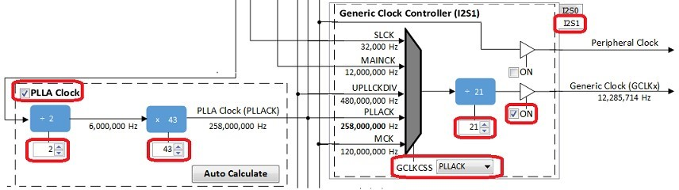
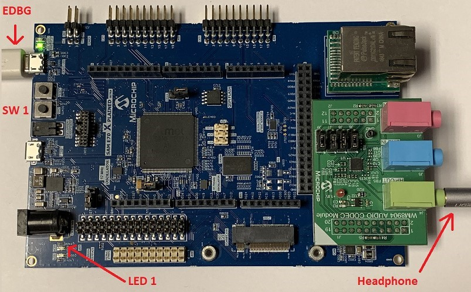

# audio_tone_linkeddma

This topic provides instructions and information about the MPLAB Harmony 3 Audio Tone using Linked DMA demonstration application, which is included in the MPLAB Harmony Library distribution.

## Description

In this demonstration application the Codec Driver sets up the WM8904 Codec. The demonstration sends out generated audio waveforms (sine tone) using linked DMA channels with volume and frequency modifiable through the on-board push button. Success is indicated by an audible output corresponding to displayed parameters.

The sine tone is one of four frequencies: 250 Hz, 500 Hz, 1 kHz, and 2 kHz, sent by default at 48,000 samples/second, which is modifiable in the the MHC as described below.

To know more about the MPLAB Harmony Codec Drivers, configuring the Codec Drivers, and the APIs provided by the Codec Drivers, refer to Codec Driver Libraries.

## Architecture

The two projects run on the SAM E70 Xplained Ultra Board, which contains a ATSAME70Q21B microcontroller with 2 MB of Flash memory and 384 KB of RAM running at 300 MHz using the following features:

*   One push button (SW1)
*   Two LEDs (LED1 and 2)
*   WM8904 Codec Daughter Board mounted on a X32 socket

The SAM E70 Xplained Ultra board does not include the WM8904 Audio Codec daughterboard, which is sold separately on microchipDIRECT as part number AC328904.

The program takes up to approximately 1% (17 KB) of the ATSAME70Q21B microcontroller’s program space. The 16-bit configuration uses 2% (6 KB) of the RAM. No heap is used.

The following figure illustrates the application architecture for the two SAM E70 Xplained Ultra configurations:

Depending on the project, either the SSC (Synchronous Serial Controller) or I2SC (Inter-IC Sound Controller) is used with the WM8904 codec, selected by a strapping option on the WM8904 daughterboard. When using the SSC interface, the WM8904 is configured in master mode, meaning it generates the I2S clocks (LRCLK and BCLK), and the SSC peripheral is configured as a slave. When using the I2SC interface, the WM8904 is configured in slave mode and the SSC peripheral is a master and generates the I2SC clocks. The other two possibilities (SSC as master and WM8904 as slave, or I2SC as slave and WM8904 as master) are possible, but not discussed.

The same application code is used without change between the two projects.

The SAM E70 microcontroller (MCU) runs the application code, and communicates with the WM8904 codec via an I2C interface. The audio interface between the SAM E70 and the WM8904 codec use the I2S interface. Audio is configured as 16-bit, 48,000 samples/second, I2S format. (16-bit, 48 kHz is the standard rate used for DVD audio. An alternate that could be used is 44,100 samples/second. This is the same sample rate used for CD's. The sample rate is configurable in the MHC.)

The Master Clock (MCLK) signal used by the codec is generated by the Peripheral Clock section of the SAM E70, and is fixed at 12 MHz.

The button and LEDs are interfaced using GPIO pins. There is no screen.

As with any MPLAB Harmony application, the SYS_Initialize function, which is located in the initialization.c source file, makes calls to initialize various subsystems as needed, such as the clock, ports, board support package (BSP), WM8904 codec, I2S, I2C, DMA, timers, and interrupts.

The codec driver and the application state machines are all updated through calls located in the SYS_Tasks function in the tasks.c file.

The application code is contained in the several source files. The application’s state machine (APP_Tasks) is contained in app.c. It first initializes the application, which includes APP_Tasks then periodically calls APP_Button_Tasks to process any pending button presses.

Then the application state machine inside APP_Tasks is given control, which first gets a handle to a timer driver instance and sets up a periodic (alarm) callback. In the next state it gets a handle to the codec driver by calling the DRV_CODEC_Open function with a mode of DRV_IO_INTENT_WRITE and sets up the volume.

The application state machine then registers an event handler APP_CODEC_BufferEventHandler as a callback with the codec driver (which in turn is called by the DMA driver).

Two buffers are used for generating a sine wave. Each contains the data for one cycle of audio. One is currently output on a repeated basis, and the second is filled in as necessary when the frequency changes. Then it is designated as the output buffer.

Initially, values for both buffers are calculated in advance. Two calls to the function

DRV_I2S_InitWriteLinkedListTransfer are made each passing the address of one buffer. The buffers are each linked back to themselves such that when one is done, it starts over again. A call to DRV_I2S_StartWriteLinkedListTransfer is made, which starts the DMA sending data using data from the first buffer to the codec.

Only when the frequency is changed, due to a button press, does the second buffer come into play. In that case new values are calculated for the second buffer (while the first buffer continues to be used for output). When the second buffer has been filled in, a call is made to DRV_I2S_WriteNextLinkedListTransfer which transfers control to the second buffer after the first buffer finishes. The way the pointers are set up, it will then repeat on itself until another frequency change is made, and after which control will revert back to the first buffer.

A table called samples contains the number of samples for each frequency that correspond to one cycle of audio (e.g. 48 for 48000 samples/sec, and a 1 kHz tone). **Note:** the samples table will need to be modified if changing the sample rate to something other than 48000 samples/second.

This value with the number of samples to be generated is then passed to the function APP_TONE_LOOKUP_TABLE_Initialize along with which buffer to work with (1 or 2) and the sample rate. The 16-bit value for each sample is calculated based on the relative distance (angle) from 0, based in turn on the current sample number and total number of samples for one cycle. First the angle is calculated in radians:

double radians = (M_PI*(double)(360.0/(double)currNumSamples)*(double)i)/180.0;

Then the sample value is calculated using the sine function:

lookupTable[i].leftData = (int16_t)(0x7FFF*sin(radians));

If the number of samples divides into the sample rate evenly, then only 1/4 (90°) of the samples are calculated, and the remainder is filled in by reflection. Otherwise each sample is calculated individually. Before returning, the size of the buffer is calculated based on the number of samples filled in.

## Demonstration Features

*   Calculation of a sine wave based on the number of samples and sample rate using the sin function
*   Uses the Codec Driver Library to write audio samples to the WM8904
*   At a lower level, uses the I2S Driver Library between the codec library and the chosen peripheral (SSC or I2SC) to send the audio to the codec
*   Use of a alternate buffers (one active, one standby) and linked DMA
*   Use of two timers: one as a periodic 1 ms timer for the application for button debouncing, and a second used by the Codec Driver (see Timer Driver Library)

## Tools Setup Differences

**For projects using the SSC interface and the WM8904 as a Master (the WM8904 codec generates the I2S clocks):**

When building a new application, start by creating a 32-bit MPLAB Harmony 3 project in MPLAB X IDE by selecting _File > New Project_. Chose the Configuration name the same based on the BSP used. Select the appropriate processor (ATSAME70Q21B).

In the MHC, under Available Components select the appropriate BSP (SAM E70 Xplained Ultra). Under _Audio>Templates_, double-click on WM8904 Codec. Answer Yes to all questions except for the one regarding FreeRTOS; answer No to that one.

You should end up with a project graph that looks like this, after rearranging the boxes:

Click on the WM8904 Driver. In the Configurations Options, set the desired Sample Rate if different from the default (48,000) under Sampling Rate.

If using the SAM E70 Xplained Ultra board, in the Clock Diagram, set MOSCEL to Main Crystal, check the Bypass checkbox, and uncheck the RC Crystal Oscillator and Main Crystal Oscillator boxes, to make use of the 12 MHz external oscillator:

In the Clock Diagram, in the PCK2 tab of the **Programmable Clock Controller** section, check the On checkbox, and set CSS to MAINCLK (12 MHz). Then check the SSC checkbox in the **Peripheral Clock Controller** section.

It is also possible to change the audio format from 16 to 32-bits, and from I2S to Left Justified (SSC only). These changes need to be done in the MHC in both the WM8904, and SSC/I2SC Peripherals. In the current application code (app.h), a #define is also set to the current width.

**For projects using the I2SC interface and the WM8904 as a Slave (the SAM E70 generates the I2S clocks):**

When building a new application, start by creating a 32-bit MPLAB Harmony 3 project in MPLAB X IDE by selecting _File > New Project_. Chose the Configuration name the based on the BSP. Select the appropriate processor (ATSAME70Q21B). Click Finish.

In the MHC, under Available Components select the BSP SAM E70 Xplained Ultra. Under _Audio>Templates_, double-click on

WM8904 Codec. Answer Yes to all questions. Click on the WM8904 Codec component (_not_ the WM8904 Driver). In the Configuration Options, under WM8904 Interface, select I2SC instead of SSC. Answer Yes to all questions except for the one regarding FreeRTOS; answer No to that one.

You should end up with a project graph that looks like this, after rearranging the boxes:

Click on the WM8904 Driver. In the Configurations Options, under Usage Mode, change Master to Slave. Set the desired Sample Rate if different from the default (48,000) under Sampling Rate.

If using the SAM E70 Xplained Ultra board, in the Clock Diagram, set MOSCEL to Main Crystal, check the Bypass checkbox, and uncheck the RC Crystal Oscillator and Main Crystal Oscillator boxes, to make use of the 12 MHz external oscillator:

Also in the Clock Diagram, in the PCK2 tab of the **Programmable Clock Controller** section, check the On checkbox, and set CSS to MAINCLK (12 MHz).

The following tables show suggested settings for various sample rates in the Clock Diagram when using the I2SC Peripheral in Master mode. Make sure **PLLA Clock** checkbox is checked, and fill in the values for the PLLA Multiplier and Divider boxes. Select the I2S1 tab under **Generic Clock Controller**, set GCLKCSS to PLLACK, fill in the Divider value as shown, and check the checkbox next to it.

The values in the first table give the lowest error rate, but have varying PLLACK values so it is best to use the UPPCLKDIV selection for CSS under **Master Clock Controller**, for a Processor Clock of 240 MHz.

| **Desired Sample Rate** | **PLLA Multipler** | **PLLA Divider** | **PLLACK** | **I2SC Generic Clock Divider** | **Calculated Sample Rate** | **Error** |
| --- | --- | --- | --- | --- | --- | --- |
| 8000 | 2 | 43 | 258 MHz | 126 | 7998 | -0.025% |
| 16000 | 2 | 43 | 258 MHz | 63 | 15997 | -0.0187% |
| 44100 | 1 | 16 | 192 MHz | 17 | 41117 | 0.0385% |
| 48000 | 2 | 43 | 258 MHz | 21 | 47991 | -0.0187% |
| 96000 | 3 | 43 | 172 MHz | 7 | 95982 | -0.0187% |

The values in the second table have somewhat higher error rates, but use a PLLACK value of 294 MHz which is suitable to be used as a Processor Clock (using the PLLACK selection for CSS) which is closer to the maximum of 300 MHz.

| **Desired Sample Rate** | **PLLA Multipler** | **PLLA Divider** | **PLLACK** | **I2SC Generic Clock Divider** | **Calculated Sample Rate** | **Error** |
| --- | --- | --- | --- | --- | --- | --- |
| 8000 | 2 | 49 | 294 MHz | 144 | 7975 | -0.3125% |
| 16000 | 2 | 49 | 294 MHz | 72 | 15950 | -0.3125% |
| 44100 | 2 | 49 | 294 MHz | 26 | 41170 | 0.1587% |
| 48000 | 2 | 49 | 294 MHz | 24 | 47851 | -0.3104% |
| 96000 | 3 | 49 | 294 MHz | 12 | 95703 | -0.3094% |

It is also possible to change the audio format from 16 to 32-bits. This changes need to be done in the MHC in both the WM8904 Driver and SSC Peripheral. In the current application code (app.h), a #define is also set to the current width.

### Bulding the Application

This section identifies the MPLAB X IDE project name and location and lists and describes the available configurations for the demonstration.

**Description**

The parent folder for these files is audio/apps/audio_tone_linkeddma. To build this project, you must open the audio/apps/audio/audio_tone_linkeddma/firmware/*.X project file in MPLAB X IDE that corresponds to your hardware configuration.

#### MPLAB X IDE Project Configurations

The following table lists and describes supported configurations.

| **Project Name** | **BSP Used** | **Description** |
| --- | --- | --- |
| audio_tone_ld_sam_e70_xult_wm8904_ssc | sam_e70_xult | This demonstration runs on the ATSAME70Q21B processor on the SAM E70 Xplained Ultra board and the WM8904 Audio Codec Daughter Board, using linked DMA. The project configuration is for a sine tone with 16-bit data width, 48000 Hz sampling frequency, and I2S audio protocol using the SSC PLIB. The WM8904 codec is configured as the master, and the SSC peripheral as the slave. |
| audio_tone_ld_sam_e70_xult_wm8904_i2sc | sam_e70_xult | This demonstration runs on the ATSAME70Q21B processor on the SAM E70 Xplained Ultra board and the WM8904 Audio Codec Daughter Board, using linked DMA. The project configuration is for a sine tone with 16-bit data width, 48000 Hz sampling frequency, and I2S audio protocol using the I2SC PLIB. The WM8904 codec is configured as the slave, and the I2SC peripheral as the master. |

### Configuring the Hardware

This section describes how to configure the supported hardware.

**Description**

Using the SAM E70 Xplained Ultra board and the WM8904 Audio Codec Daughter Board, with the SSC PLIB:

All jumpers on the WM8904 should be toward the **front**.

Using the SAM E70 Xplained Ultra board and the WM8904 Audio Codec Daughter Board, with the I2SC PLIB:

All jumpers on the WM8904 should be toward the **back**.

 **Note:** The SAM E70 Xplained Ultra board does not include the WM8904 Audio Codec daughterboard, which is sold separately on microchipDIRECT as part number AC328904.

### Running the Demonstration

This section demonstrates how to run the demonstration.

**Description**

 **Important!** Prior to using this demonstration, it is recommended to review the MPLAB Harmony 3 Release Notes for any known issues.

All configurations:

Continuous sine tones of four frequencies can be generated. **Table 1** provides a summary of the button actions that can used to control the volume and frequency.

Compile and program the target device. While compiling, select the appropriate MPLAB X IDE project based. Refer to Building the Applications for details.

1.  Connect headphones to the HP OUT jack of the WM8904 Audio Codec Daughter Board (see **Figure 1**).
2.  The tone can be quite loud, especially when using a pair of headphones.
3.  Initially the program will be in volume-setting mode (LED1 off) at a medium volume setting. Pressing SW1 with LED1 off will cycle through four volume settings (including mute).
4.  Pressing SW1 longer than one second will change to frequency-setting mode (LED1 on). Pressing SW1 with LED1 on will cycle through four frequency settings -- 250 Hz, 500 Hz, 1 kHz, and 2 kHz.
5.  Pressing SW1 longer than one second again will switch back to volume-setting mode again (LED1 off).

**Figure 1: WM8904 Audio Codec Daughter Board on SAM E70 Xplained Ultra board**

## Control Descriptions

### Table 1: Button Controls for SAM E70 Xplained Ultra board

| **Control** | **Description** |
| --- | --- |
| SW1 short press | If LED1 if off, SW1 cycles through four volume levels (one muted). If LED1 is on, SW1 cycles through four frequencies of sine tone. |
| SW1 long press (> 1 second) | Alternates between modes (LED1 on or off). |
