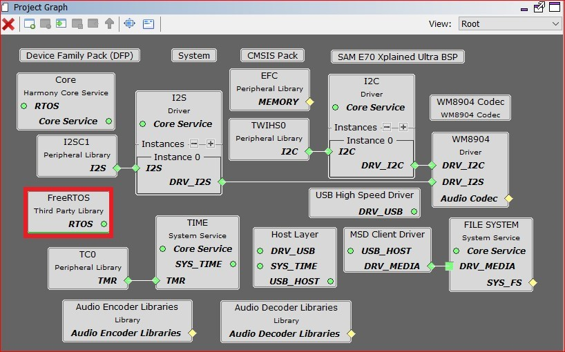
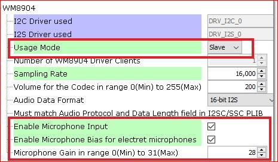
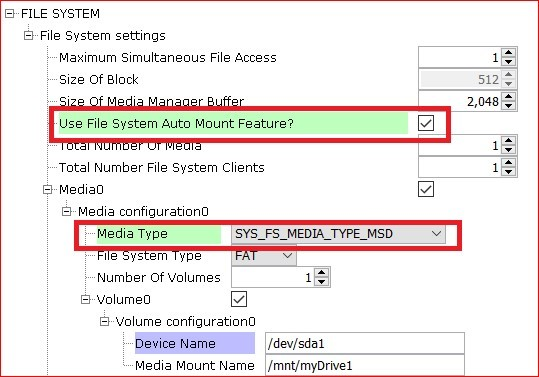
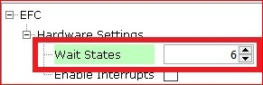
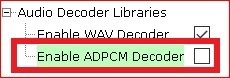

# audio_enc

This readme file provides instructions and information about the MPLAB Harmony 3 Audio Encoder demonstration application, which is included in the MPLAB Harmony Library distribution.

## Description

The audio encoder (audio_enc) application configures the SAM E70 Xplained Ultra development board to be in USB Host Mass Storage Device (MSD) mode. The application supports read/write from/to the FAT file system. When a mass storage device is connected to the development board via its target USB port, the device is mounted. After the MSD is mounted, the application waits for a short button press (< 1 sec) to start recording data from the mic input on the WM8904 Audio Codec Module. This recording will continue until another short press is detected signaling to stop recording. The recorded data is then PCM encoded and packed into a .wav container file and saved on the MSD. The app then waits to playback the last recorded file or encode another file.

All encodings are at 16K sample rate, stereo, and 16 bit depth. The name of the encoded file will be created according to the following (enc16K16b<000-999>.wav). A file will not be written over if it already exists. If a file is found to be already on the MSD, the numeric part of the file name will be incremented once until an unused file name is found. If trying to playback the last encoded file but there has been no file encoded yet, both LEDs will flash and the app will go back to waiting to start encoding a file. If there is a file available to be played, the app will read the .wav file data and write it to the codec for playback.

Command and control to the codec is done through an I2C driver. Data to the codec driver is sent through I2SC via I2S Driver and the output will be audible through the headphone output jack of the WM8904 Audio Codec Module connected to the SAM E70 Xplained Ultra board. The below architecture diagram depicts a representation of the application.

The current development board, SAM E70 Xplained Ultra, supplies one button and two LEDs for control and status feedback. LED 1 is amber and LED 2 is green. The application currently only supports PCM encoding and playback to and from a .wav file container.

Supported audio files are as represented in the table below.

| **Audio Format** | **Sample Rate (kHz)** | **Description** |
| --- | --- | --- |
| PCM | 16 | PCM (Pulse Code Modulation) is an uncompressed format. The digital data is a direct representation of the analog audio waveform. The container for the data will be a WAVE file (.wav) format. It is the native file format used by Microsoft Windows for storing digital audio data. |

## Architecture

The audio encoder (audio_enc) application uses the MPLAB Harmony Configurator to setup the USB Host, FS, Codec, and other items in order to read the music files on a USB MSD drive and play it back on the WM8904 Codec Module. It scans WAV (PCM) format files on mounted FAT USB thumb drive and streams audio through a WM8904 Audio Codec to a speaker. In the application, the number of audio output buffers can always set to be more than two to enhance the audio quality. And, the size of input buffer in this application is chosen to be able to handle all data supported. The following figure shows the architecture for the demonstration.

### Architecture Block Diagram

## Demonstration Features

*   USB MSD Host Client Driver (see H3 USB MSD Host Client Driver Library)
*   FAT File System (see H3 File System Service Library)
*   Audio real-time buffer handling
*   WM8904 Codec Driver (see H3 CODEC Driver Libraries)
*   I2S usage in audio system (see H3 I2S Driver Library Help)
*   DMA (see H3 DMA area)
*   Timer (see H3 Timer area)
*   GPIO Control (see H3 GPIO area)

## Harmony Configuration

1.  Add BSP->SAM E70 Xplained Ultra BSP
2.  Add Audio->Templates->WM8904 Codec
    *   Yes to all popups
    *   Modify WM8904 Codec from SSC to I2SC
    *   Yes to all popups
3.  Add Libraries->USB->Host Stack->MSD Client Driver
    *   a. Yes to all popups
4.  Add Harmony->System Services->FILE SYSTEM
5.  Add Harmony->Audio->Decoder->AudioDecoderLibraries
6.  Add Harmony->Audio->Encoder->AudioEncoderLibraries
7.  Remove FreeRTOS if Bare Metal version
8.  Connect MSD Client Driver: DRV_MEDIA to FILE SYSTEM: DRV_MEDIA After reorganization, your graph should look similar to the following:

If using FreeRTOS, your diagram will be slightly different. You will see an additional block for FreeRTOS as shown below.

## Tools Setup Differences

The default configuration should be correct for the majority of the app. The following configurations will need to be changed for proper operations.

MPLAB Harmony Configurator: Tools->Clock Configuration

Uncheck the Main RC Oscillator and check the "Bypass" for the Main Crystal Oscillator. When the Bypass is checked, it will cause the Main Crystal Oscillator to become unchecked.

Enable the PLLA Clock output.

Enable clocking for the I2S1.

To set the sample rate to a fixed 16KHz, set the PLLA divisor to 2 and the multiplier to 43. Also, set the I2S1 divisor to 63. Please see the two images above.

MPLAB Harmony Configurator: WM8904

MPLAB Harmony Configurator: File System

The Auto Mount feature must be selected in order to expose the media type selection. The media type that is being used in this application is Mass Storage Device. This must be correctly configured, or the storage device will not mount.

MPLAB Harmony Configurator: I2C Driver

If you are using FreeRTOS, set the driver mode back to Asynchronous.

MPLAB Harmony Configurator: System

Set the heap size in Harmony if it is not already set for the linker.

MPLAB Harmony Configurator: EFC

Set the memory wait states to 6, if not already set.

MPLAB Harmony Configurator: Audio Decoder Libraries Disable the ADPCM Decoder for this particular app.

Save and generate code for the framework.

### Building the Application

This section identifies the MPLAB X IDE project name and location and lists and describes the available configurations for the demonstration.

**Description**

The parent folder for these files is audio/apps/audio_enc. To build this project, you must open the audio/apps/audio_enc/firmware/*.X project file in MPLAB X IDE that corresponds to your hardware configuration.

#### MPLAB X IDE Project Configurations

The following table lists and describes supported project configurations.

| **Project Name** | **BSP Used** | **Description** |
| --- | --- | --- |
| audio_enc_sam_e70_xult_wm8904_i2sc | sam_e70_xult | This demonstration runs on the ATSAME70Q21B processor on the SAM E70 Xplained Ultra board with the WM8904 Audio Codec Module attached. The project configuration is for encode/playback of an audio file to/from a USB Mass Storage Device. Data to be tx/rx to/from the Codec via I2S audio protocol using the I2SC PLIB. The WM8904 codec is configured as the slave, and the I2SC peripheral as the master. |
| audio_enc_sam_e70_xult_wm8904_i2sc_freertos | sam_e70_xult | This demonstration runs on the ATSAME70Q21B processor on the SAM E70 Xplained Ultra board with the WM8904 Audio Codec Module attached. The project configuration is for encode/playback of an audio file to/from a USB Mass Storage Device. Data to be tx/rx to/from the Codec via I2S audio protocol using the I2SC PLIB. The WM8904 codec is configured as the slave, and the I2SC peripheral as the master. This demonstration also uses FreeRTOS. |

### Configuring the Hardware

This section describes how to configure the supported hardware.

**Description**

This application uses the I2SC PLIB to transfer data to the WM8904 Audio Codec Daughter Board. To connect to the I2SC, the jumpers (J6, J7, J8, and J9) on the WM8904 Codec Daughter Board must be oriented towards the pink, mic in, connector. See the red outlined jumpers in the below image as reference.

 **Note:** The SAM E70 Xplained Ultra board does not include the WM8904 Audio Codec daughterboard, which is sold separately on microchipDIRECT as part number AC328904.

### Running the Demonstration

This section demonstrates how to run the demonstration.

**Description**

 **Important!** Prior to using this demonstration, it is recommended to review the MPLAB Harmony 3 Release Notes for any known issues.

Compile and program the target device. While compiling, select the appropriate MPLAB X IDE project based. Refer to Building the Application for details.

1.  Connect headphones to the green HP OUT jack of the WM8904 Audio Codec Daughter Board, and a microphone to the pink MIC IN jack.
2.  Connect power to the board. The system will be in a wait state for USB to be connected (amber LED1 blinking).
3.  Connect a USB mass storage device (thumb drive) to the USB TARGET connector of the SAM E70 Xplained Ultra board. You will probably need a USB-A Female to Micro-B Male adapter cable to do so. The application currently can only record WAVE (.wav) format audio files.

## Control Description

1.  Long presses of the push button cause the app to attempt to playback the last encoded file that is saved on the MSD. The two LEDs flash if there is no file that has been encoded.
2.  Short presses of the push button cause the app to start or stop encoding.

Button control is shown in the table below.

### Button Operations

| **Operation** | **Function** |
| --- | --- |
| Long Press (> 1 sec) | Play back the last encoded |
| Short Press (< 1 sec) | Start/Stop Encoding |

## Status Indicator Description

1.  When the application first starts running, it looks to find an attached storage device. If one is not found, LED1 will toggle on and off about every 100 ms indicating that a storage device is not attached.
2.  If/When a storage device is attached, LED1 will turn off.
3.  LED2 will turn on when the application is ready to start encoding or playback the last encoded file. If playback is chosen without first creating an encoded file, LED1 and LED2 will toggle briefly then the app will wait for encoding to start.

LED status indication is shown in the table below.

### LED Status

| **Operation** | **LED 1 Status** | **LED 2 Status** |
| --- | --- | --- |
| No Storage Device Connected | Toggling | Off |
| Storage Device Connected | Off | Don't Care |
| Ready to Encode/Playback | Off | Don't Care |
| Not Ready to Encode/Playback | Off | Off |
| Encoding | Off | Toggling |
| Playback before Encoded File Created | Toggling | Toggling |
