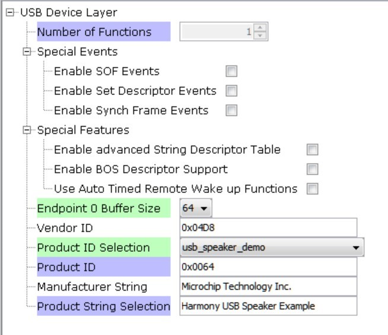

# usb_speaker

This topic provides instructions and information about the MPLAB Harmony 3 USB Speaker Basic demonstration application, which is included in the MPLAB Harmony Library distribution.

## Description

This demonstration application configures the development board to implement a USB Speaker device configured to run at 48 kHz sampling rate at 16 bit per sample.

The USB Device driver in Full Speed mode will interface to a USB Host (such as a personal computer) via the USB Device Stack using the V1.0 Audio Function Driver. The embedded system will enumerate with a USB audio device endpoint and enable the host system to input audio from the USB port using a standard USB Full-Speed implementation. The embedded system will stream USB playback audio to the Codec. The Codec Driver sets up the audio interface, timing, DMA channels and buffer queue to enable a continuous audio stream. The digital audio is transmitted to the codec through an I2S data module for playback through a headphone jack.

## Architecture

The application runs on two target boards, as follows:

1. SAM E70 Xplained Ultra Board

*   Processor runs @ 300 MHz
*   One push button (SW)
*   Two LEDs (amber LED1 and green LED2). Only LED 1 can be used for a USB Device application, due to requiring VBUS sense to be selected rather than LED2.
*   WM8904 Codec Daughter Board mounted on a X32 socket (configured as I2SC1 slave)
*   USB Device interface

 **Note:** The SAM E70 Xplained Ultra board does not include the WM8904 Audio Codec daughterboard, which is sold separately on microchipDIRECT as part number AC328904.

2. PIC32 MZ EF Curiosity 2

*   Processor runs @ 200 MHz
*   4 push buttons (SW1-SW4)
*   3 LEDs (all red LED1-LED3) and RGB LED (LED4).
*   AK4954 Codec Daughter Board mounted on X32 socket
*   USB Device interface

 **Note:** The PIC32 MZ EF Curiosity 2 does not include the AK4954 Audio Codec daughterboard, which is sold separately on microchipDIRECT as part number AC324954.

The usb_speaker_basic application uses the MPLAB Harmony Configurator to setup the USB Audio Device, codec, and other items in order to play back the USB audio through the WM8904 Codec Module.

A USB Host system is connected to the micro-mini USB device connector. The application detects the cable connection, which can also supply device power; recognizes the type of connection (Full Speed); enumerates its functions with the host, isochronous audio streaming playback through device. Audio stream data is buffered in 1 ms frames for playback using the WM8904 Codec daughter board. Audio is heard through the Headphone jack (HP OUT).

The following figure shows the basic architecture for the demonstration.

_Figure 1. Architecture Block Diagram_

## Demonstration Features

*   Audio playback using an WM8904 codec daughterboard on the SAM E70 xPlained Ultra (E70XULT) board.
*   Audio playback using a AK4954 codec daughterboard on the PIC32 MZ EF Curiousity 2 (MZEFC2)
*   USB connection to a host system using the USB Library Device Stack for a USB Speaker device using E70XULT and MZEFC2 boards
*   E70XULT and MZEFC2 board button processing for volume/mute control
*   USB Attach/Detach and mute status using an LED on E70XULT and MZEFC2 boards
*   Utilization of the of SAM E70 I2S peripherals, E70 SSC (as slave) and I2SC (as master), on E70XULT board
*   Utilization of the PIC32 I2S peripheral (as master) on the MZEFC2 board

Note that all the calls to the WM8904 and AK4954 codec drivers use the form DRV_CODEC_xxx rather than DRV_WM8904_xxx. or DRV_AK4954_xxx This is to make the code more generic, such that another codec could be substituted for another without having to make changes to the application code except for the location of the driver�s public header file.

## Tools Setup Differences

### Harmony Configuration

The usb_speaker demonstration uses multiples projects for multiple hardware configurations. MPLAB-X Harmony 3 projects only have one associated configuration. When each Harmony 3 project is created the MPLAB-X Harmony Configurator (MHC) code generation is guided by the processor that is selected.

Start MHC for the project in order to add the application code components. Both projects of the usb_speaker application use the USB Audio stack components. These can be added by selecting the Libraries/USB/Device Stack/Audio Function Driver component template under the MHC Available Components list, as shown below.

Answer yes to all questions. This loads the USB High Speed Driver, the USB Device Layer and Audio Function Driver components.

The Codec component to be used depends on the hardware and peripheral configuration. This is described in the following two sections.

The MHC Project Graph for usb_speaker_basic is shown below for the E70XULT board.

_Figure 2. USB Speaker Basic MHC Project Graph for the SAM E70 Xplained Ultra Board_

Each block provides configuration parameters to generate the application framework code. This includes all the needed drivers, middleware, libraries. The generated framework code is placed under the firmware/src/config directory for this usb_speaker application (usb_speaker_basic_sam_e70_xult_wm8904_usb). The usb_speaker_basic application code is located in the firmware/src directory app.c and app.h files, which utilize the framework drivers, middleware and library APIs located in definitions.h (as generated by the configurator).

A configuration utilizing the I2SC1 peripheral as a slave is used to replace the SSC as a master in the above diagram. Also, a configuration that adds the FreeRTOS block to the above project is also given.

### PIC32 MZ EF Curiosity 2 and the AK4965 Daughter Board Configuration

The MZEFC2 board configuration in similar to the prior E70XULT board configuration, but replaces the WM8904 with an AK4954 Codec, which uses a different I2S peripheral driver.

In the MHC, under Available Components select the BSP PIC32 MZ EF Curiosity 2.0. Under Audio>Templates, double-click on AK4954 Codec Template (shown below). Answer Yes to all questions except for the one regarding FreeRTOS; answer No to that one. This loads the AK4954 Codec component along with associated I2C, I2S and timer driver components.

The project configuration should now look something like this:

_Figure 3. USB Speaker Project Graph for the PIC32 MZ EF Curiosity 2 Board_

## Harmony Code Configuration Options

Each block in the MHC Project Graph may need to be configured through parameters for the specific application. These parameters are accessed by selecting the block with the mouse, and appear in the Configuration Options window, where they can be edited. The next section describes the configuration of the USB, Math, and Codec component blocks for the USB Speaker with �Bass Boost� application.

USB Configuration

The application uses USB Library as a "Device" stack, which will connect to a "Host". The USB High Speed Driver is set to �Full Speed�, V1.0 interface (not �High Speed�, V2.0 Interface):

The USB Device Layer is configured by selecting Product ID Selection as �usb_speaker_demo� with an endpoint buffer size of 64 (bytes). The Product String Selection is changed to �Harmony USB Speaker w/Bass Boost Example�. This information will be used to generate the fullSpeedConfigurationDescriptor array variable structure (located in initialization.c under the config folder) that defines the enumeration of device functions with the USB Host. This structure defines the connection to the host at 48 kHz with 16 bit stereo channel data.

The Audio Function Driver is configured with an Audio Read Queue that matches that of the codec driver write queue for this Audio V1.0 USB Speaker interface.

A playback packet queue of length 64 is set with the Audio Read Queue Size configuration, which should match the Audio Write Queue Size of the WM8904/I2S. The Audio Write Queue Size is unimportant. The The maximum USB packets size is set to 48 * 2 channels/sample * 2 bytes/channel= 192 bytes, which gives a 1ms stereo sample packet size at 48Khz (the standard data frame length at this rate), thus the buffer size needs to be of the same size.

## The WM8904 Codec

Using the SAM E70 Xplained Ultra board and the WM8904 Audio Codec Daughter Board:

The WM8904 codec uses a TWIHS (I2C) interface for configuration and control register setting and either a SSC for audio data or I2SC I2S interface. The default settings are used as shown below for SSC:

When the I2SC1 driver is used for DRV_I2S_0 the usage mode changes to �Slave�

The I2S configuration uses a Transfer queue size of 64, matching that that of the USB Read Queue:

The I2SC1 automatically replaces the �PLIB Used� when it is connected to the I2S block in place of the SSC.

## Pin Manager

The buttons, LED, Switch, I2S and I2C interfaces using GPIO pins via the Microchip Harmony Configurator (MHC) Pin Manager, as follows for the SSC:

| **NAME** | **PORT** | **E70 PIN** | **Notes** |
| --- | --- | --- | --- |
| SSC_TK | PB01 | 20 | I2S BCLK |
| SSC_TF | PB00 | 21 | I2S LRCK |
| PMC_PCK2 | PA18 | 24 | I2S MCLK (Master Clock) |
| SSC_TD | PD26 | 53 | I2S Data |
| SWITCH | PA11 | 66 | Push Button |
| LED | PA05 | 73 | - |
| TWIHS0_TWCK0 | PA04 | 77 | I2C |
| TWIHS0_TWD0 | PA03 | 91 | I2C |
| STDBY | PD11 | 98 | - |
| LED2/VBUS DETECT(J204) | PB08 | 141 | J204 set to VBUS DETECT for USB Device |

When the I2SC1 is used the following pins are used:

| **NAME** | **PORT** | **E70 PIN** | **Notes** |
| --- | --- | --- | --- |
| I2SC1_WS | PE00 | 4 | I2S LRCK (Word Select) |
| I2SC1_DO0 | PE01 | 6 | I2S DO (Data Out) |
| I2SC1_DI0 | PE02 | 7 | I2S DI (Data In) |
| I2SC1_CK | PA20 | 22 | I2S BCLK (Bit Clock) |
| I2SC1_GCLK | PA19 | 23 | I2S MCLK (Bit Clock as used by the E70 I2SC1, I2S Master) |
| PMC_PCK2 | PA18 | 24 | I2S MCLK (Master Clock as used by the WM8904 Codec I2S Slave) |
| SWITCH | PA11 | 66 | Push Button |
| LED1 | PA05 | 73 | - |
| TWIHS0_TWCK0 | PA04 | 77 | I2C |
| TWIHS0_TWD0 | PA03 | 91 | I2C |
| STDBY | PD11 | 98 | - |
| LED2/VBUS DETECT(J204) | PB08 | 141 | J204 set to VBUS DETECT for USB Device |

## Clock Manager

All clocks are generated from the 12 MHz Main Clock oscillator. From this clock is derived the following clocks:

| **Clock** | **Value** | **Description** |
| --- | --- | --- |
| HCLK | 300 MHz | Processor Clock |
| PCK2 | 12 MHz | Peripheral Clock 2 |
| USB FS | 48 MHz | USB Full Speed Clock |

The I2S clocks are setup for 48KHz sampling rate, with stereo 16 bit samples, giving a 32 bit sample frame. The I2S clocks are generated from the WM8904 acting as I2S master using the 12.288 Mhz master clock obtained from Peripheral Clock 2 (PCK2). The I2S clocks will then be generated, as follows:

| **I2S Function** | **Value** | **Description** |
| --- | --- | --- |
| LRCK | 48.000000 K | Sample rate clock |
| BCLK | 3072000 Hz | Bit Rate Clock |
| MCLK | 12.288000 MHz | Master Clock |

## MPLAB Harmony Configurator: Tools>Clock Configuration

### SSC Clock Configuration

Uncheck the Main RC Oscillator and check the �Bypass� for the Main Crystal Oscillator. When the Bypass is checked, it will cause the Main Crystal Oscillator to become disabled. An external MEMS oscillator input on the XIN pin is used for Main Clock generation.

_Figure 4. Main Clock Configuration_

Enable the PCK2 output to enable the WM8904 master clock generation, to enable clocking for the SSC operating as a slave I2S:

_Figure 5. Clock Diagram>Peripheral Clock Enable_

Enable the peripheral clock to the SSC using the Peripheral Clock Enable of the Peripheral Clock Controller:

_Figure 6. Enable SSC Clock_

### I2SC1 Clock Configuration

The I2SC1 master requires the I2SC1_GCLK generate an MCLK to approximate 12.288Mhz. This is sourced using the PLLA Clock (PLLACK), as shown below.

_Figure 7. PLLA Clock Generation for I2SC Peripheral_

_Figure 8. Generic Clock (GCLK) Generation for the I2SC1_

### Harmony Code Generation

All the needed drivers, middleware, libraries and application framework code can be generated from the MHC blocks (MHC components) placed in the MHC Project Graph,

The generated framework code is placed under the firmware/src/config directory under the name of the configuration used for the Harmony 3 project. The initial application code is located in the firmware/src directory app.c and app.h files, which utilize the framework drivers, middleware and library APIs located in definitions.h located in the config directory.

All Harmony applications first execute the SYS_Initialize function, located in initialization.c. This is executed from the main function to initialize various subsystems such as the clock, ports, BSP (board support package), codec, usb, timers, and interrupts. The application APP_Initialize function in app.c is executed last in the generated SYS_Initialize routine after the system initializations have completed.

The SYS_Tasks function (located in tasks.c) is used to update the USB subsystems, WM8904 driver, timers etc., as well as the application state machine (APP_tasks routine in app.c). This function is executed from the main polling loop. The polling loop either execute SYS_Tasks repeatably in the infinite loop to perform the updates, or it the updates occur as separate processes executed at fixed time intervals using an RTOS schedular.

The application utilizes a simple state machine (APP_Tasks executed from SYS_Tasks) with the following functions

1.  Setup the drivers and USB Library interface
2.  Respond to USB Host control commands (�Attach�, �Detach�, �Suspend�)
3.  Initiate and maintains the bidirectional data audio streaming for the "USB Playback" function.
4.  Sense Volume control button pushes and set LED status lights

### Building the Application

This section identifies the MPLAB X IDE project name and location and lists and describes the available configurations for the demonstration.

**Description**

The parent folder for these files is audio/apps/usb_speaker. To build this project, you must open the audio/apps/usb_speaker/firmware/*.X project file in MPLAB X IDE that corresponds to your hardware configuration.

**MPLAB X IDE Project**

This table lists the name and location of the MPLAB X IDE project folder for the demonstration.

#### MPLAB X IDE Project Configurations

This table lists and describes the supported configurations of the demonstration, which are located within ./firmware/src/config.

| **Project Name** | **BSP Used** | **Description** |
| --- | --- | --- |
| us_basic_pic32mz_ef_c2_ ak4954 | pic32_mz_ef_c2 | This demonstration runs on the PIC32 MZ EF Curiosity 2 board with the AK4954 Codec. |
| us_basic_sam_e70_xult_ wm8904_i2sc_usb | sam_e70_xult | This demonstration runs on the SAM E70 Xplained Ultra board with the WM8904 daughter board using the I2SC PLIB. |
| us_basic_sam_e70_xult_ wm8904_ssc_usb | sam_e70_xult | This demonstration runs on the SAM E70 Xplained Ultra board with the WM8904 daughter board using the SSC PLIB. |
| us_basic_sam_e70_xult_ wm8904_ssc_usb_freertos | sam_e70_xult | This demonstration runs on the SAM E70 Xplained Ultra board with the WM8904 daughter board using the I2SC PLIB. It also uses FreeRTOS. |

### Configuring the Hardware

This section describes how to configure the supported hardware.

**Description**

Using the SAM E70 Xplained Ultra board and the WM8904 Audio Codec Daughter Board configured for the I2SC1 PLIB:

Jumper J203, which is next to the SAM E70 Xplained Ultra logo, should be jumpered for VBUS (not LED2).

To connect to the I2SC1, the jumpers (J6, J7, J8, and J9) on the WM8904 Codec Daughterboard must be oriented toward the pink, mic in, connector.

Attach the WM8904 Daughter Board to the X32 connector and connect headphones to the green HP OUT jack, as shown in the figure below.

_WM8904 Audio Codec Daughter Board on SAM E70 Xplained Ultra board. Headphone Out Jack is green. Microphone In Jack is pink. Note: the brown wire is a jumper between EXT1-13 to J601(Camera)-14 and is not used for this demo._

 **Note:** The SAM E70 Xplained Ultra board does not include the WM8904 Audio Codec daughterboard, which is sold separately on microchipDIRECT as part number AC328904.

As shown, the SAM E70 will be programmed via MPLAB-X through the USB cable connected to the EDBG micro-mini connector. Program debug can also be performed over USB this connection, if required.

Using the PIC32 MZ EF Curiosity 2 and the AK4965 Daughter Board:

The PIC32 MZ EF Curiosity board and the AK4954 Audio Codec Daughter Board only requires the AK4954 Codec Daughterboard to be connected to X32 Header 2 as shown below. No jumper settings are required.

_AK4954 Audio Codec Daughter Board on PIC32 MZ EF Curiosity 2 board. Headphone Out Jack is green. Microphone In Jack is pink._

 **Note:** The SAM E70 Xplained Ultra board does not include the AK4954 Audio Codec daughterboard, which is sold separately on microchipDIRECT as part number AC324954.

Connect headphones to the green HP OUT jack of the Codec Daughter Board (as shown in the Figure above).

As shown, the SAM E70 will be programmed through the USB cable connected to the PKOB4 micro-mini connector. Program debug can also be performed over USB this connection.

### Running the Demonstration

This section demonstrates how to run the demonstration.

**Description**

 **Important!** Prior to using this demonstration, it is recommended to review the MPLAB Harmony 3 Release Notes for any known issues.

Compile and program the target device. While compiling, select the appropriate MPLAB X IDE project. Refer to Building the Application for details

Do the following to run the demonstration:

1.  Configure the hardware, as described in the previous section, for the selected MPLAB-X project.

**Important:** The I2SC/SSC jumpers must be in the correct position for the configuration being run.

1.  Connect power to the board, compile the application and program the target device. Run the device. The system will be in a waiting for USB to be connected (LED1 off).
2.  Connect to the USB Host via the micro-mini connector (see Configuring the Hardware).
3.  Allow the Host computer to acknowledge, install drivers (if needed), and enumerate the device. No special software is necessary on the Host side. LED1 will blink after enumeration. It will continue to blink until the Harmony USB Speaker is selected as the speaker device, and the audio stream is started. It will then turn a solid color.
4.  If needed, configure the Host computer to use the usb_speaker as the selected audio recording device. For Windows, this is done in the "Recording" tab in the "Sound" dialog for Windows 7 or by selecting the �Open Sound Setting�. The sound dialog

selection for Both Windows 10 and Windows 7 sound dialog is accessed by right clicking the loudspeaker icon in the taskbar, which will bring up a menu for the selection. This is shown in the Figure below for Windows 10. Windows 7 works in a similar fashion.

_Figure 12. Windows 10 - Sound Dialog Showing Harmony USB Speaker Selection._

 **Note:** The device "Harmony USB Speaker Example" should be available along with a sound level meter indication audio when playing. If no sound level is registering or the name of the Harmony speaker is incorrect, uninstall the driver using the Windows Device Manager, since it may have incorrect configuration set by a similar connection to one of the other MPLAB-X Harmony Audio Demos.

1.  Open a playback application (such as Window Media Player) and initiate playback through the USB Speaker. LED 1 should be a solid color.

Open a playback application (such as Window Media Player) and initiate playback through the USB Speaker

1.  Playback of the should demonstrate that the audio is being heard in the USB Speaker headphones.
2.  Volume can be change by repeated press of SW1. Volume will increase to maximum. It will then mute the speaker (LED1 will fast blink during mute) and then start increasing from minimum volume to maximum after more presses of SW1. NOTE: Volume is also controlled using the PC volume control and the Windows Media Player volume control.,

## Control Description

Button control uses the push button function sequence given in the table below:

| **Function** | **Press** |
| --- | --- |
| Volume Control Level 1 | Low (-66 dB) |
| Volume Control Level 2 | Medium (-48 dB) |
| Volume Control Level 3 | High (-0 dB) |
| Mute | Mute |

**Note:** Mute will transition to Volume Control Level 1 on the next button push.

USB operational status is given by LED1, as with the other USB Audio Demos, as shown below:

| **LED1** | **Status** |
| -------------- | ---------- |
| OFF | USB cable detached |
| ON | USB cable attached |
| Blinking | Playback muted or USB waiting to be configured|

The PIC32MZ EF Curiosity 2 has a second LED (LED2), which indicates if the audio
is streaming or not.

| **LED1** | **Status** |
| -------------- | ---------- |
| OFF | USB Audio not configured|
| ON | USB Audio is streaming|
| Blinking | Playback muted or USB Audio not streaming |
