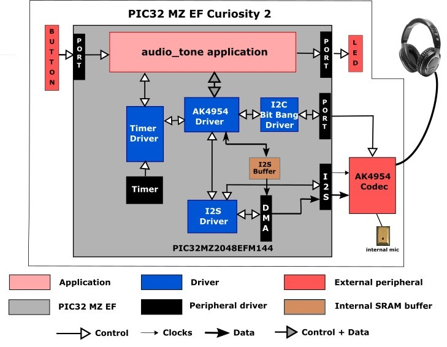
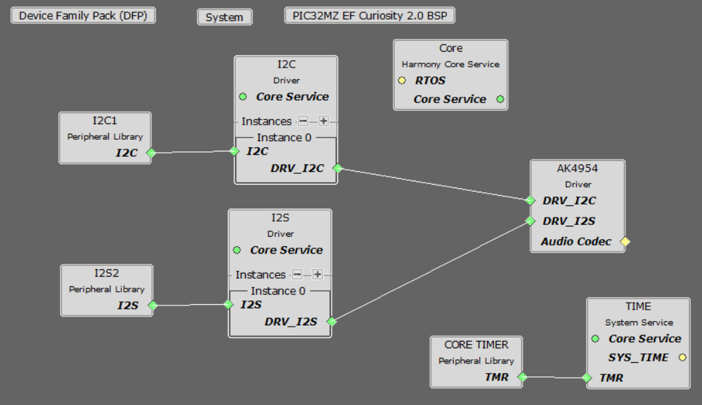
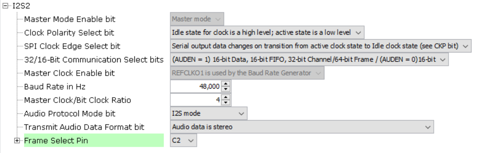
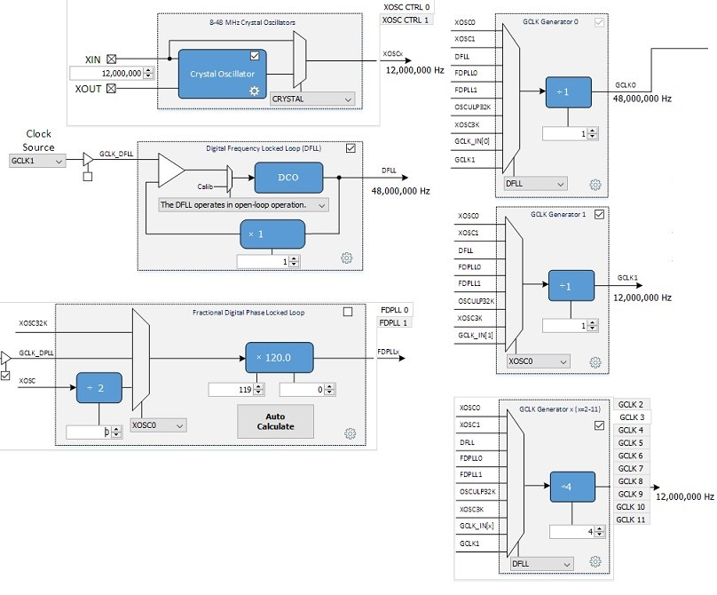
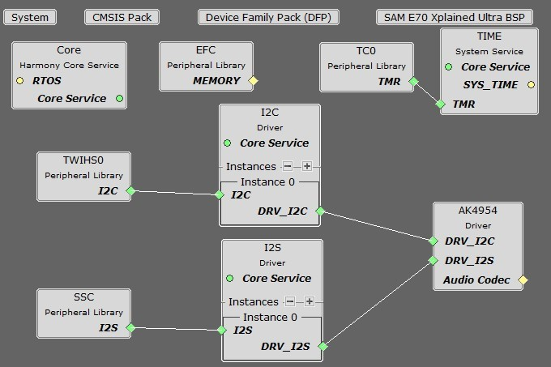

# microphone_loopback

This readme file provides instructions and information about the MPLAB Harmony 3 Microphone Loopback demonstration application, which is included in the MPLAB Harmony Library distribution.

## Description

In this demonstration application, the AK4954 or WM8904 Codec Driver sets up the codec so it can receive audio data through the microphone input on the daughter board and sends this same audio data back out through the on-board headphones, after a delay. The volume and delay are configurable using the on-board pushbutton. The audio by default is sampled at 48,000 samples per second, which is modifiable in the MHC as described below.

To know more about the MPLAB Harmony Codec Drivers, configuring the Codec Drivers, and the APIs provided by the Codec Drivers, refer to Codec Driver Libraries.

## Architecture

There are seven different projects packaged in this application.

**PIC32 MZ EF Curiosity 2.0 Project:**

One project runs on the PIC32 MZ EF Curiosity 2.0 board, using the PIC32MZ2048EFM144 microcontroller with 2 MB of Flash memory and 512 KB of RAM running at 198 MHz. The PIC32 MZ EF Curiosity 2.0 board includes the following features:

*	Four push buttons (SW1-SW4, only SW1 is used)
*	Four LEDs (LED1-LED4, only LED1 is used)
*	AK4954 Codec Daughter Board mounted on X32 HEADER 2 socket
The PIC32 MZ EF Curiosity 2.0 board does not include the AK4954 Audio Codec daughterboard, which is sold separately on microchipDIRECT as part number AC324954.

The program takes up to approximately 2% (33 KB) of the PIC32MZ2048EFM144 microcontroller’s program space, and 55% (283 KB) of the RAM. No heap is used.

The following figure illustrates the application architecture for the PIC32 MZ EF Curiosity 2.0 configuration:

**SAM E54 Curiosity Ultra Projects:**

Two projects run on the SAM E54 Curiosity Ultra Board, which contains a ATSAME54P20A microcontroller with 1 MB of Flash memory and 256 KB of RAM running at 48 MHz using the following features:

*   Two push buttons (SW1 and SW2, only SW1is used)
*   Two LEDs (LED1 and 2, only LED1 is used)
*   WM8904 Codec Daughter Board mounted on a X32 socket

The SAM E54 Curiosity Ultra board does not include the WM8904 Audio Codec daughterboard, which is sold separately on microchipDIRECT as part number AC328904.

The non-RTOS version of the program takes up to approximately 2% (23 KB) of the ATSAME54P20A microcontroller’s program space. The 16-bit configuration uses 45% (115 KB) of the RAM. No heap is used. For the FreeRTOS project, the program takes up to approximately 3% (31 KB) of the ATSAME54P20A microcontroller’s program space, and the 16-bit configuration uses 60% (155 KB) of the RAM. No heap is used.

The following figure illustrates the application architecture for the two SAM E54 Xplained Ultra configurations (RTOS not shown):

The I2S (Inter-IC Sound Controller) is used with the WM8904 codec. The WM8904 is configured in master mode, meaning it generates the I2S clocks (LRCLK and BCLK), and the I2S peripheral is configured as a slave.

**SAM E70 Xplained Ultra Projects:**

Three projects run on the SAM E70 Xplained Ultra Board without a display, which contains a ATSAME70Q21B microcontroller with 2 MB of Flash memory and 384 KB of RAM running at 300 MHz using the following features:

*   One push button (SW1, may be labeled as SW0 on some boards)
*   Two LEDs (LED1 and 2, only LED1 is used)
*   AK4954 or WM8904 Codec Daughter Board mounted on a X32 socket

The SAM E70 Xplained Ultra board does not include the AK4954 or WM8904 Audio Codec daughterboards, which are sold separately on microchipDIRECT as part numbers AC324954 and AC328904, respectively.

The two non-RTOS versions of the program take up to approximately 1% (18 KB) of the ATSAME70Q21B microcontroller’s program space. The 16-bit configuration uses 30% (115 KB) of the RAM. No heap is used. For the FreeRTOS project, the program takes up to approximately 1% (22 KB) of the ATSAME70Q21B microcontroller’s program space, and the 16-bit configuration uses 41% (155 KB) of the RAM. No heap is used.

The following figure illustrates the application architecture for the three SAM E70 Xplained Ultra configurations using the WM8904 (RTOS not shown). The AK4954 version is the same with the substitution of the AK4954 Driver and Codec blocks.

The I2SC (Inter-IC Sound Controller) is used with the WM8904 codec, selected by a strapping option on the WM8904 daughterboard. The WM8904 is configured in slave mode and the I2SC peripheral is a master and generates the I2SC (LRCLK and BCLK) clocks. Other possible configurations are possible but not discussed.

**SAM V71 Xplained Ultra Project:**

This project runs on the SAM V71 Xplained Ultra Board, which contains a ATSAMV71Q21B microcontroller with 2 MB of Flash memory and 384 KB of RAM running at 300 MHz using the following features:

*   Two push buttons (SW0 and 1, only SW0 used)
*   Two LEDs (LED0 and 1, only LED0 used)
*   WM8904 codec (on board)

The program takes up to approximately 1% (13 KB) of the ATSAME70Q21B microcontroller’s program space. The 16-bit configuration uses 74% (284 KB) of the RAM. No heap is used.

The architecture is the same as for the first bare-metal SAM E70 Ultra board configuration; however only it uses the SSC peripheral instead of the I2SC. The WM8904 is configured in master mode and generates the I2SC (LRCLK and BCLK) clocks, and the I2SC peripheral is configured as a slave.

Except for the user interface, the same application code is used without change between the various projects.

The PIC32 or SAM microcontroller (MCU) runs the application code, and communicates with the AK4954 or WM8904 codec via an I2C interface. The audio interface between the microcontroller and the WM8904 codec use the I2S interface. Audio is configured as 16-bit, 48,000 or 16,000 samples per second, I2S format. (16-bit, 48 kHz is the standard rate used for DVD audio. 16 kHz still provides excellent voice quality audio. Another alternative that could be used is 44,100 samples per second. This is the same sample rate used for CD's.

The Master Clock (MCLK) signal used by the codec is generated by the Generic Clock section of the E54, or the Peripheral Clock section of the SAM E70\/V71, and is either 12 MHz (when the codec is configured as a master), or close to 12,288,000 (when the codec is configured as a slave, this frequency being 256 times the sample rate).

The button and LEDs are interfaced using GPIO pins.

As with any MPLAB Harmony application, the SYS_Initialize function, which is located in the initialization.c source file, makes calls to initialize various subsystems as needed, such as the clock, ports, board support package (BSP), screen (if applicable), AK4954 or WM8904 codec, I2S, I2C, DMA, timers, and interrupts.

The codec driver and the application state machines are all updated through calls located in the SYS_Tasks function in the tasks.c file.

When the application’s state machine (APP_Tasks), contained in app.c, is given control it first gets a handle to a timer driver instance and sets up a periodic (alarm) callback. In the next state it gets a handle to the codec driver by calling the

DRV_CODEC_Open function with a mode of DRV_IO_INTENT_WRITE and sets up the volume. The application state machine then registers an event handler APP_CODEC_BufferEventHandler as a callback with the codec driver (which in turn is called by the DMA driver).

A total of MAX_BUFFERS (#defined as 150) buffers are allocated, each able to hold 10 ms of audio (480 samples at 48,000 samples\/second), which is enough for a 1.5 second delay.).

Two indicies, appData.rxBufferIdx and appData.txBufferIdx are used to track the current buffers for both input and output. Initially all buffers are zeroed out. A call to DRV_CODEC_BufferAddWriteRead is made, which writes out the data from the buffer pointed to by appData.txBufferIdx (initially zero), while at the same time data is read from the codec into the buffer pointed to by appData.rxBufferIdx.

On each callback from the DMA, the buffer pointers are advanced, wrapping around at the ends. After the prescribed delay, the audio from the first buffer filled in will be output.

If the button is held down for more than one second, the mode changes, and there is no delay while the volume is being adjusted. Instead of a circular array of buffers, the first two buffers are just toggled back and forth in a ping-pong fashion.

## Demonstration Features

*   Uses the Codec Driver Library to input audio samples from the AK4954 or WM8904 codec, and later write them back out to the codec
*   At a lower level, uses the I2S Driver Library between the codec library and the chosen peripheral (SSC or I2SC or I2S) to send the audio to the codec
*   Using either an array of circular buffers to create an audio delay, or two buffers in ping-pong fashion for no delay, both using DMA
*   Use of two timers: one as a periodic 1 ms timer for the application for button debouncing, and a second used by the Codec Driver (see Timer Driver Library)
*   For the version using the display, use of the touch screen as a UI

## Tools Setup Differences

**For the project using the PIC32MZ, the I2S interface and the AK4954 as a Slave (the I2S peripheral generates the I2S clocks):**

When building a new application, start by creating a 32-bit MPLAB Harmony 3 project in MPLAB X IDE by selecting _File \> New Project_. Chose the Configuration name based on the BSP. Select the appropriate processor (PIC32MZ2048EFM144). Click Finish.

In the MHC, under Available Components select the PIC32 MZ EF Curiosity 2.0. Under _Audio\>Templates_, double-click on AK4954 Codec. Answer Yes to all questions except for the one regarding FreeRTOS; answer No to that one.

You should end up with a project graph that looks like this, after rearranging the boxes:

 Click on the I2S Peripheral. In the Configurations Options, under 32\/16-Bit Communication Select bits, select (AUDEN=1) 24-bit data, 32-bit FIFO, 32-bit Channel\/64-bit Frame. Change Master Clock Enable bit to REFCLK. Set the Frame Select Pin to C2 for the Curiosity 2.0 board. The configuration should look like this:

Click on the I2C1 peripheral.  Tick the checkbox for the Include Force Write I2C Function:

Under Tools, click on Clock Configuration. In the Clock Diagram:

*   Change the Primary Oscillator frequency to 12,000,000 Hz, and select HS under POSCMOD.
*   Change the FPLLRNG to 8-16 MHz, and FPLLMULT to MUL_33.
*   In the Reference CLock section, check the ON and OE checkboxes,, and set ROTRIM1 to 29 and RODIV1 to 8. This should give a REFCLKO1 output of 12,288,000 Hz, which is 256 times the 48 KHz sample rate.

You should end up with a clock diagram like this:

**For projects using the E54, the I2S interface and the WM8904 as a Master (the WM8904 codec generates the I2S clocks):**

When building a new application, start by creating a 32-bit MPLAB Harmony 3 project in MPLAB X IDE by selecting _File \> New Project_. Chose the Configuration name based on the BSP. Select the appropriate processor (ATSAME54P20A). Click Finish.

In the MHC, under Available Components select the BSP SAM E54 Curiosity Ultra. Under _Audio\>Templates_, double-click on WM8904 Codec. Answer Yes to all questions. Click on the WM8904 Codec component (_not_ the WM8904 Driver). Answer Yes to all questions except for the one regarding FreeRTOS; answer Yes or No to that one depending on whether you will be using FreeRTOS or not.

You should end up with a project graph that looks like this, after rearranging the boxes:

Click on the WM8904 Driver. In the Configurations Options, under Audio Data Format, change it to 32-bit I2S. Set the desired Sample Rate if different from the default (48,000) under Sampling Rate.

In the Clock Diagram:

*   Set enable the Crystal Oscillator, change it frequency to 12,000,000 Hz, and select CRYSTAL.
*   Uncheck the Fractional Digital Phase Locked Loop enable (FDPLL 0).
*   In the CLK Generator 0 box, change the input to DFLL for an output of 48 MHz.
*   In the CLK Generator 1 box, change the input to XOSC0 with a divider of 1 for an output of 12 MHz.
*   In the GCLK Generator, uncheck the selection for GCLK 2, and then select the GCLK 3 tab. Choose the DFLL as the input, with a divide by 4 for an output of 12 MHz.

You should end up with a clock diagram like this:

**For projects using the E70, the SSC interface and the AK4954 as a Slave (the SAM E70 generates the I2S clocks):**

When building a new application, start by creating a 32-bit MPLAB Harmony 3 project in MPLAB X IDE by selecting _File \> New Project_. Chose the Configuration name based on the BSP. Select the appropriate processor (ATSAME70Q21B). Click Finish.

In the MHC, under Available Components select the BSP SAM E70 Xplained Ultra. Under _Audio\>Templates_, double-click on AK4954 Codec. Answer Yes to all questions. Click on the AK4954 Codec component (_not_ the AK4954 Driver). In the Configuration Options, under AK4954 Interface, select I2SC instead of SSC. Answer Yes to all questions except for the one regarding FreeRTOS; answer Yes or No to that one depending on whether you will be using FreeRTOS or not.

You should end up with a project graph that looks like this, after rearranging the boxes:

Click on the AK4954 Driver. In the Configurations Options, under Usage Mode, change Master to Slave. Set the desired Sample Rate if different from the default (48,000) under Sampling Rate.

In the Clock Diagram, set MOSCEL to Main Crystal, check the Bypass checkbox, and uncheck the RC Crystal Oscillator and Main Crystal Oscillator boxes, to make use of the 12 MHz external oscillator:

Still in the Clock Diagram, enable the PLLA Clock. Leave the divider at 1 (12 MHz) and change the multiplier to 41 for an output of 492 MHz.

In the Master Clock Controller, select the source (CSS) as PLLACK (492 MHz), all all three dividers as divide by 2 to generate a Processor Clock of 246 MHz and a Master Clock of 123 MHz. In the Programmable Clock Controller section, select the PCK2 tab, select the source (CSS) as PLLACK (492 MHz), the divider of 40 for a PCK2 output of 12,300,000 Hz.

Then check the SSC checkbox in the **Peripheral Clock Controller** section..

**For projects using the I2SC interface and the WM8904 as a Slave (the SAM E70 generates the I2S clocks):**

When building a new application, start by creating a 32-bit MPLAB Harmony 3 project in MPLAB X IDE by selecting _File \> New Project_. Chose the Configuration name based on the BSP. Select the appropriate processor (ATSAME70Q21B). (The WM8904 on the SAM V71 Xplained Ultra cannot be used with I2SC.) Click Finish.

In the the MHC, under Available Components select the BSP SAM E70 Xplained Ultra. Under _Audio\>Templates_, double-click on WM8904 Codec. Answer Yes to all questions. Click on the WM8904 Codec component (_not_ the WM8904 Driver). In the Configuration Options, under WM8904 Interface, select I2SC instead of SSC. Answer Yes to all questions except for the one regarding FreeRTOS; answer Yes or No to that one depending on whether you will be using FreeRTOS or not.

You should end up with a project graph that looks like this, after rearranging the boxes, assuming a non-FreeRTOS project:

Click on the WM8904 Driver. In the Configurations Options, under Usage Mode, change Master to Slave. Set the desired Sample Rate if different from the default (48,000) under Sampling Rate. Select Enable Microphone Input, and Enable Microphone Bias for elecret microphones if appropriate.

If using the SAM E70 Xplained Ultra board, in the Clock Diagram, set MOSCEL to Main Crystal, check the Bypass checkbox, and uncheck the RC Crystal Oscillator and Main Crystal Oscillator boxes, to make use of the 12 MHz external oscillator:

In the Clock Diagram, in the PCK2 tab of the **Programmable Clock Controller** section, check the **On** checkbox, and set CSS to MAINCLK (12 MHz).

The following tables show suggested settings for various sample rates in the Clock Diagram when using the I2SC Peripheral in Master mode. Make sure **PLLA Clock** checkbox is checked, and fill in the values for the PLLA Multiplier and Divider boxes. Select the I2S1 tab under **Generic Clock Controller**, set GCLKCSS to PLLACK, fill in the Divider value as shown, and check the checkbox next to it.

The values in the first table give the lowest error rate, but have varying PLLACK values so it is best to use the UPPCLKDIV selection for CSS under **Master Clock Controller**, for a Processor Clock of 240 MHz.

| **Desired Sample Rate** | **PLLA Multipler** | **PLLA Divider** | **PLLACK** | **I2SC Generic Clock Divider** | **Calculated Sample Rate** | **Error** |
| --- | --- | --- | --- | --- | --- | --- |
| 8000 | 2 | 43 | 258 MHz | 126 | 7998 | -0.025% |
| 16000 | 2 | 43 | 258 MHz | 63 | 15997 | -0.0187% |
| 44100 | 1 | 16 | 192 MHz | 17 | 41117 | 0.0385% |
| 48000 | 2 | 43 | 258 MHz | 21 | 47991 | -0.0187% |
| 96000 | 3 | 43 | 172 MHz | 7 | 95982 | -0.0187% |

The values in the second table have somewhat higher error rates, but use a PLLACK value of 294 MHz which is suitable to be used as a Processor Clock (using the PLLACK selection for CSS) which is closer to the maximum of 300 MHz.

| **Desired Sample Rate** | **PLLA Multipler** | **PLLA Divider** | **PLLACK** | **I2SC Generic Clock Divider** | **Calculated Sample Rate** | **Error** |
| --- | --- | --- | --- | --- | --- | --- |
| 8000 | 2 | 49 | 294 MHz | 144 | 7975 | -0.3125% |
| 16000 | 2 | 49 | 294 MHz | 72 | 15950 | -0.3125% |
| 44100 | 2 | 49 | 294 MHz | 26 | 41170 | 0.1587% |
| 48000 | 2 | 49 | 294 MHz | 24 | 47851 | -0.3104% |
| 96000 | 3 | 49 | 294 MHz | 12 | 95703 | -0.3094% |

It is also possible to change the audio format from 16 to 32-bits. This changes need to be done in the MHC in both the WM8904 Driver and SSC Peripheral. In the current application code (app.h), a #define is also set to the current width.

If using FreeRTOS, in the code you will need to move the call to DRV_WM8904_Tasks(sysObj.drvwm8904Codec0); from the SYS_Tasks function in src\/config\/\<config_name\>\/tasks.c to inside the while(1) loop of _APP_Tasks (just before the call to APP_Tasks).

**For projects using the SSC interface and the WM8904 as a Master (the WM8904 codec generates the I2S clocks):**

When building a new application, start by creating a 32-bit MPLAB Harmony 3 project in MPLAB X IDE by selecting _File \> New Project_. Chose the Configuration name same based on the BSP used. Select the appropriate processor (e.g. ATSAMV71Q21B) depending on your board. Click Finish.

In the MHC, under Available Components select the appropriate BSP (e.g. SAM V71 Xplained Ultra). Under _Audio\>Templates_, double-click on WM8904 Codec. Answer Yes to all questions except for the one regarding FreeRTOS; answer Yes or No to that one depending on whether you will be using FreeRTOS or not.

You should end up with a project graph that looks like this, after rearranging the boxes, assuming a non-FreeRTOS project:

If using the SAM E70 Xplained Ultra board, in the Clock Diagram, in the Clock Diagram, set MOSCEL to Main Crystal, check the Bypass checkbox, and uncheck the RC Crystal Oscillator and Main Crystal Oscillator boxes, to make use of the 12 MHz external oscillator:

If using the ATSAMV71Q21B, in the Clock Diagram set MOSCEL to Main Crystal, uncheck the Bypass checkbox and RC Crystal Oscillator checkbox, and check the Main Crystal Oscillator box.

Also in the Clock Diagram, in the PCK2 tab of the **Programmable Clock Controller** section, check the On checkbox, and set CSS to MAINCLK (12 MHz). Then check the SSC checkbox in the **Peripheral Clock Controller** section.

It is also possible to change the audio format from 16 to 32-bits, and from I2S to Left Justified (SSC only). These changes need to be done in the MHC in both the WM8904, and SSC\/I2SC Peripherals. In the current application code (app.h), a #define is also set to the current width.

If using FreeRTOS, in the code you will need to move the call to DRV_WM8904_Tasks(sysObj.drvwm8904Codec0); from the SYS_Tasks function in src\/config\/\<config_name\>\/tasks.c to inside the while(1) loop of _APP_Tasks (just before the call to APP_Tasks).

### Building the Application

This section identifies the MPLAB X IDE project name and location and lists and describes the available configurations for the demonstration.

**Description**

The parent folder for these files is audio\/apps\/audio_microphone_loopback. To build this project, you must open the audio\/apps\/audio\/audio_microphone_loopback\/firmware\/\*.X project file in MPLAB X IDE that corresponds to your hardware configuration.

## MPLAB X IDE Project Configurations

The following table lists and describes supported configurations.

| **Project Name** | **BSP Used** | **Description** |
| --- | --- | --- |
| mic_loopback_ pic32mz_ef_c2_ ak4954 | pic32mz_ef_curiosity_v2 | This demonstration runs on the PIC32MZ2048EFM144 processor on the PIC32 MZ EF Curiosity 2.0 board and the AK4954 Audio Codec Daughter Board. The configuration is for a 16-bit data width, 48000 Hz sampling frequency, and I2S audio protocol using the I2S PLIB. The AK4954 codec is configured as the slave, and the I2S peripheral as the master. |
| mic_loopback_ sam_e54_cult_ wm8904_ssc | sam_e54_cult | This demonstration runs on the ATSAME54P20A processor on the SAM E54 Curiosity Ultra board and the WM8904 Audio Codec Daughter Board. The configuration is for a 16-bit data width, 48000 Hz sampling frequency, and I2S audio protocol using the SSC PLIB. The WM8904 codec is configured as the master, and the SSC peripheral as the slave. |
| mic_loopback_ sam_e54_cult_ wm8904_ssc_freertos | sam_e54_cult | This demonstration runs on the ATSAME54P20A processor on the SAM E54 Curiosity Ultra board and the WM8904 Audio Codec Daughter Board. The configuration is for a 16-bit data width, 48000 Hz sampling frequency, and I2S audio protocol using the SSC PLIB. The WM8904 codec is configured as the master, and the SSC peripheral as the slave. This demonstration also uses FreeRTOS. |
| mic_loopback_ sam_e70_xult_ ak4954_ssc | sam_e70_xult | This demonstration runs on the ATSAME70Q21B processor on the SAM E70 Xplained Ultra board and the AK4954 Audio Codec Daughter Board. The configuration is for a 16-bit data width, 48000 Hz sampling frequency, and I2S audio protocol using the SSC PLIB. The AK4954 codec is configured as the slave, and the SSC peripheral as the master. |
| mic_loopback_ sam_e70_xult _wm8904_i2sc | sam_e70_xult | This demonstration runs on the ATSAME70Q21B processor on the SAM E70 Xplained Ultra board and the WM8904 Audio Codec Daughter Board. The configuration is for a 16-bit data width, 48000 Hz sampling frequency, and I2S audio protocol using the I2SC PLIB. The WM8904 codec is configured as the slave, and the I2SC peripheral as the master. |
| mic_loopback_ sam_e70_xult_ wm8904_i2sc_freertos | sam_e70_xult | This demonstration runs on the ATSAME70Q21B processor on the SAM E70 Xplained Ultra board and the WM8904 Audio Codec Daughter Board. The configuration is for a 16-bit data width, 48000 Hz sampling frequency, and I2S audio protocol using the I2SC PLIB. The WM8904 codec is configured as the slave, and the I2SC peripheral as the master. This demonstration also uses FreeRTOS. |
| mic_loopback_ sam_v71_xult | sam_v71_xult | This demonstration runs on the ATSAMV71Q21B processor on the SAMV71 Xplained Ultra board along with the on-board WM8904 codec. The configuration is for a 16-bit data width, 48000 Hz sampling frequency, and I2S audio protocol using the SSC PLIB. The WM8904 codec is configured as the master, and the SSC peripheral as the slave. |

### Configuring the Hardware

This section describes how to configure the supported hardware. SAM V71 Xplained Ultra board and the WM8904 Audio Codec Daughter Board, using the SSC PLIB. No configuration is necessary.

**Description**

Using the PIC32 MZ EF Curiosity 2.0 board and the AK4954 Audio Codec Daughter Board, and I2S PLIB. The AK4954 daughter board is plugged into the set of X32 connectors on the right side of the board (X32 HEADER 2).

  **Note:** The PIC32 MZ EF Curiosity 2.0 does not include the AK4954 Audio Codec daughterboard, which is sold separately on microchipDIRECT as part number AC324954.

Using the SAM E54 Curiosity Ultra board and the WM8904 Audio Codec Daughter Board, and the I2S PLIB. All jumpers on the WM8904 should be toward the **front:**

In addition, make sure the J401 jumper (CLK SELECT) is set for the PA17 pin:

  **Note:** The SAM E54 Curiosity Ultra board does not include the WM8904 Audio Codec daughterboard, which is sold separately on microchipDIRECT as part number AC328904.

Using the SAM E70 Xplained Ultra board and the AK4954 Audio Codec Daughter Board, and the SSC PLIB. No special configuration needed.

  **Note:** The SAM E70 Xplained Ultra board does not include the AK4954 Audio Codec daughterboard, which is sold separately on microchipDIRECT as part number AC324954.

Using the SAM E70 Xplained Ultra board and the WM8904 Audio Codec Daughter Board, and the I2SC PLIB. All jumpers on the WM8904 should be toward the **back:**

 **Note:** The SAM E70 Xplained Ultra board does not include the WM8904 Audio Codec daughterboard, which is sold separately on microchipDIRECT as part number AC328904.

Using the SAM V71 Xplained Ultra board with on-board WM8904, with the SSC PLIB. No special configuration needed.

### Running the Demonstration

This section demonstrates how to run the demonstration.

**Description**

 **Important!** Prior to using this demonstration, it is recommended to review the MPLAB Harmony 3 Release Notes for any known issues.

Compile the program using MPLAB X, and program the target device using the EDBG interface. While compiling, select the appropriate MPLAB X IDE project. Refer to Building the Application for details.

Four different delays can be generated. **Tables 1-2** provides a summary of the button actions that can used to control the volume and delay amount.

1.  Connect headphones to the HP OUT jack of the AK4954 or WM8904 Audio Codec Daughter Board (see **Figures 1-2**), or the HEADPHONE jack of the SAM V71 Xplained Ultra board.
2.  If applicable, connect a microphone to the MIC IN jack of the WM8904 Audio Codec Daughter Board, or the MICROPHONE jack of the SAM V71 Xplained Ultra board. (For the AK4954, the internal microphone contained on the daughterboard is used instead.)
3.  The lowest-numbered pushbutton (SW0 or SW1) and LED are used as the user interface to control the program, as shown in Tables 1-3 below, depending on the board used. Initially the program will be in delay-setting mode (LED on) at a medium volume setting. Pressing the pushbutton with the LED on will cycle through four delay settings.
4.  Pressing the pushbutton longer than one second will change to volume-setting mode (LED off). Pressing the pushbutton with the LED off will cycle through four volume settings (including mute). There is never any delay when setting the volume.
5.  Pressing the pushbutton longer than one second again will switch back to delay-setting mode again (LED on).

## Control Descriptions

### Figure 1: AK4954 Audio Codec Daughter Board on PIC32 MZ EF Curiosity 2.0 Board

### Figure 2: WM8904 Audio Codec Daughter Board on SAM E70 Xplained Ultra board

### Table 1: Button Controls for PIC32MZ Ef Curiosity 2.0, SAM E54 Curiosity Ultra board and SAM E70 Xplained Ultra board

(On some E70 boards, SW0\/LED0 are the lowest numbered pushbutton and LED, so use Table 3 instead.)

| **Control** | **Description** |
| --- | --- |
| SW1 short press | If LED1 if off, SW1 cycles through four volume levels (one muted). If LED1 is on, SW1 cycles through four delays: ¼ second, ½ second, 1 second and 1½ seconds. |
| SW1 long press (\> 1 second) | Alternates between modes (LED1 on or off). |

### Table 2: Button Controls for SAM V71 Xplained Ultra board

| **Control** | **Description** |
| --- | --- |
| SW0 short press | If LED0 if off, SW0 cycles through four volume levels (one muted). If LED0 is on, SW0 cycles through four delays: ¼ second, ½ second, 1 second and 1½ seconds. |
| SW0 long press (\> 1 second) | Alternates between modes (LED0 on or off). |
