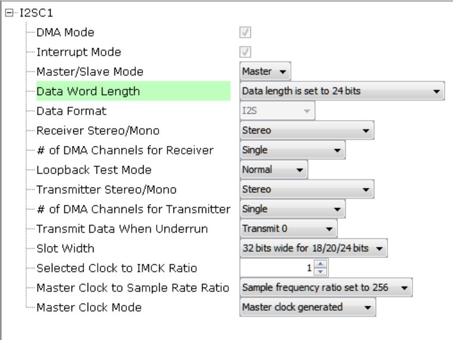
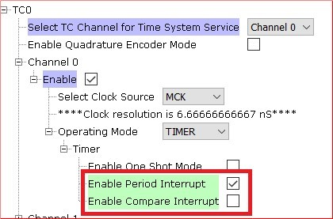
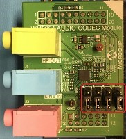

# usb_speaker_hi_res

This topic provides instructions and information about the MPLAB Harmony 3 USB Speaker Hi-Res demonstration application, which is included in the MPLAB Harmony Library distribution.

## Description

This demonstration application configures the development board to implement a USB Speaker device configured to run at 96 Khz sampling rate at 24 bit per sample.

The USB Device driver in Full Speed mode will interface to a USB Host (such as a personal computer) via the USB Device Stack using the V1.0 Audio Function Driver. The embedded system will enumerate with a USB audio device endpoint and enable the host system to input audio from the USB port using a standard USB Full-Speed implementation. The embedded system will stream USB playback audio to the Codec. The Codec Driver sets up the audio interface, timing, DMA channels and buffer queue to enable a continuous audio stream. The digital audio is transmitted to the codec through an I2S data module for playback through a headphone jack.

## Architecture

The application runs on the SAM E70 Xplained Ultra Board, with the following features:

*   One push button (SW1)
*   Two LEDs (amber LED1 and green LED2). Only LED 1 can be used for a USB Device requiring VBUS sense.
*   WM8904 Codec Daughter Board mounted on a X32 socket

 **Note:** The SAM E70 Xplained Ultra board does not include the WM8904 Audio Codec daughterboard, which is sold separately on microchipDIRECT as part number AC328904.

The hi-res application uses the MPLAB Harmony Configurator to setup the USB Audio Device, codec, and other items in order to play back the USB audio through the WM8904 Codec Module.

A USB Host system is connected to the micro-mini USB device connector. The application detects the cable connection, which can also supply device power; recognizes the type of connection (Full Speed); enumerates its functions with the host, isochronous audio streaming playback through device. Audio stream data is buffered in 1 ms frames for playback using the WM8904 Codec daughter board. Audio is heard through the Headphone jack (HP OUT).

The following figure shows the basic architecture for the demonstration.

## Demonstration Features

*   Playback using an WM8904 codec daughterboard on the SAM E70 xPlained Ultra (E70XULT) board.
*   USB connection to a host system using the USB Library Device Stack for a USB Speaker device using E70XULT
*   E70XULT Button processing for volume/mute control
*   USB Attach/Detach and mute status using an LED.
*   Utilization of the of I2S peripheral I2SC (as master)

## Tools Setup Differences

### Harmony Configuration

The MHC Project Graph for usb_speaker_hi-res is shown below.

Each block provides configuration parameters to generate the application framework code. This includes all the needed drivers, middleware, libraries. The generated framework code is placed under the firmware/src/config directory for this usb_speaker application (usb_speaker_basic_sam_e70_xult_wm8904_usb). The usb_speaker_basic application code is located in the firmware/src directory app.c and app.h files, which utilize the framework drivers, middleware and library APIs located in definitions.h (as generated by the configurator).

### Harmony Code Generation

All Harmony applications use the function SYS_Initialize function located in the source file also located in initialization.c. This is executed from main to initialize various subsystems such as the clock, ports, BSP (board support package), codec, usb, timers, and interrupts. The application APP_Initialize function in app.c is also executed in this routine to setup the application code state machine.

The USB, WM8904 driver, and the application state machines (APP_Tasks routine) are all updated via calls located in the function SYS_Tasks, executed from the main polling loop, located in tasks.c.

The application code is contained in the standard source file app.c. The application utilizes a simple state machine (APP_Tasks executed from SYS_Tasks) with the following functions

1.  Setup the drivers and USB Library interface
2.  Respond to USB Host control commands (�Attach�, �Detach�, �Suspend�)
3.  Initiate and maintains the bidirectional data audio streaming for the "USB Playback" function.

### USB Configuration

The application uses USB Library as a "Device" stack, which will connect to a "Host". The USB High Speed Driver is selected to by �Full Speed� (not �High Speed�):

The USB Device Layer is configured by selecting the �usb_speaker_demo� with an endpoint buffer size of 64 (bytes). The Audio

Function Driver is configured for 5 USB endpoints with a single function having 3 interfaces. All of these are defined for a USB Speaker device in the fullSpeedConfigurationDescriptor array variable structure (located in initialization.c under the config folder).

This structure defines the connection to the host at 96 Khz with 24 bit stereo channel data. A packet queue of length

APP_QUEUE_SIZE (set to 32) is used for playback data. The maximum USB packets size is set to 96 * 3 channels/sample * 2 bytes/channel= 576 bytes, which gives a 1ms stereo sample packet size at 96 Khz (the standard data frame length at this rate), thus the buffer size needs to be of the same size.

The Audio Function Driver is configured with a Audio Read Queue that matches that of the codec driver write queue for this Audio V1.0 USB Speaker interface.

The Audio Function Driver is configured with a Audio Read Queue that matches that of the codec driver write queue for this Audio V1.0 USB Speaker interface.

**Note:** The USB Speaker selection generates a USB Full Speed Descriptor with an isochronous audio stream at 48 Khz/2 Channel/16 bits per channel. This code is modified manually to enumerate a 96Khz/ 2 Channel/ 24 bits per channel isochronous audio data stream.

### The WM8904 Codec

The WM8904 codec uses a TWIHS (I2C) interface for configuration and control register setting and either a SSC for audio data or I2SC I2S interface. The default settings are used as shown below:

The I2SC1 driver is in �Slave� mode, thus the codec usage mode changes to �Slave�

The I2S configuration uses a Transfer queue size of 128, matching that that of the USB Read Queue:

The I2S data channel is 32 bit long, although only 24 bits is used. The DMA should be selected to match what is configured in the system block.

The I2SC1 driver is configured for 24 bit data, although a 32 bit channel frame is used. This implies that the 24 bit 3 byte packed data buffer received from the USB audio data stream must be unpacked to 32 bit words (4 byte), since a 24 bit frame is not available for the WM8904.

### Pin Manager

The buttons, LED, Switch, I2S and I2C interfaces using GPIO pins via the Microchip Harmony Configurator (MHC) Pin Manager, as follows for the I2SC1:

| **NAME** | **PORT** | **E70 PIN** | **Notes** |
| --- | --- | --- | --- |
| I2SC1_WS | PE00 | 4 | I2S LRCK (Word Select) |
| I2SC1_DO0 | PE01 | 6 | I2S DO (Data Out) |
| I2SC1_DI0 | PE02 | 7 | I2S DI (Data In) |
| I2SC1_CK | PA20 | 22 | I2S BCLK (Bit Clock) |
| I2SC1_GCLK | PA19 | 23 | I2S MCLK (Bit Clock as used by the E70 I2SC1, I2S Master) |
| PMC_PCK2 | PA18 | 24 | I2S MCLK (Master Clock as used by the WM8904 Codec I2S Slave) |
| SWITCH | PA11 | 66 | Push Button |
| LED1 | PA05 | 73 | - |
| TWIHS0_TWCK0 | PA04 | 77 | I2C |
| TWIHS0_TWD0 | PA03 | 91 | I2C |
| STDBY | PD11 | 98 | - |
| LED2/VBUS DETECT(J204) | PB08 | 141 | J204 set to VBUS DETECT for USB Device |

### Clock Manager

All clocks are generated from the 12 MHz Main Clock oscillator. From this clock is derived the following clocks:

| **Clock** | **Value** | **Description** |
| --- | --- | --- |
| HCLK | 300 MHz | Processor Clock |
| PCK2 | 12 MHz | Peripheral Clock 2 |
| USB FS | 48 MHz | USB Full Speed Clock |

The I2S clocks are setup for 48Khz sampling rate, with stereo 32 bit samples, giving a 64 bit stereo sample frame. The I2S clocks are generated from the WM8904 acting as I2S master using the 24.576 Mhz master clock obtained from I2SC1_GCLK. The I2S clocks will then be generated from the MCLK value below to approximate the following clock rates:

| **I2S Function** | **Value** | **Description** |
| --- | --- | --- |
| LRCK | 96.000000 K | Sample rate clock |
| BCLK | 6114000 Hz | Bit Rate Clock |
| MCLK | 24.576000 MHz | Master Clock |

**MPLAB Harmony Configurator: Tools>Clock Configuration**

### I2SC1 Clock Configuration

Uncheck the Main RC Oscillator and check the �Bypass� for the Main Crystal Oscillator. When the Bypass is checked, it will cause the Main Crystal Oscillator to become disabled. An external MEMS oscillator input on the XIN pin is used for Main Clock generation.

_Clock Diagram>Peripheral Clock Enable_

The I2SC1 master requires the I2SC1_GCLK generate an MCLK to approximate 24.576 hz. This clock is generated from the PLLA Clock (PLLACK), as shown below.

_I2SC1 Configuration of PLLA Clock (PLLACK)_

_I2SC1 GCLK Configuration_

### MPLAB Harmony Configurator: Timer Driver (TC0)

The Timer driver configuration, Timer driver instance 0, is used by a system for button processing (debounce and long press) and LED blink delay. It needs to be set to �Enable Period Interrupt�.

### Building the Application

This section identifies the MPLAB X IDE project name and location and lists and describes the available configurations for the demonstration.

**Description**

The parent folder for these files is audio/apps/usb_speaker_hi_res. To build this project, you must open the audio/apps/usb_speaker_hi_res/firmware/*.X project file in MPLAB X IDE that corresponds to your hardware configuration.

**MPLAB X IDE Project**

This table lists the name and location of the MPLAB X IDE project folder for the demonstration.

#### MPLAB X IDE Project Configurations

This table lists and describes the supported configurations of the demonstration, which are located within ./firmware/src/config.

| **Project Name** | **BSP Used** | **Description** |
| --- | --- | --- |
| us_hi_res_basic_sam_e70_xult_ wm8904_i2sc_usb.X | sam_e70_xult | This demonstration runs on the SAM E70 Xplained Ultra board with the WM8904 daughter board using the I2SC PLIB. |

### Configuring the Hardware

This section describes how to configure the supported hardware.

**Description**

Using the SAM E70 Xplained Ultra board and the WM8904 Audio Codec Daughter Board, using the I2SC PLIB:

Jumper J204, which is next to the SAM E70 Xplained Ultra logo, should be jumpered for VBUS.

To connect to the SSC, the jumpers (J6, J7, J8, and J9) on the WM8904 Codec Daughterboard must be oriented towards the pink, mic in, connector. See the red outlined jumpers in the below image as reference.

 **Note:** The SAM E70 Xplained Ultra board does not include the WM8904 Audio Codec daughterboard, which is sold separately on microchipDIRECT as part number AC328904.

### Running the Application

This section demonstrates how to run the demonstration.

**Description**

 **Important!** Prior to using this demonstration, it is recommended to review the MPLAB Harmony 3 Release Notes for any known issues.

Compile and program the target device. While compiling, select the appropriate MPLAB X IDE project. Refer to Building the Application for details.

Do the following to run the demonstration:

1.  Attach the WM8904 Daughter Board to the X32 connector. Connect headphones to the HP OUT (green) jack of the WM8904 Audio Codec Daughter Board (see **Figure 1**).

**Important:** The I2SC/SSC jumpers must be in the correct position for the configuration being run.

_Figure 1. WM8904 Audio Codec Daughter Board on SAM E70 Xplained Ultra board. Headphone Out Jack is green._

_Note: the brown wire is a jumper which is not relevant for this app._

1.  Connect power to the board, compiles the application and program the target device. Run the device. The system will be in a waiting for USB to be connected (amber LED1 off).
2.  Connect to the USB Host via the micro-mini connector located above the push-button switches on the right side of the board using a standard USB cable.
3.  Allow the Host computer to acknowledge, install drivers (if needed), and enumerate the device. No special software is necessary on the Host side.

_Figure 2. Windows 7 Sound Dialog showing USB Microphone with Sound Level Meter_

1.  If needed, configure the Host computer to use the usb_speaker as the selected audio playback device. For Windows, this is done in the "Playback" tab in the "Sound" dialog (as shown in Figure 2) accessed by right clicking the loudspeaker icon in the taskbar.

 **Note:** The device "Harmony USB Hi Res Speaker Example" should be available along with a sound level meter indication audio when playing. If no sound level is registering, uninstall the driver, since it may have incorrect configuration set by a similar connection to one of the other MPLAB-X Harmony Audio Demos. Disconnect and reconnect the usb cable to the PC. The reconfigured driver will then be installed for the correct USB device.

1.  Open a playback application (such as Window Media Player) and initiate playback through the USB Speaker
2.  Playback will demonstrate that the audio is being heard in the USB Speaker headphones. Use the pushbutton switch to mute and change volume levels to the headphone.

## Control Description

Button control uses the push button function sequence given in the table below:

| **Function** | **Press** |
| --- | --- |
| Volume Control Level 1 | Low (-66 dB) |
| Volume Control Level 2 | Medium (-48 dB) |
| Volume Control Level 3 | High (-0 dB) |
| Mute | Mute |

**Note:** Mute will transition to Volume Control Level 1 on the next button push.

USB operational status is given by LED, as shown below:

| **LED Status** | **Status** |
| --- | --- |
| OFF | USB cable detached |
| ON | USB cable attached |
| Blinking | Playback muted |
