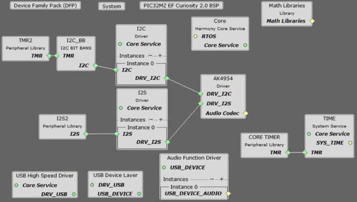
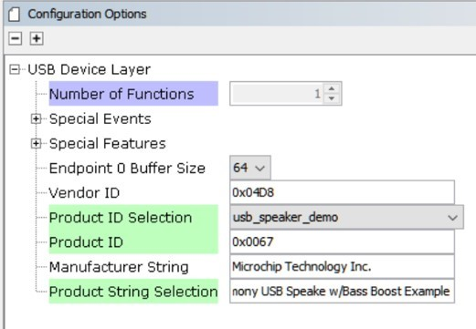
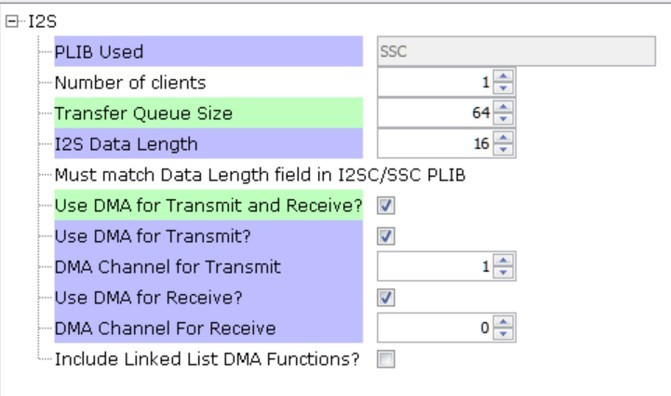
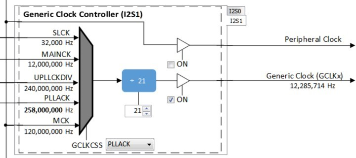
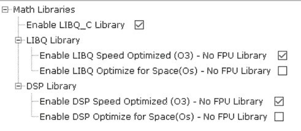
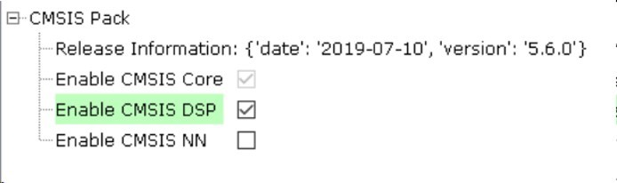
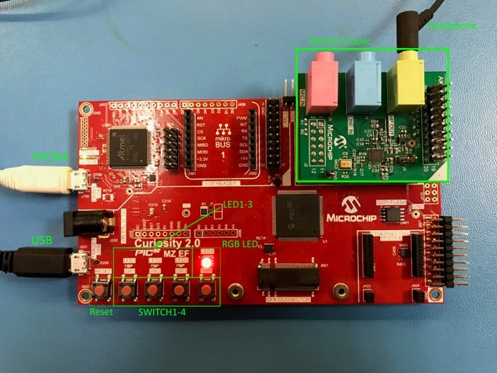
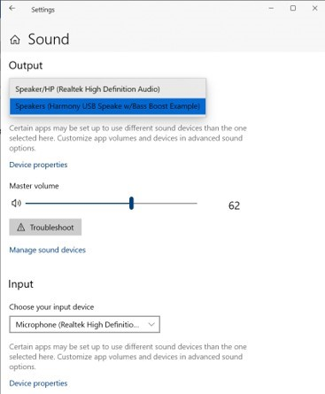

# usb_speaker_bass_boost

This topic provides instructions and information about the MPLAB Harmony 3 USB Speaker with �Bass Boost� audio enhancement demonstration application which is included in the MPLAB Harmony Library distribution.

## Description

This demonstration application configures the development board to implement a USB Speaker device configured to run at 48 Khz sampling rate at 16 bit per sample and process the USB audio input through a "Bass Boost" filter (using either the CMSIS-DSP or the PIC32 MZ EF DSP library functions) prior to playback.

The USB Device driver in Full Speed mode will interface to a USB Host (such as a personal computer) via the USB Device Stack using the V1.0 Audio Function Driver. The embedded system will enumerate with a USB audio device endpoint and enable the host system to input audio from the USB port using a standard USB Full-Speed implementation. The embedded system will stream USB playback audio to a "Bass Boost" filter prior to the audio output for playback through codec hardware.

The USB Device driver in Full Speed mode will interface to a USB Host (such as a personal computer) via the USB Device Stack using the V1.0 Audio Function Driver. The embedded system will enumerate with a USB audio device endpoint and enable the host system to input audio from the USB port using a standard USB Full-Speed implementation. The embedded system will stream USB playback audio to a "Bass Boost" filter prior to the audio output for playback through codec hardware.

## Architecture

The application runs on two target boards, as follows:

1. SAM E70 Xplained Ultra Board

*   Processor runs @ 300 MHz
*   One push button (SW)
*   Two LEDs (amber LED1 and green LED2). Only LED 1 can be used for a USB Device application, due to requiring VBUS sense to be selected rather than LED2.
*   WM8904 Codec Daughter Board mounted on a X32 socket (configured as I2SC1 Master)
*   USB Device interface

  **Note:** The SAM E70 Xplained Ultra board does not include the WM8904 Audio Codec daughterboard, which is sold separately on microchipDIRECT as part number AC328904.

2. PIC32 MZ EF Curiosity 2

*   Processor runs @ 200 MHz
*   4 push buttons (SW1-SW4)
*   3 LEDs (all red LED1-LED3) and RGB LED (LED4).
*   AK4954 Codec Daughter Board mounted on X32 socket
*   USB Device interface

  **Note:** The PIC32 MZ EF Curiosity 2 does not include the AK4954 Audio Codec daughterboard, which is sold separately on microchipDIRECT as part number AC324954.

The usb_speaker_bass_boost application uses the MPLAB Harmony Configurator to setup the USB Audio Device, codec, and other items in order to play back the USB audio through the Codec Module.

The USB Host system that can provide streaming audio (like a PC) is connected to the micro-mini USB device connector. The application then detects the cable connection, which can also supply device power; recognizes the type of connection (Full Speed); enumerates the devices functions it can provide to the host, and then selects the isochronous audio streaming playback. Audio stream data is buffered in 1 MS frames for playback using the WM8904 Codec daughter board. Audio is heard through the Headphone jack (HP OUT).

A USB Host system is connected to the micro-mini USB device connector. The application detects the cable connection, which can also supply device power; recognizes the type of connection (Full Speed); enumerates its functions with the host, isochronous audio streaming playback through device. Audio stream data is buffered in 1 MS frames for playback using the WM8904 Codec daughter board. Audio is heard through the Headphone jack (HP OUT).

### Bass Boost Filter

The �Bass Boost� audio enhancement is the 16 bit fixed-point implementation of a "Peak Shelving Filter", described by:

NOTES:

1.  The parameter "K" sets the transition frequency, Fc, above where the boost goes away.
2.  The parameter "V0" sets the boost or cut value in dB
3.  The parameter �root2� adjusts the slope of the transition (replaces square root of 2) Giving the coefficients of 2nd-order difference equation:

The Direct-Form 1 implementation (without scaling) is shown below:

_Figure 1. Biquad Filter - Direct Form 1_

The a0 scaling parameter can assumed to be 1, but for fixed point coefficient multiplies the right hand side coefficients should be scaled to fit into the required �Q� format. See LIBQ or CMIS-DSP library documentation for the defined Q formats for fixed point values required by the library.

The response of the filter for a bass boost of 6dB and a cutoff of 200Hz is shown below

_Figure 2. Peak Shelving Filter Frequency Response, Fc=200 Hz, Gboost = 6 dB_

The gain is boosted below ~350 Hz and attenuated by -6dB above 800Hz, with a transition in between. the -6dB attenuation of the upper frequencies give headroom such that the boost does not overly saturate the audio output.

_Figure 3. USB Speaker w/Bass Boost - Block Diagram_

## Demonstration Features

*   Playback using an WM8904 codec daughterboard on the SAM E70 xPlained Ultra (E70XULT) board.
*   Playback using an AK4954 codec daughterboard on the PIC32 MZ EF Curiousity 2 (MZEFC2) board
*   USB connection to a host system using the USB Library Device Stack for a USB Speaker device using E70XULT or MZEFC2
*   Button processing for volume/mute/Bass Boost control using E70XULT or MZEFC2
*   USB Attach/Detach and mute status using an LED using E70XULT or MZEFC2
*   Utilization of the of I2S peripheral, I2SC (as master), for the E70XULT
*   Utilization of the I2S peripheral for the MZEFC2
*   Utilization of the DSP Math libraries (CMSIS-DSP and LIBQ/DSP) for both the ARM and MIPS processors to implement "Bass Boost" audio enhancement filters

Note that all the calls to the WM8904 and AK4954 codec drivers use the form DRV_CODEC_xxx rather than DRV_WM8904_xxx. or DRV_AK4954_xxx This is to make the code more generic, such that another codec could be substituted for another without having to make changes to the application code except for the location of the driver�s public header file.

## Tools Setup Differences

### Harmony Configuration

The usb_speaker_bass_boost demonstration uses multiples projects for multiple hardware configurations. MPLAB-X Harmony 3 projects only have one associated configurations. When each Harmony 3 project is created the MPLAB-X Harmony Configurator (MHC) code generation is guided by the processor that is selected.

Start MHC for the project in order to add the application code components. Both projects of the usb_speaker_bass_boost application use the USB Audio stack components. These can be added by selecting the Libraries/USB/Device Stack/Audio Function Driver component template under the MHC Available Components list, as shown below.

Answer yes to all questions. This loads the USB High Speed Driver, the USB Device Layer and Audio Function Driver components.

Additional MHC components for Math and Codec depend on the hardware configuration and are described in the next two sections.

The MHC Project Graph for usb_speaker_bass_boost is shown below.

### PIC32 MZ EF Curiosity 2 and the AK4965 Daughter Board Configuration

In the MHC, under Available Components select the BSP PIC32 MZ EF Curiosity 2.0. Under Audio>Templates, double-click on AK4954 Codec Template (shown below). Answer Yes to all questions except for the one regarding FreeRTOS; answer No to that one. This loads the AK4954 Codec component along with associated I2C, I2S and timer driver components.

Select the Audio/Math/Math Libraries component to load the libq_c, libq/dsp libraries, as shown below

The project configuration should now look something like this:

_Figure 4. USB Speaker w/Bass Boost MHC Project Graph showing the PIC32 Math Libraries Component Block._

### SAM E70 Xplained Ultra board and the WM8904 Audio Codec Daughter Board Configuration

When building a new application, start by creating a 32-bit MPLAB Harmony 3 project in MPLAB X IDE by selecting File > New Project. Chose the Configuration name based on the BSP used. Select the appropriate processor (ATSAME70Q21B). Click Finish.

In the MHC, under Available Components select the appropriate BSP (SAM E70 Xplained Ultra). Under Audio>Templates, double-click on WM8904 Codec. Answer Yes to all questions except for the one regarding FreeRTOS; answer No to that one.

Select the Libraries/USB/Device Stack/Audio Function Driver component template, as shown below. Answer yes to all questions. This loads the USB High Speed Driver, the USB Device Layer and Audio Function Driver components.

To add the CMSIS-DSP Library to the project, select the CMSIS packs component.

The project configuration should look something like this:

_Figure 5. The USB Speaker w/Bass Boost Project MHC Project Graph Showing the CMSIS-DSP Library Block (CMSIS Pack)_

## Harmony Code Configuration Options

Each block in the MHC Project Graph may need to be configured through parameters for the specific application. These parameters are accessed by selecting the block with the mouse, and appear in the Configuration Options window, where they can be edited. The next section describes the configuration of the USB, Math, and Codec component blocks for the USB Speaker with �Bass Boost� application

## USB Configuration

The application uses USB Library as a "Device" stack, which will connect to a "Host". The USB High Speed Driver is set to �Full Speed�, V1.0 interface (not �High Speed�, V2.0 Interface):

The USB Device Layer is configured by selecting Product ID Selection as �usb_speaker_demo� with an endpoint buffer size of 64 (bytes). The Product String Selection is changed to �Harmony USB Speaker w/Bass Boost Example�. This information will be used to generate the fullSpeedConfigurationDescriptor array variable structure (located in initialization.c under the config folder) that defines the enumeration of device functions with the USB Host. This structure defines the connection to the host at 48 Khz with 16 bit stereo channel data.

The Audio Function Driver is configured with an Audio Read Queue that matches that of the codec driver write queue for this Audio V1.0 USB Speaker interface.

A playback packet queue of length 64 is set with the Audio Read Queue Size configuration, which should match the Audio Write Queue Size of the WM8904/I2S. The Audio Write Queue Size is unimportant. The The maximum USB packets size is set to 48 * 2 channels/sample * 2 bytes/channel= 192 bytes, which gives a 1ms stereo sample packet size at 48Khz (the standard data frame length at this rate), thus the buffer size needs to be of the same size.

### The WM8904 Codec

_Using the SAM E70 Xplained Ultra board and the WM8904 Audio Codec Daughter Board:_

The WM8904 codec uses a TWIHS (I2C) interface for configuration and control register setting and the I2SC1 peripheral interface. This application uses the I2SC1 I2S peripheral interface in Master mode, as shown below:

When the I2SC1 driver is used for DRV_I2S_0 the usage mode changes to �Slave�

The I2S configuration uses a Transfer queue Size of 64 and I2S Data Length of 16, matching that that of the USB Read Queue. Bidirectional DMA is set (using 2 channels) for data transfer.

## Pin Manager

The following pins are used for Clocks, I2SC1, I2C, Reset, LEDs, Switches, and VBUS Detect:

The I2SC1 peripheral uses the following pins:

| **NAME** | **PORT** | **E70 PIN** | **Notes** |
| --- | --- | --- | --- |
| I2SC1_WS | PE00 | 4 | I2S LRCK (Word Select) |
| I2SC1_DO0 | PE01 | 6 | I2S DO (Data Out) |
| I2SC1_DI0 | PE02 | 7 | I2S DI (Data In) |
| I2SC1_CK | PA20 | 22 | I2S BCLK (Bit Clock) |
| I2SC1_GCLK | PA19 | 23 | I2S MCLK (Bit Clock as used by the E70 I2SC1, I2S Master) |
| PMC_PCK2 | PA18 | 24 | I2S MCLK (Master Clock as used by the WM8904 Codec I2S Slave) |
| SWITCH | PA11 | 66 | Push Button |
| LED1 | PA05 | 73 | - |
| TWIHS0_TWCK0 | PA04 | 77 | I2C |
| TWIHS0_TWD0 | PA03 | 91 | I2C |
| STDBY | PD11 | 98 | - |
| LED2/VBUS DETECT(J204) | PB08 | 141 | J204 set to VBUS DETECT for USB Device |

## Clock Manager

All clocks are generated from the 12 MHz Main Clock oscillator. From this clock is derived the following clocks:

| **Clock** | **Value** | **Description** |
| --- | --- | --- |
| HCLK | 240 MHz | Processor Clock |
| PCK2 | 12 MHz / 12.288 MHz | Peripheral Clock 2 SSC/I2SC1 |
| USB FS | 48 MHz | USB Full Speed Clock |

The I2S clocks are setup for 48Khz sampling rate, with stereo 16 bit samples, giving a 32 bit sample frame. The I2S clocks are generated from the WM8904 acting as I2S master using the 12.288 Mhz master clock obtained from Peripheral Clock 2 (PCK2). The I2S clocks will then be generated, as follows:

| **I2S Function** | **Value** | **Description** |
| --- | --- | --- |
| LRCK | 48.000000 K | Sample rate clock |
| BCLK | 3072000 Hz | Bit Rate Clock |
| MCLK | 12.288000 MHz | Master Clock |

## MPLAB Harmony Configurator: Tools>Clock Configuration

Uncheck the Main RC Oscillator and check the �Bypass� for the Main Crystal Oscillator. When the Bypass is checked, it will cause the Main Crystal Oscillator to become disabled. An external MEMS oscillator input on the XIN pin is used for Main Clock generation.

### I2SC1 Clock Configuration

The I2SC1 master requires the I2SC1_GCLK generate an MCLK to approximate 12.288Mhz. This is sourced using the PLLA Clock (PLLACK), as shown below.

_USB Speaker PLLA Clock_

USB Speaker I2S1 Bit Clock for 48Mhz operation

_Figure 6. I2SC1 Clock Configuration_

#### _AK4954 Codec_

_Using the PIC32 MZ EF Curiosity 2 and the AK4965 Daughter Board:_

Click on the I2S2 Peripheral. Set the Frame Select Pin to C2. This is used to sense the start of the Left/Right bit frame clock.

Select the I2S driver and change the Transfer Queue Size to 64, as shown below

Select the I2C1 component and select the �Include Force Write I2C ��, This is required for the case where the AK4954 is in reset and does not respond with NACK when the I2C operation completes.

### Math Library

_Using the PIC32 MZ EF Curiosity 2 with the AK4965 Daughter Board:_

The LIBQ/DSP are used with MIPS MCU with microAptiv core require The default configuration of the audio/math/math libraries component is used, as shown below:

The DSP Library requires the LIBQ library to be selected.

_Using the SAM E70 Xplained Ultra board and the WM8904 Audio Codec Daughter Board:_

The CMSIS-DSP Library is optimized for use with the ARM M0-M7 MCU cores. It is selected using the CMSIS-Pack component (which is loaded automatically with the processor core component), as shown below:

### Harmony Code Generation

All the needed drivers, middleware, libraries and application framework code can be generated from the MHC blocks (MHC components) placed in the MHC Project Graph,

The generated framework code is placed under the firmware/src/config directory under the name of the configuration used for the Harmony 3 project. The initial application code is located in the firmware/src directory app.c and app.h files, which utilize the framework drivers, middleware and library APIs located in definitions.h located in the config directory.

All Harmony applications first execute the SYS_Initialize function, located in initialization.c. This is executed from the main function to initialize various subsystems such as the clock, ports, BSP (board support package), codec, usb, timers, and interrupts. The application APP_Initialize function in app.c is executed last in the generated SYS_Initialize routine after the system initializations have completed.

The SYS_Tasks function (located in tasks.c) is used to update the USB subsystems, WM8904 driver, timers etc., as well as the application state machine (APP_tasks routine in app.c). This function is executed from the main polling loop. The polling loop either execute SYS_Tasks repeatably in the infinite loop to perform the updates, or it the updates occur as separate processes executed at fixed time intervals using an RTOS schedular.

The application utilizes a simple state machine (APP_Tasks executed from SYS_Tasks) with the following functions

1.  Setup the drivers and USB Library interface
2.  Respond to USB Host control commands (�Attach�, �Detach�, �Suspend�)
3.  Initiate and maintains the bidirectional data audio streaming for the "USB Playback" function.

### Building the Application

This section identifies the MPLAB X IDE project name and location and lists and describes the available configurations for the demonstration.

**Description**

The parent folder for these files is audio/apps/usb_speaker_bass_boost. To build this project, you must open the audio/apps/usb_speaker_bass_boost/firmware/*.X project file in MPLAB X IDE that corresponds to your hardware configuration.

#### MPLAB X IDE Project Configurations

This table lists and describes the supported configurations of the demonstration, which are located within ./firmware/src/config.

| **Project Name** | **BSP Used** | **Description** |
| --- | --- | --- |
| us_bb_pic32_mz_ef_c2_ak4954 | pic32_mz_ef_c2 | This demonstration runs on the PIC32 MZ EF Curiosity 2 with the AK4954 Codec |
| us_bb_sam_e70_xult_wm8904_ i2sc_usb | sam_e70_xult | This demonstration runs on the SAM E70 xPlained Ultra board with the WM8904 Codec |

### Configuring the Hardware

This section describes how to configure the supported hardware.

**Description**

Using the SAM E70 Xplained Ultra board and the WM8904 Audio Codec Daughter Board configured for the I2SC1 PLIB:

Jumper J203, which is next to the SAM E70 Xplained Ultra logo, should be jumpered for VBUS (not LED2).

To connect to the I2SC1, the jumpers (J6, J7, J8, and J9) on the WM8904 Codec Daughterboard must be oriented toward the pink, mic in, connector.

Attach the WM8904 Daughter Board to the X32 connector and connect headphones to the green HP OUT jack, as shown in the figure below.

_WM8904 Audio Codec Daughter Board on SAM E70 Xplained Ultra board. Headphone Out Jack is green. Microphone In Jack is pink. Note: the brown wire is a jumper between EXT1-13 to J601(Camera)-14 and is not used for this demo._

 **Note:** The SAM E70 Xplained Ultra board does not include the WM8904 Audio Codec daughterboard, which is sold separately on microchipDIRECT as part number AC328904.

As shown, the SAM E70 will be programmed via MPLAB-X through the USB cable connected to the EDBG micro-mini connector. Program debug can also be performed over USB this connection, if required.

Using the PIC32 MZ EF Curiosity 2 and the AK4965 Daughter Board:

The PIC32 MZ EF Curiosity board and the AK4954 Audio Codec Daughter Board only requires the AK4954 Codec Daughterboard to be connected to X32 Header 2 as shown below. No jumper settings are required.

_AK4954 Audio Codec Daughter Board on PIC32 MZ EF Curiosity 2 board. Headphone Out Jack is green. Microphone In Jack is pink._

 **Note:** The SAM E70 Xplained Ultra board does not include the AK4954 Audio Codec daughterboard, which is sold separately on microchipDIRECT as part number AC324954.

Connect headphones to the green HP OUT jack of the Codec Daughter Board (as shown in the Figure above).

As shown, the SAM E70 will be programmed through the USB cable connected to the PKOB4 micro-mini connector. Program debug can also be performed over USB this connection.

### Running the Demonstration

This section demonstrates how to run the demonstration.

**Description**

 **Important!** Prior to using this demonstration, it is recommended to review the MPLAB Harmony 3 Release Notes for any known issues.

Configure the board as described in the previous section. Attach either the EDBG or PKOB4 USB cable from the PC Host to the board, as described in the prior section.

To compile, select the appropriate MPLAB X � IDE project configuration (see Table above). Compile and program the target device. Refer to Building the Application for details Do the following to run the demonstration:

1.  After connecting a standard USB cable from the Host PC to either the EDBG or PKOB4 of the respective board, compile the application and program the target device. Run the device. The system will be in a waiting for the USB to be connected (LED1 off). The RGB LED on the Curiosity 2 board will run red, indicating no USB connection.
2.  Connect a standard USB cable to the USB Host via the micro-mini connector located, either:
    *   Above the push-button switches on the right side of the SAM E70 Xplained board, or
    *   Above and to the left of the Reset switch on the PIC32 MZ EF Curiosity 2 board
3.  Allow the Host computer to acknowledge, install drivers (if needed), and enumerate the device. No special software is necessary on the Host side.

LED1 will turn on as the USB function is enumerated (it may blink if audio is not streaming over the connection). The RGB LED on the Curiosity board will turn from red to green.

If needed, configure the Host computer to use the usb_speaker as the selected audio recording device. For Windows 7, this is done in the "Playback" tab in the "Sound" dialog accessed by right clicking the loudspeaker icon on the taskbar. For Windows 10, this is accessed by right clicking the loudspeaker icon on the taskbar and clicking �Open Sound Settings�. Select the �Speaker( Harmony USB Speaker w/Bass Boost Example)� as the default device. Now all sounds should be heard through the headphones

_Windows 10 Sound Setting showing USB Speaker w/Bass Boost Example selection._

 **Note:** The "Harmony USB Speaker w/Bass Boost Example" should be available along with a sound level meter, indicating audio when playing. If no sound level is registering when audio is playing, uninstall the driver, since it may have incorrect configuration set by a similar connection to one of the other MPLAB-X Harmony USB Audio Demos.

1.  Open a playback application (such as Window Media Player) and initiate playback, which should be heard throught the headphones.
2.  Four volume levels are available, when pressing SWITCH 1. Initially, it is set to the lowest playback level. Pressing 2 more times will change the volume from the lowest to the highest playback level. Pressing 1 more time will mute audio and LED 1 will blink slowly. Pressing the button again will go back to the initial setting, from which the volume sequence began.
3.  �Bass Boost� is demonstrated as follows:

Using the SAM E70 Xplained board and the WM8904 Daughter Board

A �Long Press� of SWITCH 1 will turn on �Bass Boost�. This will enhance (boost) the lower audio frequencies heard through the headphones. You can cycle from boosted audio to normal audio by repeating the �Long Press� of SWITCH1.

Using the PIC32 MZ EF Curiosity 2 and the AK4965 Daughter Board

Pressing SWITCH 2 will turn on LED 2 and the RGB LED will turn blue (indicating boost). The audio �Bass Boost� filter will be at its lowest level. Pressing SWITCH 2 repeatedly will cycle through 4 levels of �Bass Boost� (4, 6, 8, and 10 dB). A �Long� press of SWITCH 2 will turn off the �Bass Boost�, LED 2 will turn off and the RGB LED will turn green. Pressing again will turn on �Bass Boost� at the previous level.

## Control Description

Using the SAM E70 Xplained board and the WM8904 Daughter Board:

Button control uses the push button function sequence given in the table below:

| **Function** | **Press** |
| --- | --- |
| Volume Control Level 1 | Low (-66 dB) |
| Volume Control Level 2 | Medium (-48 dB) |
| Volume Control Level 3 | High (-0 dB) |

| Mute | Mute |
| --- | --- |

**Note:** Mute will transition to Volume Control Level 1 on the next button push.

USB operational status is given by LED, as shown below:

| **LED Status** | **Status** |
| --- | --- |
| OFF | USB cable detached |
| ON | USB cable attached |
| Blinking - Fast | USB cable attached (no audio) |
| Blinking - Slow | Playback muted |

Using the PIC32 MZ EF Curiosity 2 and the AK4965 Daughter Board:

Button control uses SWITCH 1 in the push button function sequence given in the table below:.

| **Function** | **Press** |
| --- | --- |
| Volume Control Level 1 | Low (-66 dB) |
| Volume Control Level 2 | Medium (-48 dB) |
| Volume Control Level 3 | High (-0 dB) |
| Mute | Mute |

**Note:** Mute will transition to Volume Control Level 1 on the next button push.

USB operational status is given by LED, as shown below:

 <td colspan="2"> **LED1 Status** | **Status** |
| --- |
 <td colspan="2"> OFF | USB cable detached or (USB attached & invalid enumeration) |
 <td colspan="2"> ON | USB cable attached |
 <td colspan="2"> Blinking - Fast | USB cable attached (no audio) |
 <td colspan="2"> Blinking - Slow | Playback muted |
| **LED2/RGB LED Status**  <td colspan="2"> **Status** |
| OFF/Red  <td colspan="2"> USB cable detached or (USB attached & invalid enumeration) |
| ON/Green  <td colspan="2"> USB cable attached and audio enumerated (normal audio) |
| ON/Blue  <td colspan="2"> USB cable attached and audio enumerated (�Bass Boost� enabled) |
| Blinking � Fast/Red  <td colspan="2"> USB cable attached (no audio) |
| Blinking � Slow/Green or Blue  <td colspan="2"> Audio Playback muted in either normal (green) or boosted (blue) modes |
