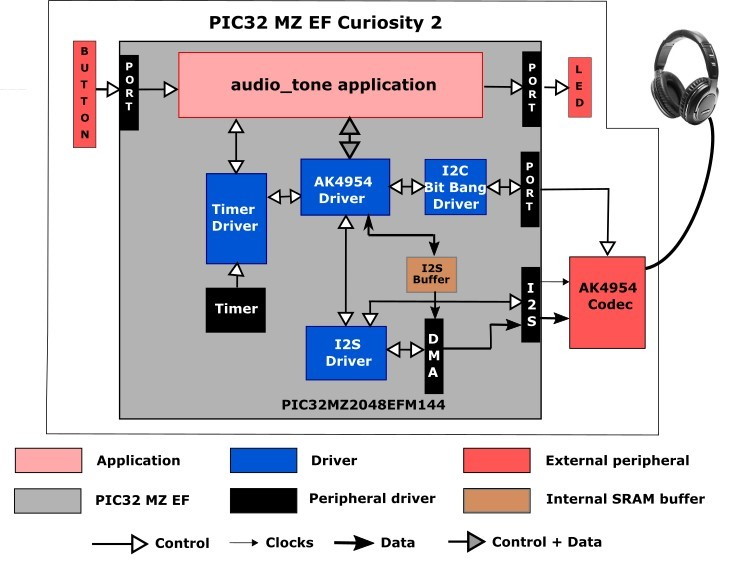
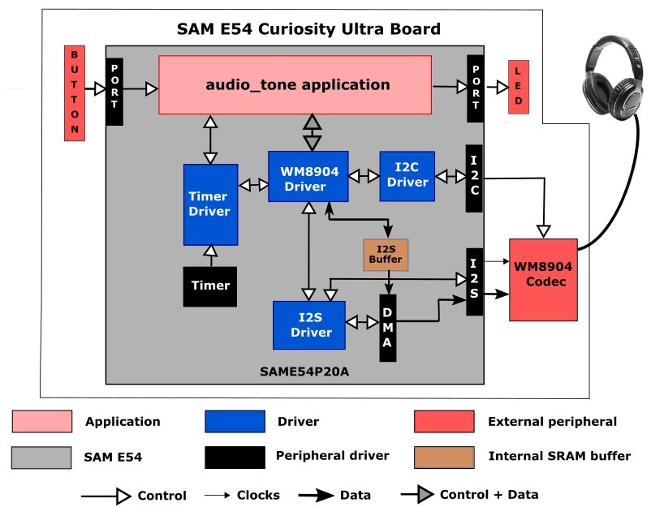
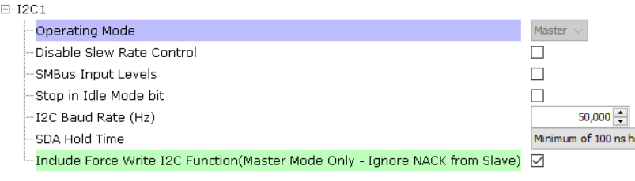
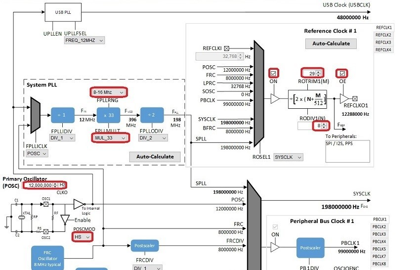
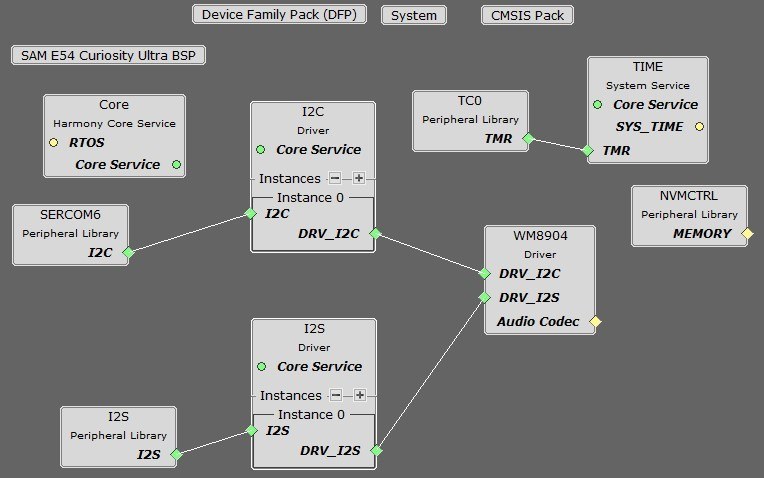
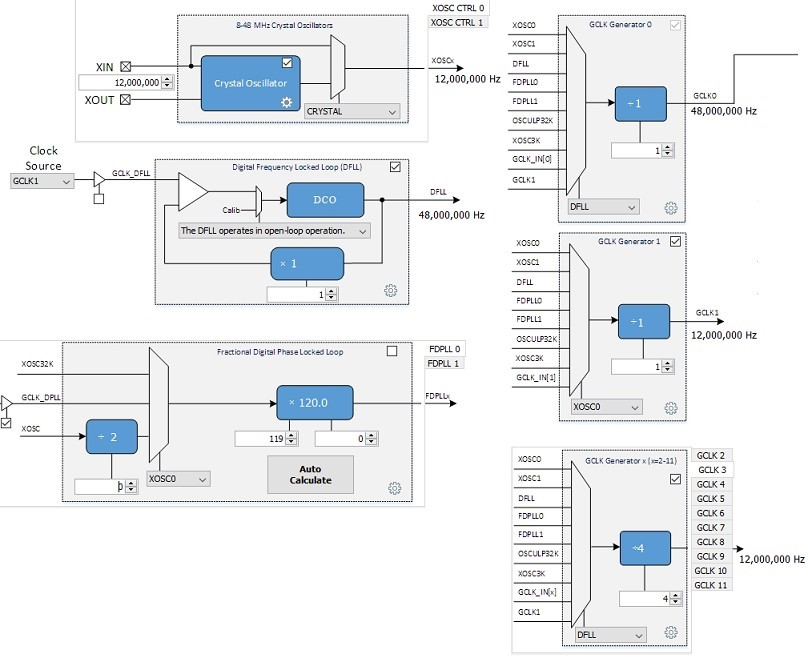
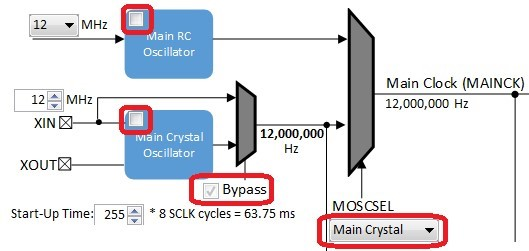
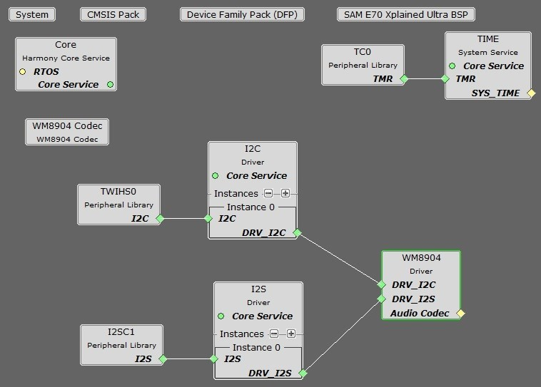
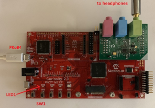

# audio_tone

This topic provides instructions and information about the MPLAB Harmony 3 Audio Tone demonstration application, which is included in the MPLAB Harmony Library distribution.

## Description

In this demonstration application the Codec Driver sets up an AK4954 or WM8904 Codec. The demonstration sends out generated audio waveforms (sine tone) with volume and frequency modifiable through the on-board push button. Success is indicated by an audible output corresponding to displayed parameters.

The sine tone is one of four frequencies: 250 Hz, 500 Hz, 1 kHz, and 2 kHz, sent by default at 48,000 samples/second, which is modifiable in the MHC as described below.

To know more about the MPLAB Harmony Codec Drivers, configuring the Codec Drivers, and the APIs provided by the Codec Drivers, refer to Codec Driver Libraries.

## Architecture

There are eight different projects packaged in this application.

**PIC32 MZ EF Curiosity 2.0 Project:**

One project runs on the PIC32 MZ EF Curiosity 2.0 board, using the PIC32MZ2048EFM144 microcontroller with 2 MB of Flash memory and 512 KB of RAM running at 198 MHz. The PIC32 MZ EF Curiosity 2.0 board includes the following features:

*	Four push buttons (SW1-SW4, only SW1 is used)
*	Four LEDs (LED1-LED4, only LED1 is used)
*	AK4954 Codec Daughter Board mounted on X32 HEADER 2 socket
*	
The PIC32 MZ EF Curiosity 2.0 board does not include the AK4954 Audio Codec daughterboard, which is sold separately on microchipDIRECT as part number AC324954.

The program takes up to approximately 3% (55 KB) of the PIC32MZ2048EFM144 microcontroller’s program space, and 23% (115 KB) of the RAM. No heap is used.

The following figure illustrates the application architecture for the PIC32 MZ EF Curiosity 2.0 configuration:

For both configurations, the I2S (Inter-IC Sound Controller) is used with the AK4954 codec. The AK4954 is configured in slave mode, meaning it receives I2S clocks (LRCLK and BCLK) from the PIC32, and the I2S peripheral is configured as a master.

**SAM E54 Curiosity Ultra Projects:**

Two projects run on the SAM E54 Curiosity Ultra Board, which contains a ATSAME54P20A microcontroller with 1 MB of Flash memory and 256 KB of RAM running at 48 MHz using the following features:

*   Two push buttons (SW1 and SW2, only SW1 is used)
*   Two LEDs (LED1 and 2, only LED1 is used)
*   WM8904 Codec Daughter Board mounted on a X32 socket

The SAM E54 Curiosity Ultra board does not include the WM8904 Audio Codec daughterboard, which is sold separately on microchipDIRECT as part number AC328904.

The non-RTOS version of the program takes up to approximately 3% (28 KB) of the ATSAME54P20A microcontroller’s program space. The 16-bit configuration uses 45% (115 KB) of the RAM. No heap is used. For the FreeRTOS project, the program takes up to approximately 1% (22 KB) of the ATSAME54P20A microcontroller’s program space, and the 16-bit configuration uses 60% (155 KB) of the RAM. No heap is used.

The following figure illustrates the application architecture for the two SAM E54 Xplained Ultra configurations (RTOS not shown):

The I2S (Inter-IC Sound Controller) is used with the WM8904 codec. The WM8904 is configured in master mode, meaning it generates the I2S clocks (LRCLK and BCLK), and the I2S peripheral is configured as a slave.

**SAM E70 Xplained Ultra Projects:**

Four projects run on the SAM E70 Xplained Ultra Board, which contains a ATSAME70Q21B microcontroller with 2 MB of Flash memory and 384 KB of RAM running at 300 MHz using the following features:

*   One push button (SW1, may be labeled as SW0 on some boards)
*   Two LEDs (LED1 and 2, only LED1 is used)
*   AK4954 or WM8904 Codec Daughter Board mounted on a X32 socket

The SAM E70 Xplained Ultra board does not include the AK4954 or WM8904 Audio Codec daughterboards, which are sold separately on microchipDIRECT as part numbers AC324954 and AC328904, respectively.

The two non-RTOS versions of the program take up to approximately 1% (18 KB) of the ATSAME70Q21B microcontroller’s program space. The 16-bit configuration uses 30% (115 KB) of the RAM. No heap is used. For the FreeRTOS project, the program takes up to approximately 1% (22 KB) of the ATSAME70Q21B microcontroller’s program space, and the 16-bit configuration uses 41% (155 KB) of the RAM. No heap is used.

The following figure illustrates the application architecture for the three SAM E70 Xplained Ultra configurations using the WM8904 (RTOS not shown). The AK4954 version is the same with the substitution of the AK4954 Driver and Codec blocks.

The AK4954 codec is only used with the SSC (Synchronous Serial Controller). The WM8904 is configured in slave mode and the SSC peripheral is a master and generates the I2SC clocks.

Depending on the project, either the SSC (Synchronous Serial Controller) or I2SC (Inter-IC Sound Controller) is used with the WM8904 codec, selected by a strapping option on the WM8904 daughterboard. When using the SSC interface, the WM8904 is configured in master mode, meaning it generates the I2S clocks (LRCLK and BCLK), and the SSC peripheral is configured as a slave. When using the I2SC interface, the WM8904 is configured in slave mode and the SSC peripheral is a master and generates the I2SC clocks. The other two possibilities (SSC as master and WM8904 as slave, or I2SC as slave and WM8904 as master) are possible, but not discussed.

**SAMV71 Xplained Ultra Project:**

One project runs on the SAMV71 Xplained Ultra Board, which contains a ATSAMV71Q21B microcontroller with 2 MB of Flash memory and 384 KB of RAM running at 300 MHz using the following features:

*   Two push buttons (SW0 and SW1, only SW0 is used)
*   Two LEDs (LED0 and 1, only LED0 is used)
*   WM8904 codec (on board)

The program takes up to approximately 1% (18 KB) of the ATSAME70Q21B microcontroller’s program space. The 16-bit configuration uses 30% (115 KB) of the RAM (with 15K of that used by the three audio buffers). No heap is used.

The architecture is the same as for the SAM E70 Ultra board configurations; however only the SSC is available.

The same application code is used without change between the seven projects.

The PIC32 or SAM microcontroller (MCU) runs the application code, and communicates with the AK4954 or WM8904 codec via an I2C interface. The audio interface between the microcontroller and the codec use the I2S interface. Audio is configured as 16-bit, 48,000 samples/second, I2S format. (16-bit, 48 kHz is the standard rate used for DVD audio. An alternate that could be used is 44,100 samples/second. This is the same sample rate used for CD's. The sample rate is configurable in the MHC.)

The Master Clock (MCLK) signal used by the codec is generated by the Peripheral Clock section of the microcontroller, and is fixed at 12 MHz.

The button and LED are interfaced using GPIO pins. There is no screen.

As with any MPLAB Harmony application, the SYS_Initialize function, which is located in the initialization.c source file, makes calls to initialize various subsystems as needed, such as the clock, ports, board support package (BSP), codec, I2S, I2C, DMA, timers, and interrupts.

The codec driver and the application state machines are all updated through calls located in the SYS_Tasks function in the tasks.c file.

The application code is contained in the several source files. The application’s state machine (APP_Tasks) is contained in app.c. It first initializes the application, which includes APP_Tasks then periodically calls APP_Button_Tasks to process any pending button presses.

Then the application state machine inside APP_Tasks is given control, which first gets a handle to a timer driver instance and sets up a periodic (alarm) callback. In the next state it gets a handle to the codec driver by calling the DRV_CODEC_Open function with a mode of DRV_IO_INTENT_WRITE and sets up the volume.

The application state machine then registers an event handler APP_CODEC_BufferEventHandler as a callback with the codec driver (which in turn is called by the DMA driver).

Two buffers are used for generating a sine wave in a ping-pong fashion. Initially values for the first buffer are calculated, and then the buffer is handed off to the DMA using a DRV_CODEC_BufferAddWrite. While the DMA is transferring data to the SSC or I2SC/I2S peripheral, causing the tone to sent to the codec over I2S, the program calculates the values for the next cycle. (In the current version of the program, this is always the same unless the frequency is changed manually.) Then when the DMA callback Audio_Codec_BufferEventHandler is called, the second buffer is handed off and the first buffer re-initialized, back and forth.

A table called samples contains the number of samples for each frequency that correspond to one cycle of audio (e.g. 48 for 48000 samples/sec, and 1 kHz tone). This is divided into the MAX_AUDIO_NUM_SAMPLES value (maximum number of elements in the tone) to provide the number of cycles of tone to be generated to fill the table. Another table (appData.numSamples1 or 2) is then filled in with the number of samples for each cycle to be generated. **Note:** the samples table will need to be modified if changing the sample rate to something other than 48000 samples/second.

This table with the number of samples per cycle to be generated is then passed to the function APP_TONE_LOOKUP_TABLE_Initialize along with which buffer to work with (1 or 2) and the sample rate. The 16-bit value for each sample is calculated based on the relative distance (angle) from 0, based in turn on the current sample number and total number of samples for one cycle. First the angle is calculated in radians:

double radians = (M_PI*(double)(360.0/(double)currNumSamples)*(double)i)/180.0;

Then the sample value is calculated using the sine function:

lookupTable[i].leftData = (int16_t)(0x7FFF*sin(radians));

If the number of samples divides into the sample rate evenly, then only 1/4 (90°) of the samples are calculated, and the remainder is filled in by reflection. Otherwise each sample is calculated individually. Before returning, the size of the buffer is calculated based on the number of samples filled in.

## Demonstration Features

*   Calculation of a sine wave based on the number of samples and sample rate using the sin function, with reflection if possible
*   Uses the Codec Driver Library to write audio samples to the AK4954 or WM8904
*   At a lower level, uses the I2S Driver Library between the codec library and the chosen peripheral (SSC or I2SC or I2S) to send the audio to the codec
*   Use of ping-pong buffers and DMA
*   Use of two timers: one as a periodic 1 ms timer for the application for button debouncing, and a second used by the Codec Driver (see Timer Driver Library)

## Tools Setup Differences

**For the project using the PIC32MZ, the I2S interface and the AK4954 as a Slave (the I2S peripheral generates the I2S clocks):**

When building a new application, start by creating a 32-bit MPLAB Harmony 3 project in MPLAB X IDE by selecting _File > New Project_. Chose the Configuration name based on the BSP. Select the appropriate processor (PIC32MZ2048EFM144). Click Finish.

In the MHC, under Available Components select the PIC32 MZ EF Curiosity 2.0. Under _Audio>Templates_, double-click on AK4954 Codec. Answer Yes to all questions except for the one regarding FreeRTOS; answer No to that one.

You should end up with a project graph that looks like this, after rearranging the boxes:

 Click on the I2S Peripheral. In the Configurations Options, under 32/16-Bit Communication Select bits, select (AUDEN=1) 24-bit data, 32-bit FIFO, 32-bit Channel/64-bit Frame. Change Master Clock Enable bit to REFCLK. Set the Frame Select Pin to C2 for the Curiosity 2.0 board. The configuration should look like this:

Click on the I2C1 peripheral.  Tick the checkbox for the Include Force Write I2C Function:

Under Tools, click on Clock Configuration. In the Clock Diagram:

*   Change the Primary Oscillator frequency to 12,000,000 Hz, and select HS under POSCMOD.
*   Change the FPLLRNG to 8-16 MHz, and FPLLMULT to MUL_33.
*   In the Reference CLock section, check the ON and OE checkboxes,, and set ROTRIM1 to 29 and RODIV1 to 8. This should give a REFCLKO1 output of 12,288,000 Hz, which is 256 times the 48 KHz sample rate.

You should end up with a clock diagram like this:

**For projects using the E54, the I2S interface and the WM8904 as a Master (the WM8904 codec generates the I2S clocks):**

When building a new application, start by creating a 32-bit MPLAB Harmony 3 project in MPLAB X IDE by selecting _File > New Project_. Chose the Configuration name based on the BSP. Select the appropriate processor (ATSAME54P20A). Click Finish.

In the MHC, under Available Components select the BSP SAM E54 Curiosity Ultra. Under _Audio>Templates_, double-click on WM8904 Codec. Answer Yes to all questions. Click on the WM8904 Codec component (_not_ the WM8904 Driver). Answer Yes to all questions except for the one regarding FreeRTOS; answer Yes or No to that one depending on whether you will be using FreeRTOS or not.

You should end up with a project graph that looks like this, after rearranging the boxes:

Click on the WM8904 Driver. In the Configurations Options, under Audio Data Format, change it to 32-bit I2S. Set the desired Sample Rate if different from the default (48,000) under Sampling Rate.

In the Clock Diagram:

*   Enable the Crystal Oscillator, change it frequency to 12,000,000 Hz, and select CRYSTAL.
*   Uncheck the Fractional Digital Phase Locked Loop enable (FDPLL 0).
*   In the CLK Generator 0 box, change the input to DFLL for an output of 48 MHz.
*   In the CLK Generator 1 box, change the input to XOSC0 with a divider of 1 for an output of 12 MHz.
*   In the GCLK Generator, uncheck the selection for GCLK 2, and then select the GCLK 3 tab. Choose the DFLL as the input, with a divide by 4 for an output of 12 MHz.

You should end up with a clock diagram like this:

**For projects using the E70, the SSC interface and the AK4954 as a Slave (the SAM E70 generates the I2S clocks):**

When building a new application, start by creating a 32-bit MPLAB Harmony 3 project in MPLAB X IDE by selecting _File > New Project_. Chose the Configuration name based on the BSP. Select the appropriate processor (ATSAME70Q21B). Click Finish.

In the MHC, under Available Components select the BSP SAM E70 Xplained Ultra. Under _Audio>Templates_, double-click on

AK4954 Codec. Answer Yes to all questions. Click on the AK4954 Codec component (_not_ the AK4954 Driver). In the Configuration Options, under AK4954 Interface, select I2SC instead of SSC. Answer Yes to all questions except for the one regarding FreeRTOS; answer Yes or No to that one depending on whether you will be using FreeRTOS or not.

You should end up with a project graph that looks like this, after rearranging the boxes:

Click on the AK4954 Driver. In the Configurations Options, under Usage Mode, change Master to Slave. Set the desired Sample Rate if different from the default (48,000) under Sampling Rate.

In the Clock Diagram, set MOSCEL to Main Crystal, check the Bypass checkbox, and uncheck the RC Crystal Oscillator and Main Crystal Oscillator boxes, to make use of the 12 MHz external oscillator:

Still in the Clock Diagram, enable the PLLA Clock. Leave the divider at 1 (12 MHz) and change the multiplier to 41 for an output of 492 MHz.

In the Master Clock Controller, select the source (CSS) as PLLACK (492 MHz), all all three dividers as divide by 2 to generate a Processor Clock of 246 MHz and a Master Clock of 123 MHz. In the Programmable Clock Controller section, select the PCK2 tab, select the source (CSS) as PLLACK (492 MHz), the divider of 40 for a PCK2 output of 12,300,000 Hz.

Then check the SSC checkbox in the **Peripheral Clock Controller** section.

**For projects using the E70 or V71, the SSC interface and the WM8904 as a Master (the WM8904 codec generates the I2S clocks):**

When building a new application, start by creating a 32-bit MPLAB Harmony 3 project in MPLAB X IDE by selecting _File > New Project_. Chose the Configuration name based on the BSP used. Select the appropriate processor (ATSAME70Q21B or ATSAMV71Q21B) depending on your board. Click Finish.

In the MHC, under Available Components select the appropriate BSP (SAM E70 Xplained Ultra or SAM V71 Xplained Ultra). Under _Audio>Templates_, double-click on WM8904 Codec. Answer Yes to all questions except for the one regarding FreeRTOS; answer Yes or No to that one depending on whether you will be using FreeRTOS or not.

You should end up with a project graph that looks like this, after rearranging the boxes, assuming a non-FreeRTOS project:

Click on the WM8904 Driver. In the Configurations Options, set the desired Sample Rate if different from the default (48,000) under Sampling Rate.

If using the SAM E70 Xplained Ultra board, in the Clock Diagram, set MOSCEL to Main Crystal, check the Bypass checkbox, and uncheck the RC Crystal Oscillator and Main Crystal Oscillator boxes, to make use of the 12 MHz external oscillator:

If using the ATSAMV71Q21B, in the Clock Diagram set MOSCEL to Main Crystal, uncheck the Bypass checkbox and RC Crystal Oscillator checkbox, and check the Main Crystal Oscillator box.

Also in the Clock Diagram, in the PCK2 tab of the **Programmable Clock Controller** section, check the On checkbox, and set CSS to MAINCLK (12 MHz). Then check the SSC checkbox in the **Peripheral Clock Controller** section.

It is also possible to change the audio format from 16 to 32-bits, and from I2S to Left Justified (SSC only). These changes need to be done in the MHC in both the WM8904, and SSC/I2SC Peripherals. In the current application code (app.h), a #define is also set to the current width.

If using FreeRTOS, in the code you will need to move the call to DRV_WM8904_Tasks(sysObj.drvwm8904Codec0); from the SYS_Tasks function in src/config/<config_name>/tasks.c to inside the while(1) loop of _APP_Tasks (just before the call to APP_Tasks).

**For projects using the E70, the I2SC interface and the WM8904 as a Slave (the SAM E70 generates the I2S clocks):**

When building a new application, start by creating a 32-bit MPLAB Harmony 3 project in MPLAB X IDE by selecting _File > New Project_. Chose the Configuration name based on the BSP. Select the appropriate processor (ATSAME70Q21B). (The WM8904 on the SAM V71 Xplained Ultra cannot be used with I2SC.) Click Finish.

In the MHC, under Available Components select the BSP SAM E70 Xplained Ultra. Under _Audio>Templates_, double-click on WM8904 Codec. Answer Yes to all questions. Click on the WM8904 Codec component (_not_ the WM8904 Driver). In the Configuration Options, under WM8904 Interface, select I2SC instead of SSC. Answer Yes to all questions except for the one regarding FreeRTOS; answer Yes or No to that one depending on whether you will be using FreeRTOS or not.

You should end up with a project graph that looks like this, after rearranging the boxes:

Click on the WM8904 Driver. In the Configurations Options, under Usage Mode, change Master to Slave. Set the desired Sample Rate if different from the default (48,000) under Sampling Rate.

If using the SAM E70 Xplained Ultra board, in the Clock Diagram, set MOSCEL to Main Crystal, check the Bypass checkbox, and uncheck the RC Crystal Oscillator and Main Crystal Oscillator boxes, to make use of the 12 MHz external oscillator:

Also in the Clock Diagram, in the PCK2 tab of the **Programmable Clock Controller** section, check the On checkbox, and set CSS to MAINCLK (12 MHz).

The following tables show suggested settings for various sample rates in the Clock Diagram when using the I2SC Peripheral in Master mode. Make sure **PLLA Clock** checkbox is checked, and fill in the values for the PLLA Multiplier and Divider boxes. Select the I2S1 tab under **Generic Clock Controller**, set GCLKCSS to PLLACK, fill in the Divider value as shown, and check the checkbox next to it.

The values in the first table give the lowest error rate, but have varying PLLACK values so it is best to use the UPPCLKDIV selection for CSS under **Master Clock Controller**, for a Processor Clock of 240 MHz.

| **Desired Sample Rate** | **PLLA Multipler** | **PLLA Divider** | **PLLACK** | **I2SC Generic Clock Divider** | **Calculated Sample Rate** | **Error** |
| --- | --- | --- | --- | --- | --- | --- |
| 8000 | 2 | 43 | 258 MHz | 126 | 7998 | -0.025% |
| 16000 | 2 | 43 | 258 MHz | 63 | 15997 | -0.0187% |
| 44100 | 1 | 16 | 192 MHz | 17 | 41117 | 0.0385% |
| 48000 | 2 | 43 | 258 MHz | 21 | 47991 | -0.0187% |
| 96000 | 3 | 43 | 172 MHz | 7 | 95982 | -0.0187% |

The values in the second table have somewhat higher error rates, but use a PLLACK value of 294 MHz which is suitable to be used as a Processor Clock (using the PLLACK selection for CSS) which is closer to the maximum of 300 MHz.

| **Desired Sample Rate** | **PLLA Multipler** | **PLLA Divider** | **PLLACK** | **I2SC Generic Clock Divider** | **Calculated Sample Rate** | **Error** |
| --- | --- | --- | --- | --- | --- | --- |
| 8000 | 2 | 49 | 294 MHz | 144 | 7975 | -0.3125% |
| 16000 | 2 | 49 | 294 MHz | 72 | 15950 | -0.3125% |
| 44100 | 2 | 49 | 294 MHz | 26 | 41170 | 0.1587% |
| 48000 | 2 | 49 | 294 MHz | 24 | 47851 | -0.3104% |
| 96000 | 3 | 49 | 294 MHz | 12 | 95703 | -0.3094% |

It is also possible to change the audio format from 16 to 32-bits. This changes need to be done in the MHC in both the WM8904 Driver and I2SC Peripheral. In the current application code (app.h), a #define is also set to the current width.

If using FreeRTOS, in the code you will need to move the call to DRV_WM8904_Tasks(sysObj.drvwm8904Codec0); from the SYS_Tasks function in src/config/<config_name>/tasks.c to inside the while(1) loop of _APP_Tasks (just before the call to APP_Tasks).

### Building the Application

This section identifies the MPLAB X IDE project name and location and lists and describes the available configurations for the demonstration.

**Description**

The parent folder for these files is audio/apps/audio_tone. To build this project, you must open the audio/apps/audio_tone/firmware/*.X project file in MPLAB X IDE that corresponds to your hardware configuration.

## MPLAB X IDE Project Configurations

The following table lists and describes supported project configurations.

| **Project Name** | **BSP Used** | **Description** |
| --- | --- | --- |
| audio_tone_ pic32mz_ef_c2_ ak4954 | pic32mz_ef_curiosity_v2 | This demonstration runs on the PIC32MZ2048EFM144 processor on the PIC32 MZ EF Curiosity 2.0 board and the AK4954 Audio Codec Daughter Board. The project configuration is for a sine tone with 16-bit data width, 48000 Hz sampling frequency, and I2S audio protocol using the I2S PLIB. The AK4954 codec is configured as the slave, and the I2S peripheral as the master. |
| audio_tone_ sam_e54_cult wm8904_ssc | sam_e54_cult | This demonstration runs on the ATSAME54P20A processor on the SAM E54 Curiosity Ultra board and the WM8904 Audio Codec Daughter Board. The project configuration is for a sine tone with 16-bit data width, 48000 Hz sampling frequency, and I2S audio protocol using the SSC PLIB. The WM8904 codec is configured as the master, and the SSC peripheral as the slave. |
| audio_tone_ sam_e54_cult wm8904_ssc_freertos | sam_e54_cult | This demonstration runs on the ATSAME54P20A processor on the SAM E54 Curiosity Ultra board and the WM8904 Audio Codec Daughter Board. The project configuration is for a sine tone with 16-bit data width, 48000 Hz sampling frequency, and I2S audio protocol using the SSC PLIB. The WM8904 codec is configured as the master, and the SSC peripheral as the slave. This demonstration also uses FreeRTOS. |
| audio_tone_ sam_e70_xult_ ak4954_ssc | sam_e70_xult | This demonstration runs on the ATSAME70Q21B processor on the SAM E70 Xplained Ultra board and the AK4954 Audio Codec Daughter Board. The project configuration is for a sine tone with 16-bit data width, 48000 Hz sampling frequency, and I2S audio protocol using the SSC PLIB. The AK4954 codec is configured as the slave, and the SSC peripheral as the master. |
| audio_tone_ sam_e70_xult_ wm8904_ssc | sam_e70_xult | This demonstration runs on the ATSAME70Q21B processor on the SAM E70 Xplained Ultra board and the WM8904 Audio Codec Daughter Board. The project configuration is for a sine tone with 16-bit data width, 48000 Hz sampling frequency, and I2S audio protocol using the SSC PLIB. The WM8904 codec is configured as the master, and the SSC peripheral as the slave. |
| audio_tone_ sam_e70_xult_ wm8904_ssc_freertos | sam_e70_xult | This demonstration runs on the ATSAME70Q21B processor on the SAM E70 Xplained Ultra board and the WM8904 Audio Codec Daughter Board. The project configuration is for a sine tone with 16-bit data width, 48000 Hz sampling frequency, and I2S audio protocol using the SSC PLIB. The WM8904 codec is configured as the master, and the SSC peripheral as the slave. This demonstration also uses FreeRTOS. |
| audio_tone_ sam_e70_xult _wm8904_i2sc | sam_e70_xult | This demonstration runs on the ATSAME70Q21B processor on the SAM E70 Xplained Ultra board and the WM8904 Audio Codec Daughter Board. The project configuration is for a sine tone with 16-bit data width, 48000 Hz sampling frequency, and I2S audio protocol using the I2SC PLIB. The WM8904 codec is configured as the slave, and the I2SC peripheral as the master. |
| audio_tone_ sam_v71_xult | sam_v71_xult | This demonstration runs on the ATSAMV71Q21B processor on the SAM V71 Xplained Ultra board along with the on-board WM8904 codec. The project configuration is for a sine tone with 16-bit data width, 48000 Hz sampling frequency, and I2S audio protocol using the SSC PLIB. The WM8904 codec is configured as the master, and the SSC peripheral as the slave. |

### Configuring the Hardware

This section describes how to configure the supported hardware.

**Description**

Using the PIC32 MZ EF Curiosity 2.0 board and the AK4954 Audio Codec Daughter Board, and I2S PLIB. The AK4954 daughter board is plugged into the set of X32 connectors on the right side of the board (X32 HEADER 2).

  **Note:** The PIC32 MZ EF Curiosity 2.0 does not include the AK4954 Audio Codec daughterboard, which is sold separately on microchipDIRECT as part number AC324954.

Using the SAM E54 Curiosity Ultra board and the WM8904 Audio Codec Daughter Board, and I2S PLIB. All jumpers on the WM8904 should be toward the **front:**

In addition, make sure the J401 jumper (CLK SELECT) is set for the PA17 pin:

 **Note:** The SAM E54 Curiosity Ultra board does not include the WM8904 Audio Codec daughterboard, which is sold separately on microchipDIRECT as part number AC328904.

Using the SAM E70 Xplained Ultra board and the AK4954 Audio Codec Daughter Board, and SSC PLIB. No special configuration needed.

 **Note:** The SAM E70 Xplained Ultra board does not include the AK4954 Audio Codec daughterboard, which is sold separately on microchipDIRECT as part number AC324954.

Using the SAM E70 Xplained Ultra board and the WM8904 Audio Codec Daughter Board, and SSC PLIB. All jumpers on the WM8904 should be toward the **front:**

 **Note:** The SAM E70 Xplained Ultra board does not include the WM8904 Audio Codec daughterboard, which is sold separately on microchipDIRECT as part number AC328904.

Using the SAM E70 Xplained Ultra board and the WM8904 Audio Codec Daughter Board, and I2SC PLIB. All jumpers on the WM8904 should be toward the **back:**

 **Note:** The SAM E70 Xplained Ultra board does not include the WM8904 Audio Codec daughterboard, which is sold separately on microchipDIRECT as part number AC328904.

Using the SAM V71 Xplained Ultra board with on-board WM8904, with SSC PLIB. No special configuration needed.

### Running the Demonstration

This section demonstrates how to run the demonstration.

**Description**

 **Important!** Prior to using this demonstration, it is recommended to review the MPLAB Harmony 3 Release Notes for any known issues.

All configurations:

Continuous sine tones of four frequencies can be generated. **Tables 1-2** provides a summary of the button actions that can used to control the volume and frequency.

Compile the program using MPLAB X, and program the target device using the EDBG interface. While compiling, select the appropriate MPLAB X IDE project. Refer to Building the Application for details.

1.  Connect headphones to the HP OUT jack of the AK4954 or WM8904 Audio Codec Daughter Board (see **Figures 1-2**), or the HEADPHONE jack of the SAM V71 Xplained Ultra board.
2.  The tone can be quite loud, especially when using a pair of headphones.
3.  The lowest-numbered pushbutton (SW0 or SW1) and LED are used as the user interface to control the program, as shown in Tables 1-3 below, depending on the board used. Initially the program will be in volume-setting mode (LED off) at a medium volume setting. Pressing the pushbutton with the LED off will cycle through four volume settings (including mute).
4.  Pressing the pushbutton longer than one second will change to frequency-setting mode (LED on). Pressing the pushbutton with the LED on will cycle through four frequency settings -- 250 Hz, 500 Hz, 1 kHz, and 2 kHz.
5.  Pressing the pushbutton longer than one second again will switch back to volume-setting mode again (LED off).

#### Figure 1: AK4954 Audio Codec Daughter Board on PIC32 MZ EF Curiosity 2.0 Board

#### Figure 2: WM8904 Audio Codec Daughter Board on SAM E70 Xplained Ultra board

## Control Descriptions

### Table 1: Button Controls for PIC32 MZ EF Curiosity 2.0 board, SAM E54 Curiosity Ultra board, and SAM E70 Xplained Ultra board

(On some E70 boards, SW0/LED0 are the lowest numbered pushbutton and LED, so use Table 3 instead.)

| **Control** | **Description** |
| --- | --- |
| SW1 short press | If LED1 is off, SW1 cycles through four volume levels (one muted). If LED1 is on, SW1 cycles through four frequencies of sine tone. |
| SW1 long press (> 1 second) | Alternates between modes (LED1 on or off). |

### Table 2: Button Controls for SAM V71 Xplained Ultra board

| **Control** | **Description** |
| --- | --- |
| SW0 short press | If LED0 is off, SW0 cycles through four volume levels (one muted). If LED0 is on, SW0 cycles through four frequencies of sine tone. |
| SW0 long press (> 1 second) | Alternates between modes (LED0 on or off). |
