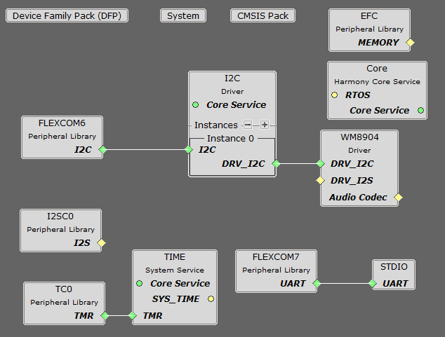
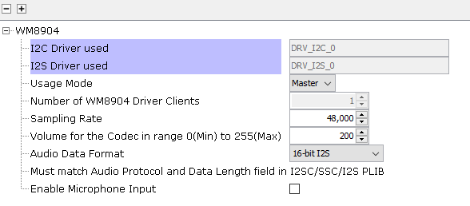
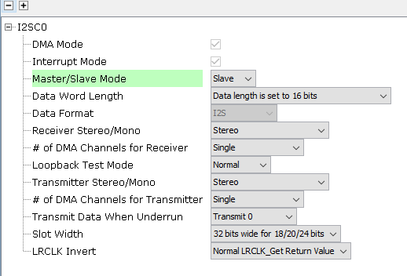
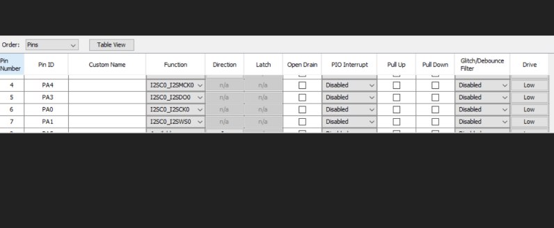
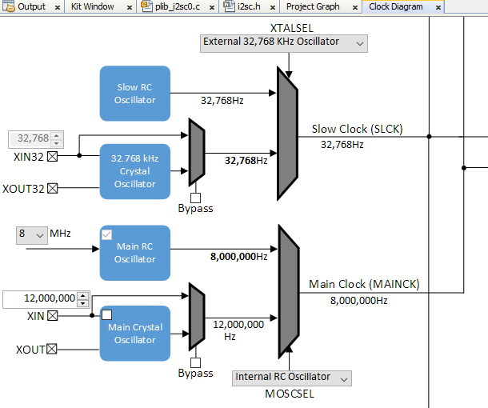
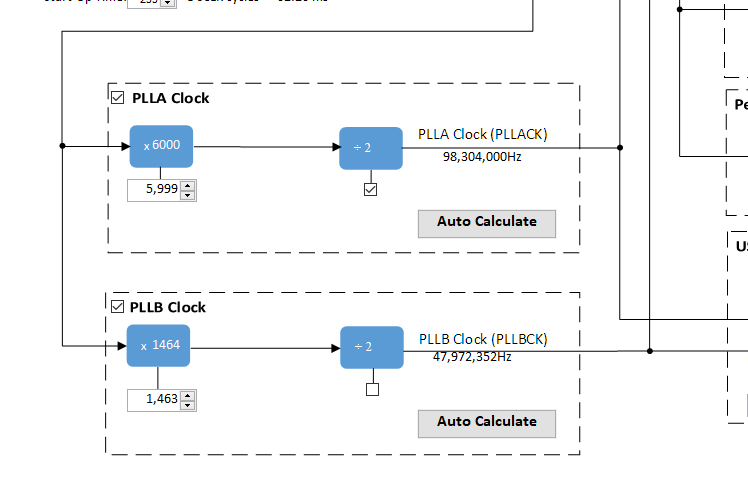
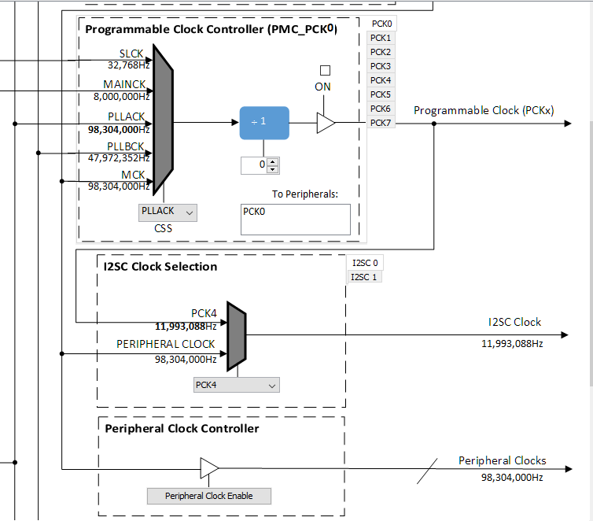
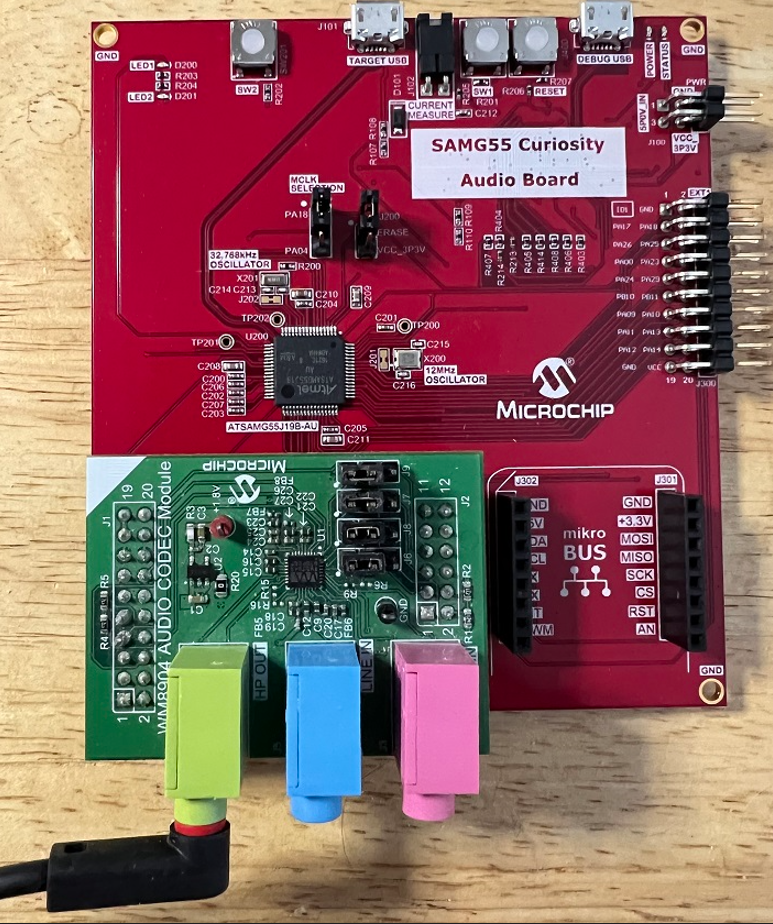

# simple_tone_generator

This topic provides instructions and information about the MPLAB Harmony3 
Simple Tone Generation Demonstration application, which is included in the MPLAB 
Harmony Library distribution.

## Overview

This demonstration application configures the development board to implement a 
Tone Generator that outputs a 1 kHz Sine Tone, configured to run at 48 kHz sampling rate 
at 16 bit per sample.

The Sine Tone Audio is output through a WM8904 Codec Daughter Board mounted on X32 socket. 
The Audio can be heard at a speaker connected to the HP_OUT line 
of the Daughter board.

## Description

The application runs on the ARM processor ATSAMG55J19 
on the SAM G55 Curiosity Audio (G55Audio) board.
*   Processor runs @ 100 MHz
*   2 push buttons (SW1-SW3)
*   2 LEDs (LED1-LED2) 
*   WM8904 Codec Daughter Board mounted on X32 socket

 **Note:** The SAM G55 Curiosity Audio board does not include the
WM8904 Audio Codec daughterboard, which is sold separately on microchipDIRECT as
part number AC328904.

The application uses the MPLAB Code Configurator to setup the 
Audio Device, codec, and other items in order to play the tone through
the Codec Module.

## Demonstration Features

*   1  KHz Tone playback using a WM8904 codec daughterboard on the
    G55 Curiosity Audio board.
*   Utilization of the SAM G55 I2SC peripheral (as slave) to transfer 
    48Khz/16 Bit stereo tone.
*   Uses the Codec Driver Library to write audio samples to the WM8904

Note that this sample just illustrates the G55's Audio capablity.
This demonstration makes direct invocations of the registers from application.
One can refer to other demonstartions to see the proper architectural layering
required by Harmony Audio Architecture.

## Harmony MCC Component Blocks 

MPLAB-X Harmony 3 projects only have one associated
configuration. When each Harmony 3 project is created the MPLAB Code
Configurator (MCC) will support application driver and library code generation 
for the selected processor.

MCC code generation is supported by adding additional components 
to the project graph.  This includes Core peripheral support for the processor
device, the Harmony framework, and the board support package.

    
_Figure 1. Simple Tone Generator Project Graph for the G55Audio Board_

Note that in this basic example, the I2SC component of the SAM G55
does not use a Harmony 3 DMA driver, neither does it use SAM G55
Peripheral DMA Controller (PDC).

### Harmony Core Block

Start MCC for the project in order to add the Harmony and the application 
code components.  The Board Support Package (BSP) for the G55 Curiosity
board should be selected first from the Available Components.

Next,  the Harmony core is selected without FreeRTOS.
Answer Yes to all questions except for the one regarding FreeRTOS; answer No to
that one.

### Audio Codec Component Blocks

#### G55Audio WM8904 Daughter Board Component Block 

Under Audio\\Templates, double-click on WM8904 Codec Template.
Answer Yes to all questions.
This loads the WM8904 Codec component along with associated I2C and I2S
driver components.

### Harmony Code Configuration Options

Each block in the MCC Project Graph may need to be configured through parameters
for the specific application. These parameters are accessed by selecting the
block with the mouse, and appear in the Configuration Options window, where they
can be edited.

#### Audio Codec Configuration

##### The G55Audio WM8904 Codec Configuration

Using the G55Audio and the WM8904 Audio Codec Daughter Board:

    
_Figure 2. WM8904 Codec Configuration_

The WM8904 codec uses a I2C interface for configuration and control
register setting and I2SC interface. The settings are unchanged from
the generated values.

The I2SC0 peripheral driver is used to transfer 16 Bit Stereo
data.

    
_Figure 3. USB Headset G55 Audio I2SC0 Peripheral Driver Configuration_

The I2C blocks can be used without changes to the configuration

#### Pin Configurations

##### G55Audio Pin Configuration
  
_Table 1. SAM G55 Audio Curiosity Pin Configuration_    

#### Clock Manager
The clock configuration diagram is shown using Tools/Clock Configuration menu

The I2S clocks are setup for 48KHz sampling rate, with stereo 16 bit 
samples, giving a 32 bit sample frame. 

#### G55 Audio Clock Generation
The clock configuration diagram is shown using Tools/Clock Configuration menu
selection.  

    
_Figure 4. SAM G55 Main Clock Generation_     
    
    
      
_Figure 5. SAM G55 PLLA (I2SC, MCK, HCLK, SysTick) Clock Generation_    

    
_Figure 6. SAM G55 PBCK4 (MCLK) I2SC0 Clock Generation_

PLLA is used for the peripheral clocks, including I2SC. 

### Harmony Code Generation

All the needed drivers, middleware, libraries and application framework code can
be generated from the MHC blocks (MHC components) placed in the MHC Project
Graph,

The generated framework code is placed under the firmware/src/config directory
under the name of the configuration used for the Harmony 3 project. The initial
application code is located in the firmware/src directory app.c and app.h files,
which utilize the framework drivers, middleware and library APIs located in
definitions.h located in the config directory.

All Harmony applications first execute the SYS_Initialize function, located in
initialization.c. This is executed from the main function to initialize various
subsystems such as the clock, ports, BSP (board support package), codec, 
timers, and interrupts. The application APP_Initialize function in app.c is
executed last in the generated SYS_Initialize routine after the system
initializations have completed.

The SYS_Tasks function (located in tasks.c) is used to update the
WM8904 driver, timers etc., as well as the application state machine (APP_tasks
routine in app.c). This function is executed from the main polling loop. The
polling loop executes SYS_Tasks repeatably in an infinite loop to perform
the updates.

The application utilizes a simple state machine (APP\_Tasks executed from
SYS_Tasks) with the following functions

1.  Opens the WM8904 codec for configuration.
2.  Repeatedly writes the Sine Tone Wave values over I2SC0

### Building the Application

This section identifies the MPLAB X IDE project name and location and lists and
describes the available configurations for the demonstration.

**Description**

The parent folder for these files is audio\_apps/apps/simple\_tone\_generator/. To build this
project, you must open the audio\_apps/apps/simple\_tone\_generator/firmware/sam\_g55\_audio.X project file in
MPLAB X IDE.

** MPLAB X IDE Project **    

This table lists the name and location of the MPLAB X IDE project folder for the
demonstration.

#### MPLAB X IDE Project Configurations

This table lists and describes the supported configurations of the demonstration,
which are located within ./firmware/src/config.

| **Project Name**             | **BSP Used**      | **Description** |
| ---------------------------- | ----------------- | ----------------------------------------------------------------------------------- |    
| sam_g55_audio.X              | sam_g55_audio_wm8904| This demonstration runs on the SAM G55 Curiosity Audio board with the Wm8904 Codec. |    

### Configuring the Hardware    

This section describes how to configure the supported hardware.

#### Using the SAM G55 Curiosity Audio and the WM8904 Daughter Board:

The G55Audio board and the WM8904 Audio Codec Daughter Board only
requires the daughterboard to be connected to the X32 Header as shown
below. The I2S Jumpers should all be set as shown, with jumpers placed
toward the blue Line-In jack, not the pink Microphone-In jack.

Jumper J305 on the G55Audio board shall select PA18.  

    
    
_Figure 7. SAM G55 Curiosity Audio Board Setup_    

Connect headphones to the green HP_OUT jack of the Codec Daughter Board (as shown
in the Figure above).

As shown, the G55 Audio Curiosity will be programmed through the USB cable 
connected to the EDBG micro-mini connector.
Program debug can also be performed over USB this connection.

### Running the Demonstration

This section demonstrates how to run the demonstration.

#### Description

 **Important!** Prior to using this demonstration, it
is recommended to review the MPLAB Harmony 3 Release Notes for any known issues.

Compile and program the target device. While compiling, select the appropriate
MPLAB X IDE project. Refer to Building the Application for details

Do the following to run the demonstration:

1.  Configure the hardware, as described in the previous section, for the
    selected MPLAB-X project.
2.  Connect power to the board, compile the application and program the target
    device. Run the device.

The speaker connected to HP_OUT will emit a continuous 1 kHz Tone.
Note: Neither the volume, nor the frequencies are configurable.

## Control Description

None

